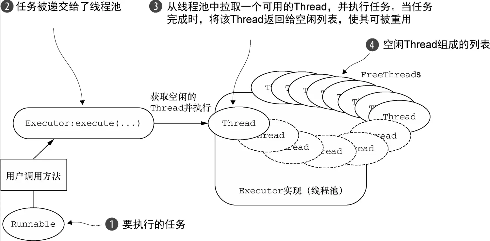
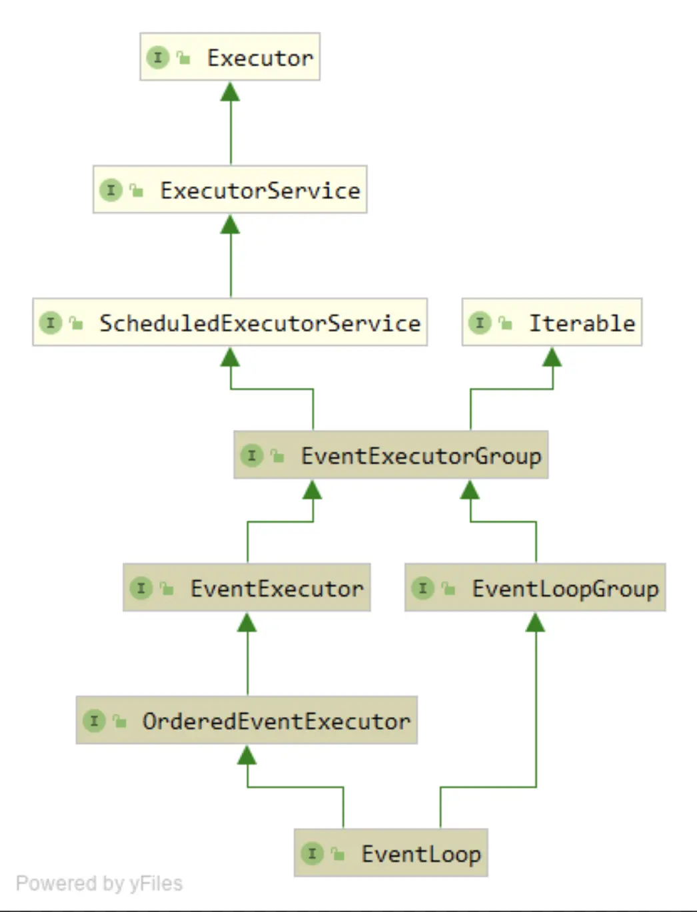
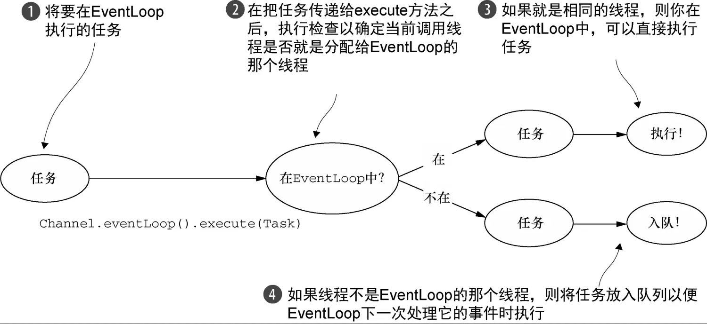
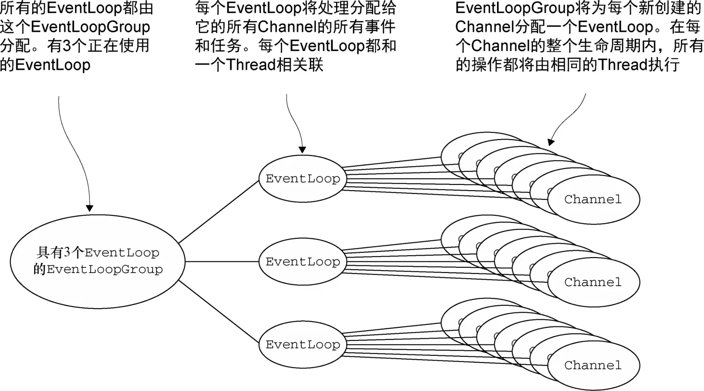
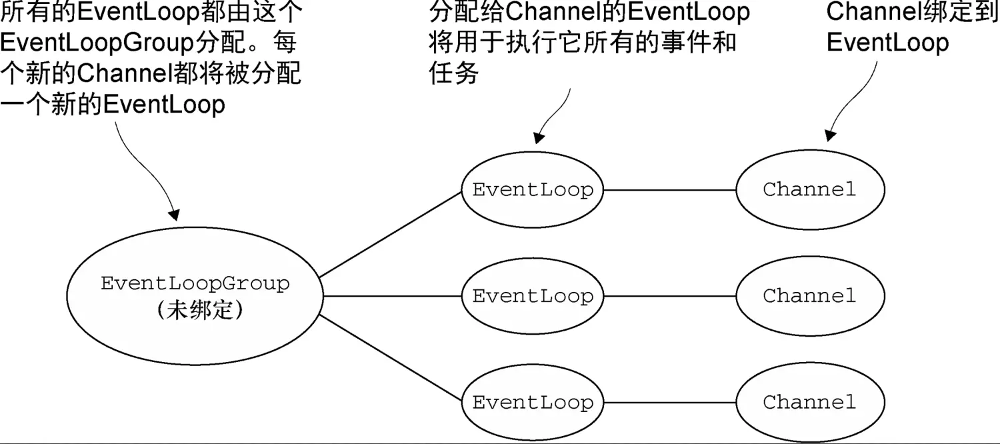
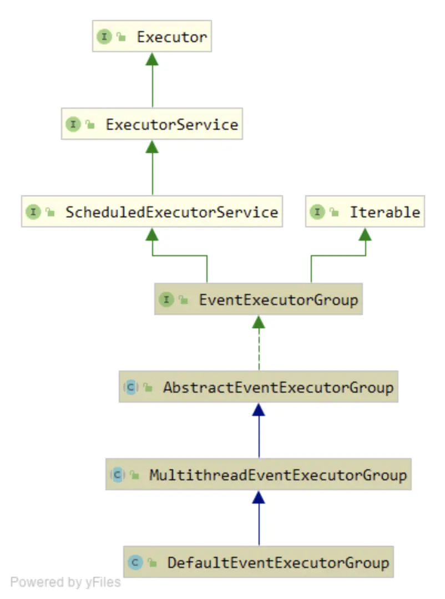
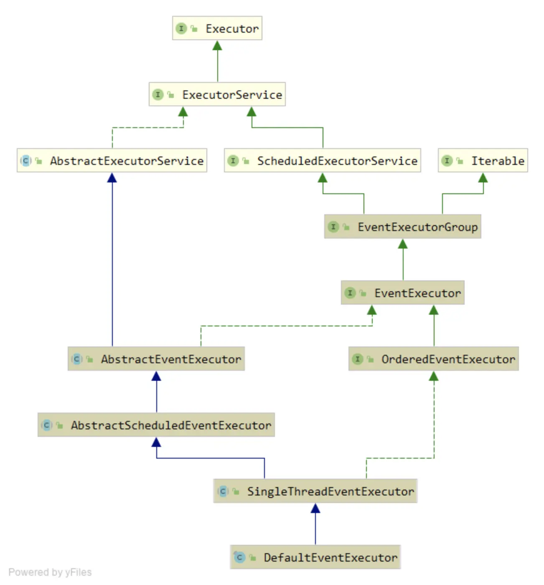
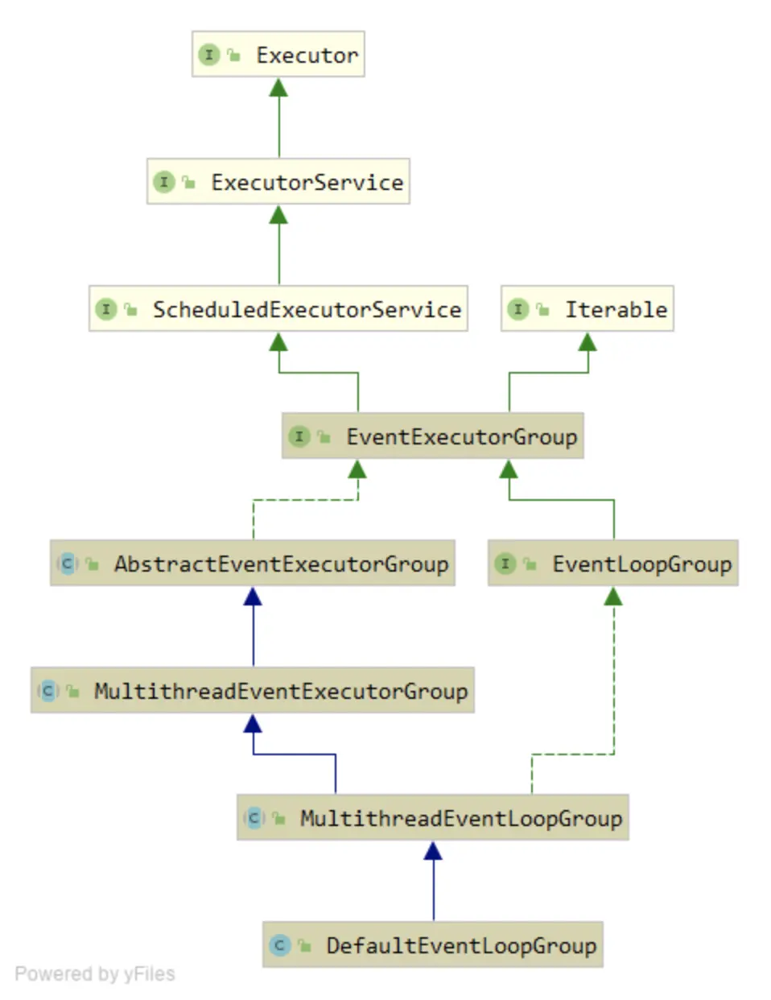
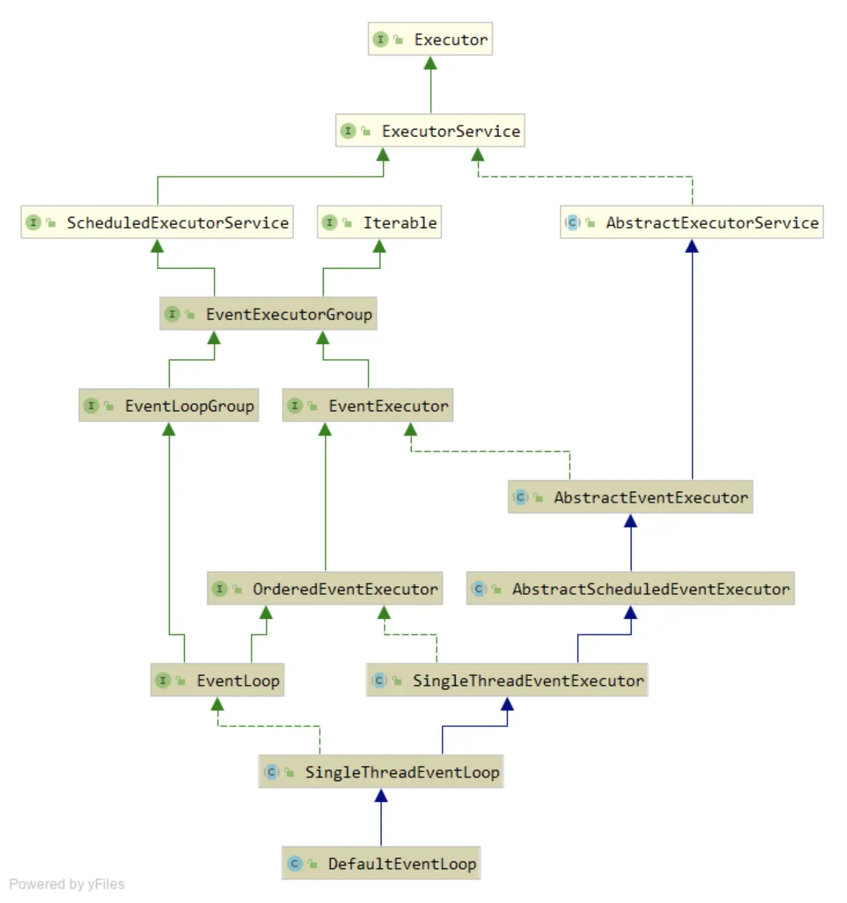

<details open markdown="block">
  <summary>
    Table of contents
  </summary>
  {: .text-delta }
- TOC
{:toc}
</details>

# 线程模型

## 概述

因为具有多核心或多个CPU 的计算机现在已经司空见惯，大多数的现代应用程序都利用了复杂的多线程处理技术以有效地利用系统资源。相比之下，在早期的Java 语言中，我们使用多线程处理的主要方式无非是按需创建和启动新的`Thread`来执行并发的任务单元——一种在高负载下工作得很差的原始方式。Java 5 随后引入了`Executor` API，其线程池通过缓存和重用`Thread` 极大地提高了性能。

基本的线程池化模式可以描述为：
- 从池的空闲线程列表中选择一个`Thread`，并且指派它去运行一个已提交的任务（一个
`Runnable` 的实现）；
- 当任务完成时，将该Thread 返回给该列表，使其可被重用。

虽然池化和重用线程相对于简单地为每个任务都创建和销毁线程是一种进步，但是它并不能
消除由上下文切换所带来的开销，其将随着线程数量的增加很快变得明显，并且在高负载下愈演
愈烈。此外，仅仅由于应用程序的整体复杂性或者并发需求，在项目的生命周期内也可能会出现
其他和线程相关的问题。



## EventLoop

Netty 的`EventLoop` 是协同设计的一部分，它采用了两个基本的API：并发和网络编程。
首先，`io.netty.util.concurrent` 包构建在JDK 的`java.util.concurrent` 包上，用
来提供线程执行器。其次，`io.netty.channel` 包中的类，为了与`Channel` 的事件进行交互，
扩展了这些接口/类。



在这个模型中，一个`EventLoop` 将由一个永远都不会改变的`Thread` 驱动，同时任务
（`Runnable` 或者`Callable`）可以直接提交给`EventLoop` 实现，以立即执行或者调度执行。
根据配置和可用核心的不同，可能会创建多个`EventLoop` 实例用以优化资源的使用，并且单个
`EventLoop` 可能会被指派用于服务多个`Channel`。

## 实现细节

Netty线程模型的卓越性能取决于对于当前执行的`Thread`的身份的确定，也就是说，确定它是否是分配给当前`Channel`以及它的`EventLoop`的那一个线程(EventLoop将负责处理一个`Channel`的整个生命周期内的所有事件)。

如果（当前）调用线程正是支撑`EventLoop` 的线程，那么所提交的代码块将会被（直接）
执行。否则，`EventLoop` 将调度该任务以便稍后执行，并将它放入到内部队列中。当`EventLoop`
下次处理它的事件时，它会执行队列中的那些任务/事件。这也就解释了`Thread` 是如何
与`Channel` 直接交互而无需在`ChannelHandler` 中进行额外同步的。

注意，每个`EventLoop` 都有它自已的任务队列，独立于任何其他的`EventLoop`。下图
展示了`EventLoop` 用于调度任务的执行逻辑。这是Netty 线程模型的关键组成部分。




服务于Channel 的I/O 和事件的EventLoop 包含在EventLoopGroup 中。根据不同的
传输实现，EventLoop 的创建和分配方式也不同。

### 1. 异步传输

异步传输实现只使用了少量的EventLoop（以及和它们相关联的Thread），而且在当前的
线程模型中，它们可能会被多个Channel 所共享。这使得可以通过尽可能少量的Thread 来支
撑大量的Channel，而不是每个Channel 分配一个Thread。
图7-4 显示了一个EventLoopGroup，它具有3 个固定大小的EventLoop（每个EventLoop
都由一个Thread 支撑）。在创建EventLoopGroup 时就直接分配了EventLoop（以及支撑它们
的Thread），以确保在需要时它们是可用的。




EventLoopGroup 负责为每个新创建的Channel 分配一个EventLoop。在当前实现中，
使用顺序循环（round-robin）的方式进行分配以获取一个均衡的分布，并且相同的EventLoop
可能会被分配给多个Channel。（这一点在将来的版本中可能会改变。）

一旦一个Channel 被分配给一个EventLoop，它将在它的整个生命周期中都使用这个
EventLoop（以及相关联的Thread）。请牢记这一点，因为它可以使你从担忧你的Channel-
Handler 实现中的线程安全和同步问题中解脱出来。

另外，需要注意的是，EventLoop 的分配方式对ThreadLocal 的使用的影响。因为一个
EventLoop 通常会被用于支撑多个Channel，所以对于所有相关联的Channel 来说，
ThreadLocal 都将是一样的。这使得它对于实现状态追踪等功能来说是个糟糕的选择。然而，
在一些无状态的上下文中，它仍然可以被用于在多个Channel 之间共享一些重度的或者代价昂
贵的对象，甚至是事件。


### 2. 阻塞传输

用于像OIO（旧的阻塞I/O）这样的其他传输的设计略有不同，如图7-5 所示。这里每一个Channel 都将被分配给一个EventLoop（以及它的Thread）。如果你开发的应用程序使用过java.io 包中的阻塞I/O 实现，你可能就遇到过这种模型。



但是，正如同之前一样，得到的保证是每个Channel 的I/O 事件都将只会被一个Thread
（用于支撑该Channel 的EventLoop 的那个Thread）处理。这也是另一个Netty 设计一致性
的例子，它（这种设计上的一致性）对Netty 的可靠性和易用性做出了巨大贡献。


# 实现

介绍完Netty的线程模型后，让我看一下它是如何实现的。之前我们已经看到了`EventLoop`的类层级结构图，现在我们不管`EventLoop`，而是先看`EventExecutorGroup`以及对应的实现。

## EventExecutorGroup

首先我们先明确一件事，`EventExecutorGroup`与常见的线程池类似，而`EventExecutor`虽然也继承了`ExecutorService`，但是它是一个特化的只维护一个线程的线程池，因此可以将其视为拥有线程池职能的线程。而一个`EventExecutorGroup`管理多个`EventExecutor`，此结构与我们熟悉的线程池模型更加相似。理解了这件事之后，关于`EventExecutorGroup`的实现将清晰许多。



`AbstractEventExecutorGroup`是`EventExecutorGroup`接口的基本实现，遵循前面的介绍的轮询(round-robin)模式，将每一个任务轮流分配给它所管理的`EventExecutor`。

```java
@Override
public Future<?> submit(Runnable task) {
    return next().submit(task);
}

/**
 * Returns one of the {@link EventExecutor}s managed by this {@link EventExecutorGroup}.
 */
EventExecutor next();
```

`MultithreadEventExecutorGroup`则实现了线程池的骨架，正如其名，它是一个支持多线程执行的`EventExecutorGroup`，与`java.util.concurrent`中实现的线程池类似。这个类的核心是它的构造方法，展现了它与`EventExecutor`之间是如何关联的：

```java
private final EventExecutor[] children;


protected MultithreadEventExecutorGroup(int nThreads, Executor executor,
                                        EventExecutorChooserFactory chooserFactory, Object... args) {
    if (nThreads <= 0) {
        throw new IllegalArgumentException(String.format("nThreads: %d (expected: > 0)", nThreads));
    }

    if (executor == null) {
        executor = new ThreadPerTaskExecutor(newDefaultThreadFactory());
    }

    children = new EventExecutor[nThreads];

    for (int i = 0; i < nThreads; i ++) {
        boolean success = false;
        try {
            children[i] = newChild(executor, args);
            success = true;
        } catch (Exception e) {
            // TODO: Think about if this is a good exception type
            throw new IllegalStateException("failed to create a child event loop", e);
        } finally {
            if (!success) {
                for (int j = 0; j < i; j ++) {
                    children[j].shutdownGracefully();
                }

                for (int j = 0; j < i; j ++) {
                    EventExecutor e = children[j];
                    try {
                        while (!e.isTerminated()) {
                            e.awaitTermination(Integer.MAX_VALUE, TimeUnit.SECONDS);
                        }
                    } catch (InterruptedException interrupted) {
                        // Let the caller handle the interruption.
                        Thread.currentThread().interrupt();
                        break;
                    }
                }
            }
        }
    }

    chooser = chooserFactory.newChooser(children);

    final FutureListener<Object> terminationListener = new FutureListener<Object>() {
        @Override
        public void operationComplete(Future<Object> future) throws Exception {
            if (terminatedChildren.incrementAndGet() == children.length) {
                terminationFuture.setSuccess(null);
            }
        }
    };

    for (EventExecutor e: children) {
        e.terminationFuture().addListener(terminationListener);
    }

    Set<EventExecutor> childrenSet = new LinkedHashSet<EventExecutor>(children.length);
    Collections.addAll(childrenSet, children);
    readonlyChildren = Collections.unmodifiableSet(childrenSet);
}
```

其中`Executor`只用来构造`Thread`，默认为一个`EventExecutor`对应一个`Thread`。注意`execute`方法：

```java
public final class ThreadPerTaskExecutor implements Executor {
    private final ThreadFactory threadFactory;

    public ThreadPerTaskExecutor(ThreadFactory threadFactory) {
        if (threadFactory == null) {
            throw new NullPointerException("threadFactory");
        }
        this.threadFactory = threadFactory;
    }

    @Override
    public void execute(Runnable command) {
        threadFactory.newThread(command).start();
    }
}
```

而`chooser`字段代表了`EventExcutor`的选择策略(默认为轮询)：

```java
public EventExecutorChooser newChooser(EventExecutor[] executors) {
    if (isPowerOfTwo(executors.length)) {
        return new PowerOfTwoEventExecutorChooser(executors);
    } else {
        return new GenericEventExecutorChooser(executors);
    }
}

private static final class PowerOfTwoEventExecutorChooser implements EventExecutorChooser {
    private final AtomicInteger idx = new AtomicInteger();
    private final EventExecutor[] executors;

    PowerOfTwoEventExecutorChooser(EventExecutor[] executors) {
        this.executors = executors;
    }

    @Override
    public EventExecutor next() {
        return executors[idx.getAndIncrement() & executors.length - 1];
    }
}

private static final class GenericEventExecutorChooser implements EventExecutorChooser {
    private final AtomicInteger idx = new AtomicInteger();
    private final EventExecutor[] executors;

    GenericEventExecutorChooser(EventExecutor[] executors) {
        this.executors = executors;
    }

    @Override
    public EventExecutor next() {
        return executors[Math.abs(idx.getAndIncrement() % executors.length)];
    }
}
```

这里有一点优化，即 `&` 操作相比 `%` 会快很多，所以当线程池的线程数量为pow2时，针对设计了`next()`方法。

`choose`字段在`EventExecutorGroup#next()`方法中使用，用以选择执行任务的线程。

```java
@Override
public EventExecutor next() {
    return chooser.next();
}
```

构造`EventExecutor`的`newChild()`方法交由子类实现，以针对不同的场景进行定制。默认实现如下所示：

```java
@Override
protected EventExecutor newChild(Executor executor, Object... args) throws Exception {
    return new DefaultEventExecutor(this, executor, (Integer) args[0], (RejectedExecutionHandler) args[1]);
}

public DefaultEventExecutor(EventExecutorGroup parent, Executor executor, int maxPendingTasks,
                            RejectedExecutionHandler rejectedExecutionHandler) {
    super(parent, executor, true, maxPendingTasks, rejectedExecutionHandler);
}

protected SingleThreadEventExecutor(EventExecutorGroup parent, Executor executor,
                                    boolean addTaskWakesUp, int maxPendingTasks,
                                    RejectedExecutionHandler rejectedHandler) {
    super(parent);
    this.addTaskWakesUp = addTaskWakesUp;
    this.maxPendingTasks = Math.max(16, maxPendingTasks);
    this.executor = ThreadExecutorMap.apply(executor, this);
    taskQueue = newTaskQueue(this.maxPendingTasks);
    rejectedExecutionHandler = ObjectUtil.checkNotNull(rejectedHandler, "rejectedHandler");
}
```

注意`taskQueue = newTaskQueue(this.maxPendingTasks);`方法，每个`EventExecutor`都自己维护一个任务队列，而不是`EventExecutorGroup`维护一个任务队列，因此一批任务都会由固定的`EventExecutor`进行执行，这样可以避免在编写代码时考虑并发控制，这个优势在`ChannelHandler`中体现。

关于`EventExecutorGroup`实现的说明到此为止，接下来讲述`EventExecutor`的实现类。



在上面的继承体系中，顶层类`AbstractEventExecutor`继承了jdk提供的骨架类`AbstractExecutorService`，在此基础上提供了自己的一些功能，比如：

```java
@Override
public EventExecutorGroup parent() {
    return parent;
}

@Override
public EventExecutor next() {
    return this;
}

@Override
public boolean inEventLoop() {
    return inEventLoop(Thread.currentThread());
}

```

其中`next()`方法我们在`EventExecutorGroup`的实现中提及过，`EventExcutor`继承了`EventExecutorGroup`接口，它的实现就是返回它自己。

而`inEventLoop()`则是核心方法，在之前的线程模型中，我们说过Netty的性能取决于对当前线程身份的确定，此方法就用于实现这一功能，关于此方法是如何带来性能提升，我们在后面再讨论。

`AbstractScheduledEventExecutor`类则增加了任务调度的功能，实现了`ScheduledExecutorService`接口。其内部维护了一个优先队列，以任务下一次执行时间为基准进行比较。

`SingleThreadEventExecutor`则实现了`EventExecutor`的核心功能，它的名字与`MultithreadEventExecutorGroup`相对应。

这个类的实现比较繁杂，有许多的辅助方法，我们从核心方法`execute()`进行切入，我们知道`EventExecutor`由`EventExecutorGroup`所控制，所以它的启动需要`EventExecutorGroup`帮助：

```java
# EventExecutorGroup.java

@Override
public void execute(Runnable command) {
    next().execute(command);
}


# SingleThreadEventExecutor.java    -------------------------------------

@Override
public boolean inEventLoop() {
    return inEventLoop(Thread.currentThread());
}

@Override
public boolean inEventLoop(Thread thread) {
    return thread == this.thread;
}

@Override
public void execute(Runnable task) {
    if (task == null) {
        throw new NullPointerException("task");
    }

    boolean inEventLoop = inEventLoop();
    // 将任务直接增加到任务队列中，而不直接执行
    addTask(task);
    if (!inEventLoop) {
        // 首次启动时，thread字段还未初始化，所以inEventLoop()方法一定会返回false
        startThread();
        // 如果EventExecutor已经被关闭，取消此任务的执行（边界条件）
        if (isShutdown()) {
            boolean reject = false;
            try {
                if (removeTask(task)) {
                    reject = true;
                }
            } catch (UnsupportedOperationException e) {
                // The task queue does not support removal so the best thing we can do is to just move on and
                // hope we will be able to pick-up the task before its completely terminated.
                // In worst case we will log on termination.
            }
            if (reject) {
                reject();
            }
        }
    }

    if (!addTaskWakesUp && wakesUpForTask(task)) {
        wakeup(inEventLoop);
    }
}


private void startThread() {
    if (state == ST_NOT_STARTED) {
        // CAS修改EventExecutor的状态为已启动
        if (STATE_UPDATER.compareAndSet(this, ST_NOT_STARTED, ST_STARTED)) {
            boolean success = false;
            try {
                doStartThread();
                success = true;
            } finally {
                if (!success) {
                    STATE_UPDATER.compareAndSet(this, ST_STARTED, ST_NOT_STARTED);
                }
            }
        }
    }
}
```

在介绍真正的启动过程之前，我们先回忆一下`EventExecutor`的构造方法：
```java
protected SingleThreadEventExecutor(EventExecutorGroup parent, Executor executor,
                                    boolean addTaskWakesUp, int maxPendingTasks,
                                    RejectedExecutionHandler rejectedHandler) {
    super(parent);
    this.addTaskWakesUp = addTaskWakesUp;
    this.maxPendingTasks = Math.max(16, maxPendingTasks);
    this.executor = ThreadExecutorMap.apply(executor, this);
    taskQueue = newTaskQueue(this.maxPendingTasks);
    rejectedExecutionHandler = ObjectUtil.checkNotNull(rejectedHandler, "rejectedHandler");
}

public static Executor apply(final Executor executor, final EventExecutor eventExecutor) {
    ObjectUtil.checkNotNull(executor, "executor");
    ObjectUtil.checkNotNull(eventExecutor, "eventExecutor");
    return new Executor() {
        @Override
        public void execute(final Runnable command) {
            executor.execute(apply(command, eventExecutor));
        }
    };
}

public static Runnable apply(final Runnable command, final EventExecutor eventExecutor) {
    ObjectUtil.checkNotNull(command, "command");
    ObjectUtil.checkNotNull(eventExecutor, "eventExecutor");
    return new Runnable() {
        @Override
        public void run() {
            setCurrentEventExecutor(eventExecutor);
            try {
                command.run();
            } finally {
                setCurrentEventExecutor(null);
            }
        }
    };
}

private static void setCurrentEventExecutor(EventExecutor executor) {
    mappings.set(executor);
}

private static final FastThreadLocal<EventExecutor> mappings = new FastThreadLocal<EventExecutor>();
```

这一步对`Runnable`进行装饰，以此将之前`EventExecutorGroup`传入的`Executor`所产生的`Thread`与`EventExecutor`绑定起来。

`doStartThread()`方法调用了`Executor`的`executor`的方法，构造一个新的线程，并执行上面修饰后的`Runnable`。

```java
private void doStartThread() {
    assert thread == null;
    executor.execute(new Runnable() {
        @Override
        public void run() {
            thread = Thread.currentThread();
            if (interrupted) {
                thread.interrupt();
            }

            boolean success = false;
            updateLastExecutionTime();
            try {
                SingleThreadEventExecutor.this.run();
                success = true;
            } catch (Throwable t) {
                logger.warn("Unexpected exception from an event executor: ", t);
            } finally {
                for (;;) {
                    int oldState = state;
                    if (oldState >= ST_SHUTTING_DOWN || STATE_UPDATER.compareAndSet(
                            SingleThreadEventExecutor.this, oldState, ST_SHUTTING_DOWN)) {
                        break;
                    }
                }

                // Check if confirmShutdown() was called at the end of the loop.
                if (success && gracefulShutdownStartTime == 0) {
                    if (logger.isErrorEnabled()) {
                        logger.error("Buggy " + EventExecutor.class.getSimpleName() + " implementation; " +
                                SingleThreadEventExecutor.class.getSimpleName() + ".confirmShutdown() must " +
                                "be called before run() implementation terminates.");
                    }
                }

                try {
                    // Run all remaining tasks and shutdown hooks.
                    for (;;) {
                        if (confirmShutdown()) {
                            break;
                        }
                    }
                } finally {
                    try {
                        cleanup();
                    } finally {
                        // Lets remove all FastThreadLocals for the Thread as we are about to terminate and notify
                        // the future. The user may block on the future and once it unblocks the JVM may terminate
                        // and start unloading classes.
                        // See https://github.com/netty/netty/issues/6596.
                        FastThreadLocal.removeAll();

                        STATE_UPDATER.set(SingleThreadEventExecutor.this, ST_TERMINATED);
                        threadLock.countDown();
                        if (logger.isWarnEnabled() && !taskQueue.isEmpty()) {
                            logger.warn("An event executor terminated with " +
                                    "non-empty task queue (" + taskQueue.size() + ')');
                        }
                        terminationFuture.setSuccess(null);
                    }
                }
            }
        }
    });
}

上面的代码虽然很长，但是核心内容只有：

```java
try {
    SingleThreadEventExecutor.this.run();
    success = true;
}
```

`SingleThreadEventExecutor`并没有实现`run()`方法，而是让其在子类中实现，让我们看一下默认实现：

```java
@Override
protected void run() {
    for (;;) {
        Runnable task = takeTask();
        if (task != null) {
            task.run();
            updateLastExecutionTime();
        }

        if (confirmShutdown()) {
            break;
        }
    }
}
```

`run()`方法内部是一个死循环，不断从任务队列中获取任务然后执行，直到`EventExecutor`被关闭。

```java
protected Runnable takeTask() {
    assert inEventLoop();
    if (!(taskQueue instanceof BlockingQueue)) {
        throw new UnsupportedOperationException();
    }

    BlockingQueue<Runnable> taskQueue = (BlockingQueue<Runnable>) this.taskQueue;
    for (;;) {
        ScheduledFutureTask<?> scheduledTask = peekScheduledTask();
        if (scheduledTask == null) {
            Runnable task = null;
            try {
                task = taskQueue.take();
                if (task == WAKEUP_TASK) {
                    task = null;
                }
            } catch (InterruptedException e) {
                // Ignore
            }
            return task;
        } else {
            long delayNanos = scheduledTask.delayNanos();
            Runnable task = null;
            // 如果定时队列中有任务，并且还未到执行时间，
            // 那么尝试从taskQueue中获取任务并执行，直到定时任务
            // 可以执行
            if (delayNanos > 0) {
                try {
                    task = taskQueue.poll(delayNanos, TimeUnit.NANOSECONDS);
                } catch (InterruptedException e) {
                    // Waken up.
                    return null;
                }
            }
            if (task == null) {
                // We need to fetch the scheduled tasks now as otherwise there may be a chance that
                // scheduled tasks are never executed if there is always one task in the taskQueue.
                // This is for example true for the read task of OIO Transport
                // See https://github.com/netty/netty/issues/1614
                fetchFromScheduledTaskQueue();
                task = taskQueue.poll();
            }

            if (task != null) {
                return task;
            }
        }
    }
}

private boolean fetchFromScheduledTaskQueue() {
    long nanoTime = AbstractScheduledEventExecutor.nanoTime();
    Runnable scheduledTask  = pollScheduledTask(nanoTime);
    while (scheduledTask != null) {
        if (!taskQueue.offer(scheduledTask)) {
            // No space left in the task queue add it back to the scheduledTaskQueue so we pick it up again.
            scheduledTaskQueue().add((ScheduledFutureTask<?>) scheduledTask);
            return false;
        }
        scheduledTask  = pollScheduledTask(nanoTime);
    }
    return true;
}
```

此处的实现与`java.util.concurrent`中线程池的工作线程基本相似，不过最重要的是线程模型之间的区别。


`takeTask()`方法在之前的版本如下：

```java
Runnable task;
if (delayNanos > 0) {
    try {
        task = taskQueue.poll(delayNanos, TimeUnit.NANOSECONDS);
    } catch (InterruptedException e) {
        return null;
    }
} else {
    task = taskQueue.poll();
}
if (task == null) {
    fetchFromDelayedQueue();
    task = taskQueue.poll();
}
```

这个版本的实现有一个bug，如果`taskQueue`中一直有任务，那么定时任务将无法被执行。

最后，让我看看一下`EventExecutor`是如何被关闭的，虽然`ExecutorService`提供了`shutdown()`方法，但是它的接口语义是线程池关闭后将不能再接受任务，这会使得某些任务无法被完成，导致出现一些问题，所以Netty定义了一个新的接口叫做`shutdownGracefully`，用来取代`shutdown()`。

```java
@Override
public Future<?> shutdownGracefully(long quietPeriod, long timeout, TimeUnit unit) {
    if (quietPeriod < 0) {
        throw new IllegalArgumentException("quietPeriod: " + quietPeriod + " (expected >= 0)");
    }
    if (timeout < quietPeriod) {
        throw new IllegalArgumentException(
                "timeout: " + timeout + " (expected >= quietPeriod (" + quietPeriod + "))");
    }
    if (unit == null) {
        throw new NullPointerException("unit");
    }

    if (isShuttingDown()) {
        return terminationFuture();
    }

    boolean inEventLoop = inEventLoop();
    boolean wakeup;
    int oldState;
    for (;;) {
        if (isShuttingDown()) {
            return terminationFuture();
        }
        int newState;
        wakeup = true;
        oldState = state;
        if (inEventLoop) {
            newState = ST_SHUTTING_DOWN;
        } else {
            switch (oldState) {
                case ST_NOT_STARTED:
                case ST_STARTED:
                    newState = ST_SHUTTING_DOWN;
                    break;
                default:
                    newState = oldState;
                    wakeup = false;
            }
        }
        if (STATE_UPDATER.compareAndSet(this, oldState, newState)) {
            break;
        }
    }
    gracefulShutdownQuietPeriod = unit.toNanos(quietPeriod);
    gracefulShutdownTimeout = unit.toNanos(timeout);

    if (ensureThreadStarted(oldState)) {
        return terminationFuture;
    }

    if (wakeup) {
        wakeup(inEventLoop);
    }

    return terminationFuture();
}

```

这个接口拥有三个参数`long quietPeriod`, `long timeout`, `TimeUnit unit`。如果指定了`quietPeriod`不为0，那么`EventExecutor`在执行完当前任务列表中的任务后，并不会立刻关闭，而是会继续等待新任务，`timeout`的作用与此类似。调用此接口后，线程池的状态变更为`ST_SHUTTING_DOWN`，进入一段静默等待的时期，如果有新任务到来，它可以成功被接受。

工作线程需要配置`shutdownGracefully`工作，让我们再看一下`run()`方法：

```java
protected void run() {
    for (;;) {
        Runnable task = takeTask();
        if (task != null) {
            task.run();
            updateLastExecutionTime();
        }

        if (confirmShutdown()) {
            break;
        }
    }
}


protected boolean confirmShutdown() {
    if (!isShuttingDown()) {
        return false;
    }

    if (!inEventLoop()) {
        throw new IllegalStateException("must be invoked from an event loop");
    }

    cancelScheduledTasks();

    if (gracefulShutdownStartTime == 0) {
        gracefulShutdownStartTime = ScheduledFutureTask.nanoTime();
    }

    if (runAllTasks() || runShutdownHooks()) {
        if (isShutdown()) {
            // Executor shut down - no new tasks anymore.
            return true;
        }

        // There were tasks in the queue. Wait a little bit more until no tasks are queued for the quiet period or
        // terminate if the quiet period is 0.
        // See https://github.com/netty/netty/issues/4241
        if (gracefulShutdownQuietPeriod == 0) {
            return true;
        }
        wakeup(true);
        return false;
    }

    final long nanoTime = ScheduledFutureTask.nanoTime();

    if (isShutdown() || nanoTime - gracefulShutdownStartTime > gracefulShutdownTimeout) {
        return true;
    }

    if (nanoTime - lastExecutionTime <= gracefulShutdownQuietPeriod) {
        // Check if any tasks were added to the queue every 100ms.
        // TODO: Change the behavior of takeTask() so that it returns on timeout.
        wakeup(true);
        try {
            Thread.sleep(100);
        } catch (InterruptedException e) {
            // Ignore
        }

        return false;
    }

    // No tasks were added for last quiet period - hopefully safe to shut down.
    // (Hopefully because we really cannot make a guarantee that there will be no execute() calls by a user.)
    return true;
}

```

任务线程每执行一次任务后，都会去检查线程池是否被关闭，如果线程池处于`ST_SHUTTING_DOWN`状态，工作线程将进入静默期，等待线程池彻底关闭或者超时。如果`quietPeriod`指定为0，那么工作线程执行完任务队列中的所有任务后，工作线程将停止，线程池彻底关闭。否则，它会等待超时或者`quietPeriod`到达，在此期间每100ms检查一次任务队列，如果有新任务到来那么执行它。


# EventLoopGroup

`EventLoopGruop`的类层次结构如下所示，虽然`DefaultEventLoopGroup`只是一个简单的实现类，但是`NioEventLoopGroup`等常用组件都和它的继承体系差不多，在此只看其基本实现，排除掉和IO关联的实现类。



从上图可见，`MultithreadEventLoopGroup`直接继承自`MultithreadEventExecutorGroup`，在原本并发架构的基础上，进行定制，实现了`EventLoopGroup`接口的一些方法。在这种设计下，并发框架保持了良好的可扩展性。

`MultithreadEventExecutorGroup`与`DefaultEventLoopGroup`的实现非常简单，只定义了一些构造方法，不再多说。

# EventLoop

`DefaultEventLoop`与`DefaultEventLoopGroup`一样，实现了`EventLoop`接口，将线程与NIO连接到了一起。




