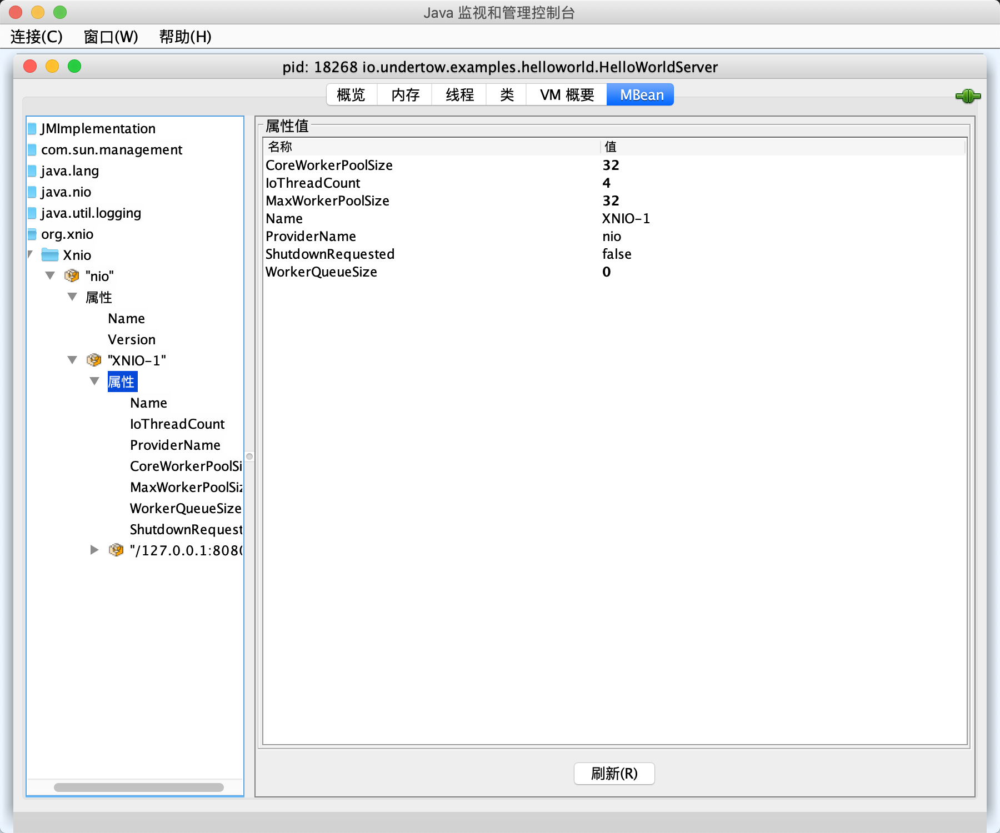

本节分析Undertow的启动过程，由于Undertow使用了`jboss`开源的`xnio`框架作为底层通信库，因此我们首先需要对其有一定了解。

## 启动示例

在`examples`模块下，Undertow的作者编写了很多使用Undertow的示例，我们从最经典的`HelloWorld`示例开始，如下所示：

```java
public class HelloWorldServer {

    public static void main(final String[] args) {
        Undertow server = Undertow.builder()
                .addHttpListener(8080, "localhost")
                .setHandler(new HttpHandler() {
                    @Override
                    public void handleRequest(final HttpServerExchange exchange) throws Exception {
                        exchange.getResponseHeaders().put(Headers.CONTENT_TYPE, "text/plain");
                        exchange.getResponseSender().send("Hello World");
                    }
                }).build();
        server.start();
    }

}
```

使用Undertow最快捷的方式便是通过它的`Builder API`，通过这些API我们可以对`Undertow`的各个方面进行一定的配置。上面的例子中通过`addHttpListener`方法增加了一个监听`localhost:8080`地址的`HTTP`监听器，这个方法可以多次调用，即绑定多个ip地址。接下来调用`setHandler`方法，这个方法的作用是设置一个默认处理器，当请求到来时这个处理器就回对其进行处理。上面的例子中对于任何请求都发送一个`Hello World`响应。最后通过`build()`方法完成最终的构造。

`Builder API`只是对Undertow进行各个功能的配置，还需要调用`server.start()`真正启动服务器。此时，你可以通过命令`curl localhost:8080`向服务器发起一个请求，之后你会收到`Hello World`响应。


## Undertow启动

`Builder API`只是常规的构建器设计模式实现，真正的核心过程为`server.start()`。接下来，让我们一探究竟Undertow是如何启动的。

```java
    public synchronized void start() {
        UndertowLogger.ROOT_LOGGER.infof("starting server: %s", Version.getFullVersionString());
        // 获取Xnio实例
        xnio = Xnio.getInstance(Undertow.class.getClassLoader());
        channels = new ArrayList<>();
        try {
            // 通常为true
            if (internalWorker) {
                // 构造xnio worker
                worker = xnio.createWorker(OptionMap.builder()
                        .set(Options.WORKER_IO_THREADS, ioThreads)
                        .set(Options.CONNECTION_HIGH_WATER, 1000000)
                        .set(Options.CONNECTION_LOW_WATER, 1000000)
                        .set(Options.WORKER_TASK_CORE_THREADS, workerThreads)
                        .set(Options.WORKER_TASK_MAX_THREADS, workerThreads)
                        .set(Options.TCP_NODELAY, true)
                        .set(Options.CORK, true)
                        .addAll(workerOptions)
                        .getMap());
            }

            OptionMap socketOptions = OptionMap.builder()
                    .set(Options.WORKER_IO_THREADS, worker.getIoThreadCount())
                    .set(Options.TCP_NODELAY, true)
                    .set(Options.REUSE_ADDRESSES, true)
                    .set(Options.BALANCING_TOKENS, 1)
                    .set(Options.BALANCING_CONNECTIONS, 2)
                    .set(Options.BACKLOG, 1000)
                    .addAll(this.socketOptions)
                    .getMap();

            OptionMap serverOptions = OptionMap.builder()
                    .set(UndertowOptions.NO_REQUEST_TIMEOUT, 60 * 1000)
                    .addAll(this.serverOptions)
                    .getMap();


            // 初始化缓冲池
            ByteBufferPool buffers = this.byteBufferPool;
            if (buffers == null) {
                buffers = new DefaultByteBufferPool(directBuffers, bufferSize, -1, 4);
            }

            listenerInfo = new ArrayList<>();
            for (ListenerConfig listener : listeners) {
                UndertowLogger.ROOT_LOGGER.debugf("Configuring listener with protocol %s for interface %s and port %s", listener.type, listener.host, listener.port);
                final HttpHandler rootHandler = listener.rootHandler != null ? listener.rootHandler : this.rootHandler;
                // 构建socket选项表
                OptionMap socketOptionsWithOverrides = OptionMap.builder().addAll(socketOptions).addAll(listener.overrideSocketOptions).getMap();

                // AJP Listener
                if (listener.type == ListenerType.AJP) {
                    AjpOpenListener openListener = new AjpOpenListener(buffers, serverOptions);
                    openListener.setRootHandler(rootHandler);

                    final ChannelListener<StreamConnection> finalListener;
                    if (listener.useProxyProtocol) {
                        finalListener = new ProxyProtocolOpenListener(openListener, null, buffers, OptionMap.EMPTY);
                    } else {
                        finalListener = openListener;
                    }
                    ChannelListener<AcceptingChannel<StreamConnection>> acceptListener = ChannelListeners.openListenerAdapter(finalListener);
                    AcceptingChannel<? extends StreamConnection> server = worker.createStreamConnectionServer(new InetSocketAddress(Inet4Address.getByName(listener.host), listener.port), acceptListener, socketOptionsWithOverrides);
                    server.resumeAccepts();
                    channels.add(server);
                    listenerInfo.add(new ListenerInfo("ajp", server.getLocalAddress(), openListener, null, server));
                } else {
                    // HTTP Listener

                    OptionMap undertowOptions = OptionMap.builder().set(UndertowOptions.BUFFER_PIPELINED_DATA, true).addAll(serverOptions).getMap();
                    // 默认false，HTTP/2构建在HTTP或HTTPS之上
                    boolean http2 = serverOptions.get(UndertowOptions.ENABLE_HTTP2, false);
                    if (listener.type == ListenerType.HTTP) {
                        // 构造监听器，处理到来的请求
                        HttpOpenListener openListener = new HttpOpenListener(buffers, undertowOptions);
                        HttpHandler handler = rootHandler;
                        if (http2) {
                            // 如果启用了http2，那么需要处理http升级
                            handler = new Http2UpgradeHandler(handler);
                        }
                        openListener.setRootHandler(handler);
                        final ChannelListener<StreamConnection> finalListener;
                        // 处理代理
                        if (listener.useProxyProtocol) {
                            finalListener = new ProxyProtocolOpenListener(openListener, null, buffers, OptionMap.EMPTY);
                        } else {
                            finalListener = openListener;
                        }

                        ChannelListener<AcceptingChannel<StreamConnection>> acceptListener = ChannelListeners.openListenerAdapter(finalListener);
                        // 创建服务器
                        AcceptingChannel<? extends StreamConnection> server = worker.createStreamConnectionServer(
                                new InetSocketAddress(Inet4Address.getByName(listener.host), listener.port),
                                acceptListener, socketOptionsWithOverrides);
                        server.resumeAccepts();
                        channels.add(server);
                        listenerInfo.add(new ListenerInfo("http", server.getLocalAddress(), openListener, null, server));
                    } else if (listener.type == ListenerType.HTTPS) {
                        // HTTPS Listener

                        OpenListener openListener;

                        HttpOpenListener httpOpenListener = new HttpOpenListener(buffers, undertowOptions);
                        httpOpenListener.setRootHandler(rootHandler);

                        if (http2) {
                            AlpnOpenListener alpn = new AlpnOpenListener(buffers, undertowOptions, httpOpenListener);
                            Http2OpenListener http2Listener = new Http2OpenListener(buffers, undertowOptions);
                            http2Listener.setRootHandler(rootHandler);
                            alpn.addProtocol(Http2OpenListener.HTTP2, http2Listener, 10);
                            alpn.addProtocol(Http2OpenListener.HTTP2_14, http2Listener, 7);
                            openListener = alpn;
                        } else {
                            openListener = httpOpenListener;
                        }

                        UndertowXnioSsl xnioSsl;
                        if (listener.sslContext != null) {
                            xnioSsl = new UndertowXnioSsl(xnio, OptionMap.create(Options.USE_DIRECT_BUFFERS, true), listener.sslContext);
                        } else {
                            OptionMap.Builder builder = OptionMap.builder()
                                    .addAll(socketOptionsWithOverrides);
                            if (!socketOptionsWithOverrides.contains(Options.SSL_PROTOCOL)) {
                                builder.set(Options.SSL_PROTOCOL, "TLSv1.2");
                            }
                            xnioSsl = new UndertowXnioSsl(xnio, OptionMap.create(Options.USE_DIRECT_BUFFERS, true),
                                    JsseSslUtils.createSSLContext(listener.keyManagers, listener.trustManagers, new SecureRandom(), builder.getMap()));
                        }

                        AcceptingChannel<? extends StreamConnection> sslServer;
                        if (listener.useProxyProtocol) {
                            ChannelListener<AcceptingChannel<StreamConnection>> acceptListener = ChannelListeners.openListenerAdapter(
                                    new ProxyProtocolOpenListener(openListener, xnioSsl, buffers, socketOptionsWithOverrides));
                            sslServer = worker.createStreamConnectionServer(new InetSocketAddress(Inet4Address.getByName(listener.host), listener.port),
                                    (ChannelListener) acceptListener, socketOptionsWithOverrides);
                        } else {
                            ChannelListener<AcceptingChannel<StreamConnection>> acceptListener = ChannelListeners.openListenerAdapter(openListener);
                            sslServer = xnioSsl.createSslConnectionServer(worker, new InetSocketAddress(Inet4Address.getByName(listener.host), listener.port),
                                    (ChannelListener) acceptListener, socketOptionsWithOverrides);
                        }

                        sslServer.resumeAccepts();
                        channels.add(sslServer);
                        listenerInfo.add(new ListenerInfo("https", sslServer.getLocalAddress(), openListener, xnioSsl, sslServer));
                    }
                }

            }

        } catch (Exception e) {
            if(internalWorker && worker != null) {
                worker.shutdownNow();
            }
            throw new RuntimeException(e);
        }
    }
```

上面的启动过程相当冗长，因为它综合了默认的启动过程以及使用用户自定义的配置后启动过程。当然这两个过程几乎一样，因此此处只分析默认的启动过程。

启动过程共分为下面几步：

1. 创建`XnioWorker`。
2. 初始化缓冲池。
3. 构造服务器。

### 创建`XnioWorker`

由于Undertow的底层通信框架为`xnio`，因此需要使用它提供的API来进行服务器的构造。关于`xnio`的文档资料比较少，它没有`Netty`社区那么活跃，但是它相对`Netty`来说更加轻量级，同时Undertow本身也是`jboss`的产物，因此使用了自家的`xnio`以及`jboss logging`。

`xnio`的使用示例可以参考[此处](https://github.com/ecki/xnio-samples/blob/master/src/main/java/org/xnio/samples/SimpleEchoServer.java)，大体过程如下所示：

```java
public final class SimpleEchoServer {

    public static void main(String[] args) throws Exception {

        // First define the listener that actually is run on each connection.
        final ChannelListener<ConnectedStreamChannel> readListener = new ChannelListener<ConnectedStreamChannel>() {
            public void handleEvent(ConnectedStreamChannel channel) {
                // read and handle request
            }
        };

        // Create an accept listener.
        final ChannelListener<AcceptingChannel<ConnectedStreamChannel>> acceptListener = new ChannelListener<AcceptingChannel<ConnectedStreamChannel>>() {
            public void handleEvent(
                    final AcceptingChannel<ConnectedStreamChannel> channel) {
                // accept request
        };

        final XnioWorker worker = Xnio.getInstance().createWorker(
                OptionMap.EMPTY);
        // Create the server.
        AcceptingChannel<? extends ConnectedStreamChannel> server = worker
                .createStreamServer(new InetSocketAddress(12345),
                        acceptListener, OptionMap.EMPTY);
        // lets start accepting connections
        server.resumeAccepts();

        System.out.println("Listening on " + server.getLocalAddress());
    }
```

Undertow中创建`XnioWorker`的过程也和上面的过程一样。

```java
xnio = Xnio.getInstance(Undertow.class.getClassLoader());
        channels = new ArrayList<>();
        try {
            // 通常为true
            if (internalWorker) {
                // 构造xnio worker
                worker = xnio.createWorker(OptionMap.builder()
                        // 配置io线程数量，max{cpu cores, 2}
                        .set(Options.WORKER_IO_THREADS, ioThreads)
                        // 活跃连接数高水位
                        .set(Options.CONNECTION_HIGH_WATER, 1000000)
                        // 活跃连接数低水位
                        .set(Options.CONNECTION_LOW_WATER, 1000000)
                        // 核心工作线程数量，默认 ioThreads * 8
                        .set(Options.WORKER_TASK_CORE_THREADS, workerThreads)
                        // 最大工作线程数量
                        .set(Options.WORKER_TASK_MAX_THREADS, workerThreads)
                        .set(Options.TCP_NODELAY, true)
                        .set(Options.CORK, true)
                        .addAll(workerOptions)
                        .getMap());
            }
```

其中`internalWorker`通常情况下都为`true`，除非你使用`Builder`提供了一个自定义的`XnioWorker`。但是更多情况下，我们只需要对其进行一定的配置即可，因此你可以通过调用`Builder#setWorkerOption`方法来完成这个目的，而无需手动创建一个`XnioWorker`。你可以在`org.xnio.Options`类中查看具体可用的配置项。

```java
    public XnioWorker createWorker(OptionMap optionMap) throws IOException, IllegalArgumentException {
        return createWorker(null, optionMap);
    }

    public XnioWorker createWorker(ThreadGroup threadGroup, OptionMap optionMap) throws IOException, IllegalArgumentException {
        return createWorker(threadGroup, optionMap, null);
    }

    public XnioWorker createWorker(final ThreadGroup threadGroup, final OptionMap optionMap, final Runnable terminationTask) throws IOException, IllegalArgumentException {
        final NioXnioWorker worker = new NioXnioWorker(this, threadGroup, optionMap, terminationTask);
        worker.start();
        return worker;
    }

    NioXnioWorker(final NioXnio xnio, final ThreadGroup threadGroup, final OptionMap optionMap, final Runnable terminationTask) throws IOException {
        super(xnio, threadGroup, optionMap, terminationTask);
        final int threadCount;
        // 获取IO线程数
        if (optionMap.contains(Options.WORKER_IO_THREADS)) {
            threadCount = optionMap.get(Options.WORKER_IO_THREADS, 0);
        } else {
            threadCount = Math.max(optionMap.get(Options.WORKER_READ_THREADS, 1), optionMap.get(Options.WORKER_WRITE_THREADS, 1));
        }
        if (threadCount < 0) {
            throw log.optionOutOfRange("WORKER_IO_THREADS");
        }
        final long workerStackSize = optionMap.get(Options.STACK_SIZE, 0L);
        if (workerStackSize < 0L) {
            throw log.optionOutOfRange("STACK_SIZE");

        }
        final String workerName = getName();
        WorkerThread[] workerThreads;
        workerThreads = new WorkerThread[threadCount];
        final boolean markWorkerThreadAsDaemon = optionMap.get(Options.THREAD_DAEMON, false);
        boolean ok = false;
        try {
            // 创建IO工作线程
            for (int i = 0; i < threadCount; i++) {
                final WorkerThread workerThread = new WorkerThread(this, xnio.mainSelectorCreator.open(), String.format("%s I/O-%d", workerName, Integer.valueOf(i + 1)), threadGroup, workerStackSize, i);
                // Mark as daemon if the Options.THREAD_DAEMON has been set
                if (markWorkerThreadAsDaemon) {
                    workerThread.setDaemon(true);
                }
                workerThreads[i] = workerThread;
            }
            // 创建accpet线程
            acceptThread = new WorkerThread(this, xnio.mainSelectorCreator.open(), String.format("%s Accept", workerName), threadGroup, workerStackSize, threadCount);
            if (markWorkerThreadAsDaemon) {
                acceptThread.setDaemon(true);
            }
            ok = true;
        } finally {
            if (! ok) {
                for (WorkerThread worker : workerThreads) {
                    if (worker != null) safeClose(worker.getSelector());
                }
            }
        }
        this.workerThreads = workerThreads;
        // 注册MXBean
        mbeanHandle = NioXnio.register(new XnioWorkerMXBean() {
            public String getProviderName() {
                return "nio";
            }

            public String getName() {
                return workerName;
            }

            public boolean isShutdownRequested() {
                return isShutdown();
            }

            public int getCoreWorkerPoolSize() {
                return NioXnioWorker.this.getCoreWorkerPoolSize();
            }

            public int getMaxWorkerPoolSize() {
                return NioXnioWorker.this.getMaxWorkerPoolSize();
            }

            public int getIoThreadCount() {
                return threadCount;
            }

            public int getWorkerQueueSize() {
                return NioXnioWorker.this.getWorkerQueueSize();
            }
        });
    }

```

`XnioWorker`的总体创建过程如上所示，共分为如下几步：

1. 调用`super()`
2. 获取配置信息
3. 创建IO线程及`accpet`线程
4. 注册`MXBean`

#### super()

`NioXnioWorker`类是`XnioWorker`的具体实现类，在`XnioWorker`的构造中，也做了一些通用的准备工作，如下所示：

```java
    protected XnioWorker(final Xnio xnio, final ThreadGroup threadGroup, final OptionMap optionMap, final Runnable terminationTask) {
        this.xnio = xnio;
        this.terminationTask = terminationTask;
        final SecurityManager sm = System.getSecurityManager();
        if (sm != null) {
            sm.checkPermission(CREATE_WORKER_PERMISSION);
        }
        String workerName = optionMap.get(Options.WORKER_NAME);
        if (workerName == null) {
            workerName = "XNIO-" + seq.getAndIncrement();
        }
        name = workerName;
        // 创建任务队列
        taskQueue = new LinkedBlockingQueue<Runnable>();
        // 获取核心工作线程数量
        this.coreSize = optionMap.get(Options.WORKER_TASK_CORE_THREADS, 4);
        // 获取工作线程是否被标记为daemon
        final boolean markThreadAsDaemon = optionMap.get(Options.THREAD_DAEMON, false);
        // 获取最大工作线程数量
        final int threadCount = optionMap.get(Options.WORKER_TASK_MAX_THREADS, 16);
        // 创建线程池
        taskPool = new TaskPool(
            threadCount, // ignore core threads setting, always fill to max
            threadCount,
            optionMap.get(Options.WORKER_TASK_KEEPALIVE, 60000), TimeUnit.MILLISECONDS,
            taskQueue,
            new WorkerThreadFactory(threadGroup, optionMap, markThreadAsDaemon),
            new ThreadPoolExecutor.AbortPolicy());
    }
```

注释中对其构造过程已经做了较为详细的描述，因此不多赘述。

#### 创建IO线程及accpet线程

`WorkerThread`实现了`java.util.concurrent.Executor`接口，同时`xnio`还允许它执行定时任务，它主要用于处理IO任务，例如`accpet`线程负责接受来自客户端的请求并创建连接。

`WorkerThread`的构造过程非常简单，在此处唯一重要的一点是构造方法传入了一个`java.nio.channels.Selector`实例，以便每个线程都可以检测是否有IO事件发生。

让我们看一下其`run()`方法的实现：

```java
    public void run() {
        final Selector selector = this.selector;
        try {
            log.tracef("Starting worker thread %s", this);
            final Object lock = workLock;
            final Queue<Runnable> workQueue = selectorWorkQueue;
            final TreeSet<TimeKey> delayQueue = delayWorkQueue;
            log.debugf("Started channel thread '%s', selector %s", currentThread().getName(), selector);
            Runnable task;
            Iterator<TimeKey> iterator;
            long delayTime = Long.MAX_VALUE;
            Set<SelectionKey> selectedKeys;
            SelectionKey[] keys = new SelectionKey[16];
            int oldState;
            int keyCount;
            // 死循环，除非被关闭，否则一直运行
            for (;;) {
                // Run all tasks
                do {
                    // 需要对workQueue和delayQueue进行操作，因此需要加锁，以防其他线程提交任务
                    synchronized (lock) {
                        // 从工作队列中提取任务
                        task = workQueue.poll();
                        // 如果工作队列中没有任务，那么检查定时任务队列是否有可执行任务
                        if (task == null) {
                            iterator = delayQueue.iterator();
                            delayTime = Long.MAX_VALUE;
                            if (iterator.hasNext()) {
                                final long now = nanoTime();
                                do {
                                    final TimeKey key = iterator.next();
                                    if (key.deadline <= (now - START_TIME)) {
                                        workQueue.add(key.command);
                                        iterator.remove();
                                    } else {
                                        delayTime = key.deadline - (now - START_TIME);
                                        // the rest are in the future
                                        break;
                                    }
                                } while (iterator.hasNext());
                            }
                            task = workQueue.poll();
                        }
                    }
                    // 安全执行任务，防止任务出现异常导致线程crash
                    safeRun(task);
                } while (task != null);
                // all tasks have been run
                oldState = state;
                // 如果当前线程被关闭
                if ((oldState & SHUTDOWN) != 0) {
                    synchronized (lock) {
                        keyCount = selector.keys().size();
                        state = keyCount | SHUTDOWN;
                        // 当前所有任务执行完成，结束线程
                        if (keyCount == 0 && workQueue.isEmpty()) {
                            // no keys or tasks left, shut down (delay tasks are discarded)
                            return;
                        }
                    }
                    // 获取当前所有可处理的事件
                    synchronized (selector) {
                        final Set<SelectionKey> keySet = selector.keys();
                        synchronized (keySet) {
                            keys = keySet.toArray(keys);
                            Arrays.fill(keys, keySet.size(), keys.length, null);
                        }
                    }
                    // shut em down
                    // 处理事件，并关闭相应的通道
                    for (int i = 0; i < keys.length; i++) {
                        final SelectionKey key = keys[i];
                        if (key == null) break; //end of list
                        keys[i] = null;
                        final NioHandle attachment = (NioHandle) key.attachment();
                        if (attachment != null) {
                            safeClose(key.channel());
                            attachment.forceTermination();
                        }
                    }
                    Arrays.fill(keys, 0, keys.length, null);
                }
                // perform select
                // 如果当前线程状态正常，执行select操作
                try {
                    // 再次检测线程状态，如果为SHUTDOWN，那么只执行一次selectNow()
                    if ((oldState & SHUTDOWN) != 0) {
                        selectorLog.tracef("Beginning select on %s (shutdown in progress)", selector);
                        selector.selectNow();
                    } else if (delayTime == Long.MAX_VALUE) {
                        // 当前没有定时任务
                        selectorLog.tracef("Beginning select on %s", selector);
                        polling = true;
                        try {
                            // 如果工作队列中存在任务需要处理，那么只执行一次selectNow()
                            if (workQueue.peek() != null) {
                                selector.selectNow();
                            } else {
                                // 否则执行select()，等待事件到来
                                selector.select();
                            }
                        } finally {
                            polling = false;
                        }
                    } else {
                        // 如果有定时任务即将执行，那么只select指定时间
                        final long millis = 1L + delayTime / 1000000L;
                        selectorLog.tracef("Beginning select on %s (with timeout)", selector);
                        polling = true;
                        try {
                            if (workQueue.peek() != null) {
                                selector.selectNow();
                            } else {
                                selector.select(millis);
                            }
                        } finally {
                            polling = false;
                        }
                    }
                } catch (CancelledKeyException ignored) {
                    // Mac and other buggy implementations sometimes spits these out
                    selectorLog.trace("Spurious cancelled key exception");
                } catch (IOException e) {
                    selectorLog.selectionError(e);
                    // hopefully transient; should never happen
                }
                selectorLog.tracef("Selected on %s", selector);
                // iterate the ready key set
                // 获取当前所有可处理事件
                synchronized (selector) {
                    selectedKeys = selector.selectedKeys();
                    synchronized (selectedKeys) {
                        // copy so that handlers can safely cancel keys
                        keys = selectedKeys.toArray(keys);
                        Arrays.fill(keys, selectedKeys.size(), keys.length, null);
                        selectedKeys.clear();
                    }
                }
                // 处理事件
                for (int i = 0; i < keys.length; i++) {
                    final SelectionKey key = keys[i];
                    if (key == null) break; //end of list
                    keys[i] = null;
                    final int ops;
                    try {
                        ops = key.interestOps();
                        if (ops != 0) {
                            selectorLog.tracef("Selected key %s for %s", key, key.channel());
                            // 获取对应的处理器，并执行
                            final NioHandle handle = (NioHandle) key.attachment();
                            if (handle == null) {
                                cancelKey(key);
                            } else {
                                handle.handleReady(key.readyOps());
                            }
                        }
                    } catch (CancelledKeyException ignored) {
                        selectorLog.tracef("Skipping selection of cancelled key %s", key);
                    } catch (Throwable t) {
                        selectorLog.tracef(t, "Unexpected failure of selection of key %s", key);
                    }
                }
                // all selected keys invoked; loop back to run tasks
            }
        } finally {
            log.tracef("Shutting down channel thread \"%s\"", this);
            safeClose(selector);
            getWorker().closeResource();
        }
    }

```

上面的`run()`方法虽然代码复杂，但是逻辑总体而言比较清晰。如果你了解过`Netty`的`NioEventLoop`的实现，那么对上述代码一定会感觉非常熟悉。总结一下`WorkerThread`共干了两件事，第一个为执行提交给它的任务，注意它实现了`Executor`接口；第二个为调用`Selector#select`方法，检查IO事件并处理。

注意`final NioHandle handle = (NioHandle) key.attachment();`这一句代码，在之后服务器的构造过程中，会设置相应的`attachment()`以便进行事件的处理。

#### 注册MXBean

最后则是注册`MXBean`，提供一个监视`xnio`内部情况的途径。

```java
    protected static Closeable register(XnioWorkerMXBean workerMXBean) {
        return Xnio.register(workerMXBean);
    }

        protected static Closeable register(XnioWorkerMXBean workerMXBean) {
        try {
            final ObjectName objectName = new ObjectName("org.xnio", ObjectProperties.properties(ObjectProperties.property("type", "Xnio"), ObjectProperties.property("provider", ObjectName.quote(workerMXBean.getProviderName())), ObjectProperties.property("worker", ObjectName.quote(workerMXBean.getName()))));
            MBeanHolder.MBEAN_SERVER.registerMBean(workerMXBean, objectName);
            return new MBeanCloseable(objectName);
        } catch (Throwable ignored) {
            return IoUtils.nullCloseable();
        }
    }
```

如果你想要了解`MXBean`的更多信息，请自行查阅资料。此处只介绍一下如何通过`MXBean`查看相应的信息。

1. 运行`HelloWorldServer`示例
2. 打开`Terminal`，并输入`jconsole`命令
3. 选择`HelloWorldServer`连接，并选择`MBean标签`

如下所示：



#### 启动`XnioWorker`

启动`XnioWorker`的过程很简单，只是启动所有的工作线程以及监听线程。如下所示：

```java
    void start() {
        for (WorkerThread worker : workerThreads) {
            openResourceUnconditionally();
            worker.start();
        }
        openResourceUnconditionally();
        acceptThread.start();
    }
```

### 初始化缓冲池

`xnio`并没有像`Netty`那样重新设计了一套缓冲区的API，而是依然使用jdk自带的nio缓冲区，因此Undertow也不能从中获取到一些编码的好处。由于jdk并没有提供缓冲池相关的工具类，在此处Undertow实现了一个非常简易的池化缓冲区，以便重复利用开辟出来的缓冲区。

除此以外，大多情况下直接缓冲区是最常用的，由于直接缓冲区并不由java堆管理，因此需要提供一个资源泄漏检测器，以防编码错误带来的内存泄漏问题。

另外，`xnio`内部开启了很多线程运行，因此提供一个`ThreadLocal`来存储一些缓冲区，可以让性能得到进一步提高。

```java
    // 初始化缓冲池
    ByteBufferPool buffers = this.byteBufferPool;
    if (buffers == null) {
        buffers = new DefaultByteBufferPool(directBuffers, bufferSize, -1, 4);
    }
```

与`XnioWorker`一样，你也可以自定义一个缓冲池并通过`Builder API`传入。缓冲区大小对应用程序性能有很大影响。对于服务器，理想大小通常为16k，因为这通常是可以通过`write()`操作写出的最大数据量（取决于操作系统的网络设置）。较小的系统可能希望使用较小的缓冲区来节省内存。

```java
        private Builder() {
            ioThreads = Math.max(Runtime.getRuntime().availableProcessors(), 2);
            workerThreads = ioThreads * 8;
            long maxMemory = Runtime.getRuntime().maxMemory();
            //smaller than 64mb of ram we use 512b buffers
            if (maxMemory < 64 * 1024 * 1024) {
                //use 512b buffers
                directBuffers = false;
                bufferSize = 512;
            } else if (maxMemory < 128 * 1024 * 1024) {
                //use 1k buffers
                directBuffers = true;
                bufferSize = 1024;
            } else {
                //use 16k buffers for best performance
                //as 16k is generally the max amount of data that can be sent in a single write() call
                directBuffers = true;
                bufferSize = 1024 * 16 - 20; //the 20 is to allow some space for protocol headers, see UNDERTOW-1209
            }
        }
```

在`Builder`的构造方法中，会根据机器的硬件条件选择合适的默认缓冲区大小。


### 构造服务器

```java
    UndertowLogger.ROOT_LOGGER.debugf("Configuring listener with protocol %s for interface %s and port %s", listener.type, listener.host, listener.port);
    final HttpHandler rootHandler = listener.rootHandler != null ? listener.rootHandler : this.rootHandler;
    // 构建socket选项表
    OptionMap socketOptionsWithOverrides = OptionMap.builder().addAll(socketOptions).addAll(listener.overrideSocketOptions).getMap();

    // AJP Listener
    if (listener.type == ListenerType.AJP) {
        AjpOpenListener openListener = new AjpOpenListener(buffers, serverOptions);
        openListener.setRootHandler(rootHandler);

        final ChannelListener<StreamConnection> finalListener;
        if (listener.useProxyProtocol) {
            finalListener = new ProxyProtocolOpenListener(openListener, null, buffers, OptionMap.EMPTY);
        } else {
            finalListener = openListener;
        }
        ChannelListener<AcceptingChannel<StreamConnection>> acceptListener = ChannelListeners.openListenerAdapter(finalListener);
        AcceptingChannel<? extends StreamConnection> server = worker.createStreamConnectionServer(new InetSocketAddress(Inet4Address.getByName(listener.host), listener.port), acceptListener, socketOptionsWithOverrides);
        server.resumeAccepts();
        channels.add(server);
        listenerInfo.add(new ListenerInfo("ajp", server.getLocalAddress(), openListener, null, server));
    } else {
        // HTTP Listener

        OptionMap undertowOptions = OptionMap.builder().set(UndertowOptions.BUFFER_PIPELINED_DATA, true).addAll(serverOptions).getMap();
        // 默认false，HTTP/2构建在HTTP或HTTPS之上
        boolean http2 = serverOptions.get(UndertowOptions.ENABLE_HTTP2, false);
        if (listener.type == ListenerType.HTTP) {
            // 构造监听器，处理到来的请求
            HttpOpenListener openListener = new HttpOpenListener(buffers, undertowOptions);
            HttpHandler handler = rootHandler;
            if (http2) {
                // 如果启用了http2，那么需要处理http升级
                handler = new Http2UpgradeHandler(handler);
            }
            openListener.setRootHandler(handler);
            final ChannelListener<StreamConnection> finalListener;
            // 处理代理
            if (listener.useProxyProtocol) {
                finalListener = new ProxyProtocolOpenListener(openListener, null, buffers, OptionMap.EMPTY);
            } else {
                finalListener = openListener;
            }

            ChannelListener<AcceptingChannel<StreamConnection>> acceptListener = ChannelListeners.openListenerAdapter(finalListener);
            // 创建服务器
            AcceptingChannel<? extends StreamConnection> server = worker.createStreamConnectionServer(
                new InetSocketAddress(Inet4Address.getByName(listener.host), listener.port),
                acceptListener, socketOptionsWithOverrides);
            server.resumeAccepts();
            channels.add(server);
            listenerInfo.add(new ListenerInfo("http", server.getLocalAddress(), openListener, null, server));
        } else if (listener.type == ListenerType.HTTPS) {
            // HTTPS Listener

            OpenListener openListener;

            HttpOpenListener httpOpenListener = new HttpOpenListener(buffers, undertowOptions);
            httpOpenListener.setRootHandler(rootHandler);

            if (http2) {
                AlpnOpenListener alpn = new AlpnOpenListener(buffers, undertowOptions, httpOpenListener);
                Http2OpenListener http2Listener = new Http2OpenListener(buffers, undertowOptions);
                http2Listener.setRootHandler(rootHandler);
                alpn.addProtocol(Http2OpenListener.HTTP2, http2Listener, 10);
                alpn.addProtocol(Http2OpenListener.HTTP2_14, http2Listener, 7);
                openListener = alpn;
            } else {
                openListener = httpOpenListener;
            }

            UndertowXnioSsl xnioSsl;
            if (listener.sslContext != null) {
                xnioSsl = new UndertowXnioSsl(xnio, OptionMap.create(Options.USE_DIRECT_BUFFERS, true), listener.sslContext);
            } else {
                OptionMap.Builder builder = OptionMap.builder()
                    .addAll(socketOptionsWithOverrides);
                if (!socketOptionsWithOverrides.contains(Options.SSL_PROTOCOL)) {
                builder.set(Options.SSL_PROTOCOL, "TLSv1.2");
                }
                xnioSsl = new UndertowXnioSsl(xnio, OptionMap.create(Options.USE_DIRECT_BUFFERS, true),
                    JsseSslUtils.createSSLContext(listener.keyManagers, listener.trustManagers, new SecureRandom(), builder.getMap()));
            }

            AcceptingChannel<? extends StreamConnection> sslServer;
            if (listener.useProxyProtocol) {
                ChannelListener<AcceptingChannel<StreamConnection>> acceptListener = ChannelListeners.openListenerAdapter(
                    new ProxyProtocolOpenListener(openListener, xnioSsl, buffers, socketOptionsWithOverrides));
                sslServer = worker.createStreamConnectionServer(new InetSocketAddress(Inet4Address.getByName(listener.host), listener.port),
                    (ChannelListener) acceptListener, socketOptionsWithOverrides);
            } else {
                ChannelListener<AcceptingChannel<StreamConnection>> acceptListener = ChannelListeners.openListenerAdapter(openListener);
                sslServer = xnioSsl.createSslConnectionServer(worker, new InetSocketAddress(Inet4Address.getByName(listener.host), listener.port),
                    (ChannelListener) acceptListener, socketOptionsWithOverrides);
            }

            sslServer.resumeAccepts();
            channels.add(sslServer);
            listenerInfo.add(new ListenerInfo("https", sslServer.getLocalAddress(), openListener, xnioSsl, sslServer));
        }
    }
```

Undertow支持`AJP`， `HTTP`， `HTTPS`以及`HTTP2`四种协议。由于本节主要目标是分析Undertow的启动过程，因此选择最简单的`HTTP`协议分析。当然，其他协议大体也相似，只多了一些协议特有的处理过程，例如`HTTPS`增加一层`SSL`协议处理。

```java
    OptionMap undertowOptions = OptionMap.builder().set(UndertowOptions.BUFFER_PIPELINED_DATA, true).addAll(serverOptions).getMap();
    // 默认false，HTTP/2构建在HTTP或HTTPS之上
    boolean http2 = serverOptions.get(UndertowOptions.ENABLE_HTTP2, false);
    // 构造监听器，处理到来的请求
    HttpOpenListener openListener = new HttpOpenListener(buffers, undertowOptions);
    HttpHandler handler = rootHandler;
    if (http2) {
        // 如果启用了http2，那么需要处理http升级
        handler = new Http2UpgradeHandler(handler);
    }
    openListener.setRootHandler(handler);
    final ChannelListener<StreamConnection> finalListener;
    // 处理代理
    if (listener.useProxyProtocol) {
        finalListener = new ProxyProtocolOpenListener(openListener, null, buffers, OptionMap.EMPTY);
    } else {
        finalListener = openListener;
    }

    ChannelListener<AcceptingChannel<StreamConnection>> acceptListener = ChannelListeners.openListenerAdapter(finalListener);
    // 创建服务器
    AcceptingChannel<? extends StreamConnection> server = worker.createStreamConnectionServer(
                new InetSocketAddress(Inet4Address.getByName(listener.host), listener.port),
                acceptListener, socketOptionsWithOverrides);
    server.resumeAccepts();
    channels.add(server);
    listenerInfo.add(new ListenerInfo("http", server.getLocalAddress(), openListener, null, server));
```

其中核心代码为`HttpOpenListener`, `openListener.setRootHandler(handler)`, `createStreamConnectionServer`这几个方法。

`HttpOpenListener`类的声明如下所示：

```java
public final class HttpOpenListener implements ChannelListener<StreamConnection>, DelegateOpenListener
```

它实现了`ChannelListener`接口，这个接口是`xnio`创建服务器要求提供的。当请求到来时，将会交由它进行处理。

而`HttpHandler`则是由用户提供，用于提供自定义的业务逻辑等。当`ChannelListener`进行了预处理后，会将解析后的HTTP请求交由`HttpHandler`处理。在之前的`HelloWorldServer`示例中，对于所有的请求都返回`HelloWorld`响应。

上述代码大部分做的都是准备工作，真正构建服务器的代码为`createStreamConnectionServer`方法。

```java
~ XnioWorker.java

    public AcceptingChannel<StreamConnection> createStreamConnectionServer(SocketAddress bindAddress, ChannelListener<? super AcceptingChannel<StreamConnection>> acceptListener, OptionMap optionMap) throws IOException {
        if (bindAddress == null) {
            throw msg.nullParameter("bindAddress");
        }
        if (bindAddress instanceof InetSocketAddress) {
            return createTcpConnectionServer((InetSocketAddress) bindAddress, acceptListener, optionMap);
        } else if (bindAddress instanceof LocalSocketAddress) {
            return createLocalStreamConnectionServer((LocalSocketAddress) bindAddress, acceptListener, optionMap);
        } else {
            throw msg.badSockType(bindAddress.getClass());
        }
    }


~ NioXnioWorker.java

    protected AcceptingChannel<StreamConnection> createTcpConnectionServer(final InetSocketAddress bindAddress, final ChannelListener<? super AcceptingChannel<StreamConnection>> acceptListener, final OptionMap optionMap) throws IOException {
        checkShutdown();
        boolean ok = false;
        // 开启一个ServerSocketChannel
        final ServerSocketChannel channel = ServerSocketChannel.open();
        try {
            // 设置接收缓冲区
            if (optionMap.contains(Options.RECEIVE_BUFFER)) channel.socket().setReceiveBufferSize(optionMap.get(Options.RECEIVE_BUFFER, -1));
            // 设置复用地址
            channel.socket().setReuseAddress(optionMap.get(Options.REUSE_ADDRESSES, true));
            // 开启非阻塞模式
            channel.configureBlocking(false);
            // 绑定本地地址
            if (optionMap.contains(Options.BACKLOG)) {
                channel.socket().bind(bindAddress, optionMap.get(Options.BACKLOG, 128));
            } else {
                channel.socket().bind(bindAddress);
            }
            if (false) {
                final NioTcpServer server = new NioTcpServer(this, channel, optionMap);
                server.setAcceptListener(acceptListener);
                ok = true;
                return server;
            } else {
                // 创建服务器
                final QueuedNioTcpServer server = new QueuedNioTcpServer(this, channel, optionMap);
                server.setAcceptListener(acceptListener);
                ok = true;
                return server;
            }
        } finally {
            if (! ok) {
                IoUtils.safeClose(channel);
            }
        }
    }
```

在`HelloWorldServer`示例中我们提供的为`InetSocketAddress`类型的地址，因此会调用`createTcpConnectionServer`方法。`createTcpConnectionServer`主要包含下面几步：

1. 开启一个`ServerSocketChannel`
2. 配置`socket`
3. 创建`TCP`服务器

#### 配置`socket`

- SO_RCVBUF： 配置接受缓冲区以及TCP接受窗口大小
- SO_REUSEADDR： 当TCP连接结束后，无需等待`TIME_WAIT`时间后才能重新使用。查看[此处](https://www.jianshu.com/p/141aa1c41f15)了解更多信息
- BACKLOG： 配置全连接队列大小，查看[此处](https://www.jianshu.com/p/7fde92785056)了解更多信息

最后绑定给定的本机地址，监听客户端的连接。

#### 创建`TCP`服务器

```java
final QueuedNioTcpServer server = new QueuedNioTcpServer(this, channel, optionMap);
server.setAcceptListener(acceptListener);
```

由于`HTTP`协议构建于`TCP`协议之上，因此创建服务器时选择JDK提供的TCP工具类。`QueuedNioTcpServer`的构造方法如下所示：

```java
    QueuedNioTcpServer(final NioXnioWorker worker, final ServerSocketChannel channel, final OptionMap optionMap) throws IOException {
        super(worker);
        this.channel = channel;
        this.thread = worker.getAcceptThread();
        final WorkerThread[] workerThreads = worker.getAll();
        final List<BlockingQueue<SocketChannel>> acceptQueues = new ArrayList<>(workerThreads.length);
        for (int i = 0; i < workerThreads.length; i++) {
            acceptQueues.add(i, new LinkedBlockingQueue<SocketChannel>());
        }
        this.acceptQueues = acceptQueues;
        socket = channel.socket();
        // 延迟配置socket
        if (optionMap.contains(Options.SEND_BUFFER)) {
            final int sendBufferSize = optionMap.get(Options.SEND_BUFFER, DEFAULT_BUFFER_SIZE);
            if (sendBufferSize < 1) {
                throw log.parameterOutOfRange("sendBufferSize");
            }
            sendBufferUpdater.set(this, sendBufferSize);
        }
        if (optionMap.contains(Options.KEEP_ALIVE)) {
            keepAliveUpdater.lazySet(this, optionMap.get(Options.KEEP_ALIVE, false) ? 1 : 0);
        }
        if (optionMap.contains(Options.TCP_OOB_INLINE)) {
            oobInlineUpdater.lazySet(this, optionMap.get(Options.TCP_OOB_INLINE, false) ? 1 : 0);
        }
        if (optionMap.contains(Options.TCP_NODELAY)) {
            tcpNoDelayUpdater.lazySet(this, optionMap.get(Options.TCP_NODELAY, false) ? 1 : 0);
        }
        if (optionMap.contains(Options.READ_TIMEOUT)) {
            readTimeoutUpdater.lazySet(this, optionMap.get(Options.READ_TIMEOUT, 0));
        }
        if (optionMap.contains(Options.WRITE_TIMEOUT)) {
            writeTimeoutUpdater.lazySet(this, optionMap.get(Options.WRITE_TIMEOUT, 0));
        }
        final int highWater;
        final int lowWater;
        if (optionMap.contains(Options.CONNECTION_HIGH_WATER) || optionMap.contains(Options.CONNECTION_LOW_WATER)) {
            highWater = optionMap.get(Options.CONNECTION_HIGH_WATER, Integer.MAX_VALUE);
            lowWater = optionMap.get(Options.CONNECTION_LOW_WATER, highWater);
            if (highWater <= 0) {
                throw badHighWater();
            }
            if (lowWater <= 0 || lowWater > highWater) {
                throw badLowWater(highWater);
            }
            final long highLowWater = (long) highWater << CONN_HIGH_BIT | (long) lowWater << CONN_LOW_BIT;
            connectionStatusUpdater.lazySet(this, highLowWater);
        } else {
            highWater = Integer.MAX_VALUE;
            lowWater = Integer.MAX_VALUE;
            connectionStatusUpdater.lazySet(this, CONN_LOW_MASK | CONN_HIGH_MASK);
        }
        // 注册到selector
        final SelectionKey key = thread.registerChannel(channel);
        handle = new QueuedNioTcpServerHandle(this, thread, key, highWater, lowWater);
        key.attach(handle);
        mbeanHandle = NioXnio.register(new XnioServerMXBean() {
            public String getProviderName() {
                return "nio";
            }

            public String getWorkerName() {
                return worker.getName();
            }

            public String getBindAddress() {
                return String.valueOf(getLocalAddress());
            }

            public int getConnectionCount() {
                return handle.getConnectionCount();
            }

            public int getConnectionLimitHighWater() {
                return getHighWater(connectionStatus);
            }

            public int getConnectionLimitLowWater() {
                return getLowWater(connectionStatus);
            }
        });
    }
```

构造过程主要如下：

1. 从参数中获取必要的组件
2. 获取socket配置，延迟设置
3. 将`Channel`注册到`Selector`上

其中第三步较为关键，具体代码如下：

```java
    final SelectionKey key = thread.registerChannel(channel);
    handle = new QueuedNioTcpServerHandle(this, thread, key, highWater, lowWater);
    key.attach(handle);
```

它将给定的`ServerSocketChannel`注册到`Selector`上，并且构造一个处理器，将其作为`SelectionKey`的`attachment`以供接受客户端连接时使用。

```java
final class QueuedNioTcpServerHandle extends NioHandle implements ChannelClosed {

    private final QueuedNioTcpServer server;

    QueuedNioTcpServerHandle(final QueuedNioTcpServer server, final WorkerThread workerThread, final SelectionKey key, final int highWater, final int lowWater) {
        super(workerThread, key);
        this.server = server;
    }

    void handleReady(final int ops) {
        server.handleReady();
    }

    // ......
}
```

它的`handleReady()`方法事实上只是调用了`QueuedNioTcpServer#handleReady()`方法，交由其进行处理。

### 监听连接

当服务器创建完成后，需要设置其开始监听连接。因为在创建服务器的时候，设置了`ServerSocketChannel`的`ops`为`0`而不是`ACCEPT`，延迟设置也是因为必要的组件还未准备完成。具体如下：

```java
    server.resumeAccepts();

    public void resumeAccepts() {
        synchronized (this) {
            suspended = false;
            // 新增ops  ACCEPT
            handle.resume(SelectionKey.OP_ACCEPT);
        }
    }

    void resume(final int ops) {
        try {
            if (! allAreSet(selectionKey.interestOps(), ops)) {
                workerThread.setOps(selectionKey, ops);
            }
        } catch (CancelledKeyException ignored) {}
    }

    void setOps(final SelectionKey key, final int ops) {
        if (currentThread() == this) {
            try {
                key.interestOps(key.interestOps() | ops);
            } catch (CancelledKeyException ignored) {}
        } else if (OLD_LOCKING) {
            final SynchTask task = new SynchTask();
            queueTask(task);
            try {
                // Prevent selector from sleeping until we're done!
                selector.wakeup();
                key.interestOps(key.interestOps() | ops);
            } catch (CancelledKeyException ignored) {
            } finally {
                task.done();
            }
        } else {
            try {
                key.interestOps(key.interestOps() | ops);
                // 唤醒线程
                if (polling) selector.wakeup();
            } catch (CancelledKeyException ignored) {
            }
        }
    }
```

上述过程其实最终起作用的代码只有`key.interestOps(key.interestOps() | ops);`。由于设置`ops`的线程不是`WorkerThread`，在之前`WorkerThread#run()`方法中我们可以发现，当任务队列中不存在普通任务以及定时任务时，那么它将会调用`Selector#select()`方法，这个方法是一个阻塞方法，线程因此也会一直阻塞直到有`I/O`事件出现或者被外界中断，在此处如果`polling`字段为`true`，即线程目前正处于阻塞轮询阶段，那么将调用`selector.wakeup()`方法唤醒，并重新调用`Selector#select()`方法以检查`ACCEPT`事件。

至此，`Undertow`已经完成了启动过程。
