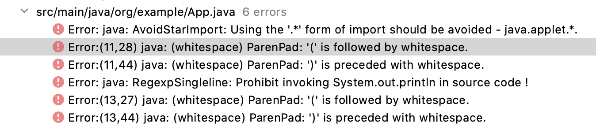

# checkstyle

在开发公司项目或者多人协作开发时，最常遇到的问题之一便是开发者编码规范的不统一，这会导致源代码显得比较杂乱，不便于维护。虽然存在alibaba开源的代码规范插件，`checkstyle`本身也可以配置为IDE的插件，但是强制要求开发者安装插件并不是一件让人开心的事情。同时，插件的强制性并不高，更多程度上只是起到了一个提醒的作用，因此比较好的方式便是在每次代码提交时都能够进行检查，配合CI流程形成一套完备的机制。

## 与maven整合

`checkstyle`提供了一系列的`maven`插件以便配合`maven`使用，如下所示：

```xml
    <plugin>
        <artifactId>maven-checkstyle-plugin</artifactId>
        <version>${maven-checkstyle-plugin.version}</version>
        <executions>
            <execution>
                <id>validate</id>
                <phase>process-sources</phase>
                <goals>
                    <goal>check</goal>
                </goals>
            </execution>
        </executions>
    </plugin>
```

同时，你需要提供一个描述代码规范的配置文件，`checkstyle`插件默认会寻找`/config/checkstyle/checkstyle.xml`文件，你可以自定义此文件的位置。

如果想要自定义一套代码规范是一件较为辛苦的事情，但是可以对细节部分有着绝对的控制。你可以在[checkstyle官网](https://checkstyle.sourceforge.io)文档中的`Check`目录下查看`checkstyle`提供的一些可选项。

## 快速体验

`checkstyle`官网也提供了`Google Java Style`配置文件，可以直接通过引入此文件快速体验checkstyle带来的好处。查看[google_checks.xml](https://github.com/checkstyle/checkstyle/blob/master/src/main/resources/google_checks.xml)获取具体的配置内容。关于`Google Java Style`的具体约束以及原因，请查看[Google Java Style Guide](https://google.github.io/styleguide/javaguide.html)。


下面是一个非常简单的`checkstyle`配置文件：

```xml
<?xml version="1.0" encoding="UTF-8"?>
<!DOCTYPE module PUBLIC
        "-//Puppy Crawl//DTD Check Configuration 1.3//EN"
        "http://checkstyle.org/dtds/configuration_1_3.dtd">
<module name="Checker">

    <property name="localeLanguage" value="en"/>

    <module name="RegexpSingleline">
        <property name="format" value="System\.out\.println"/>
        <property name="message" value="Prohibit invoking System.out.println in source code !"/>
    </module>

    <module name="TreeWalker">
        <module name="AvoidStarImport"/>
        <module name="GenericWhitespace"/>
        <module name="WhitespaceAfter"/>
        <module name="WhitespaceAround"/>
        <module name="MethodParamPad"/>
        <module name="ParenPad"/>
    </module>
</module>
```

你可以在`maven-checkstyle-plugin`插件中配置`<configLocation>`元素，指定配置文件的位置，例如下面指定配置文件处于根目录下，名称为`checkStyle.xml`。

```xml
    <plugin>
        <artifactId>maven-checkstyle-plugin</artifactId>
        <version>${maven-checkstyle-plugin.version}</version>
        <configuration>
            <configLocation>${basedir}/checkStyle.xml</configLocation>
```

通过`quickstart`默认创建的App类如下所示，如下所示：

```java
package org.example;

/**
 * Hello world!
 *
 */
public class App 
{
    public static void main( String[] args )
    {
        System.out.println( "Hello World!" );
    }
}
```

执行`mvn compile`命令，此时便会执行`checkstyle`检查，结果如下所示：



