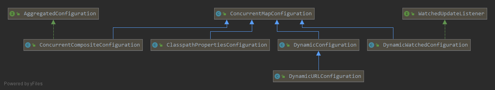
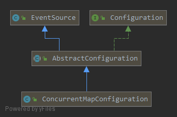

archaius是netflix开源的动态属性配置框架，基于apache commons configuration, 提供在运行时获取配置值的功能。

# Apache Commons Configuration

Commons Configuration软件库提供了一个通用的配置接口，它可以让Java应用从各种各样的配置源中读取配置数据。Commons Configuration提供了类型系统，你可以调用相应的API获取给定属性转换后的类型，如下所示：

```java
Double double = config.getDouble("number");
Integer integer = config.getInteger("number");
```

配置参数可以从下面的配置源中加载：

- Properties files
- XML documents
- Windows INI files
- Property list files (plist)
- JNDI
- JDBC Datasource
- System properties
- Applet parameters
- Servlet parameters

`Configuration`对象可以通过构建器进行创建。不同的配置源可以使用`CombinedConfigurationBuilder`和`CombinedConfiguration`来混合在一起。你还可以使用自定义的`Configuration`对象作为配置源，通过继承`AbstractConfiguration`或者`AbstractHierarchicalConfiguration`类。

# Archaius Configuration

`Archaius`通过继承`AbstractConfiguration`类自定义了一套便于使用的配置源，如下所示：





`ConcurrentMapConfiguration`使用`ConcurrentHashMap`存储配置信息，以获取吞吐量和线程安全性的平衡。除此以外，它还覆盖了`AbstractConfiguration`类的配置监听器`ConfigurationListener`的增删方法，通过`CopyOnWriteArrayList`类代替`synchronized`最大程度无锁化。

当然，`ConcurrentMapConfiguration`并不是完全无锁的，当调用`addProperty`方法时，如果之前`key`已经存在或者`value`是一个集合，那么需要进行加锁以便安全的增加新的属性值。

```java
    protected void addPropertyDirect(String key, Object value)
    {
        ReentrantLock lock = locks[Math.abs(key.hashCode()) % NUM_LOCKS];
        lock.lock();
        try {
            Object previousValue = map.putIfAbsent(key, value);
            if (previousValue == null) {
                return;
            }   
            if (previousValue instanceof List)
            {
                // the value is added to the existing list
                ((List) previousValue).add(value);
            }
            else
            {
                // the previous value is replaced by a list containing the previous value and the new value
                List<Object> list = new CopyOnWriteArrayList<Object>();
                list.add(previousValue);
                list.add(value);
                map.put(key, list);
            }
        } finally {
            lock.unlock();
        }
    }
```

当然，此处也使用了一个简单的分段锁进行了更细粒度的控制。

注意：`ConcurrentMapConfiguration`不接受`null`作为`key`或者`value`。


## ClasspathPropertiesConfiguration

`ClasspathPropertiesConfiguration`提供了一种基于约定的配置方式。假设你的应用使用了很多个模块（`.jar`文件），这个类将会扫描当前`classpath`中的所有`jar`文件并从一个指定的读取配置文件，默认的位置为`META-INF/conf/config.properties`，并将此配置文件作为配置源使用。

## DynamicConfiguration

`DynamicConfiguration`支持配置信息在运行时动态更新，如果它在相应的配置源中发生了改变，它会使用一个定时器定期轮询配置源。

`DynamicConfiguration`的构造方法如下：

```java
    public DynamicConfiguration(PolledConfigurationSource source, AbstractPollingScheduler scheduler) {
        this();
        startPolling(source, scheduler);
    }

    public interface PolledConfigurationSource {

    /**
     * Poll the configuration source to get the latest content.
     * 
     * @param initial true if this operation is the first poll.
     * @param checkPoint Object that is used to determine the starting point if the result returned is incremental. 
     *          Null if there is no check point or the caller wishes to get the full content.
     * @return The content of the configuration which may be full or incremental.
     * @throws Exception If any exception occurs when fetching the configurations.
     */
    public PollResult poll(boolean initial, Object checkPoint) throws Exception;    
    }
```

其中`PolledConfigurationSource`就是动态配置源的抽象，定时器会定期调用其`poll(boolean, Object)`方法检查是否有配置更新。

```java
    /**
     * Initiate the first poll of the configuration source and schedule the runnable. This may start a new thread or 
     * thread pool depending on the implementation of {@link #schedule(Runnable)}.
     * 
     * @param source Configuration source being polled
     * @param config Configuration where the properties will be updated
     * @throws RuntimeException if any error occurs in the initial polling
     */
    public void startPolling(final PolledConfigurationSource source, final Configuration config) {
        initialLoad(source, config);
        Runnable r = getPollingRunnable(source, config);
        schedule(r);
    }

    /**
     * Do an initial poll from the source and apply the result to the configuration.
     * 
     * @param source source of the configuration
     * @param config Configuration to apply the polling result
     * @throws RuntimeException if any error occurs in polling the configuration source
     */
    protected synchronized void initialLoad(final PolledConfigurationSource source, final Configuration config) {      
        PollResult result = null;
        try {
            result = source.poll(true, null); 
            checkPoint = result.getCheckPoint();
            fireEvent(EventType.POLL_SUCCESS, result, null);
        } catch (Throwable e) {
            throw new RuntimeException("Unable to load Properties source from " + source, e);
        }
        try {
            populateProperties(result, config);
        } catch (Throwable e) {                        
            throw new RuntimeException("Unable to load Properties", e);            
        }
    }

    /**
     * Apply the polled result to the configuration.
     * If the polled result is full result from source, each property in the result is either added to set 
     * to the configuration, and any property that is in the configuration but not in the result is deleted if ignoreDeletesFromSource
     * is false. If the polled result is incremental, properties added and changed in the partial result 
     * are set with the configuration, and deleted properties are deleted form configuration if ignoreDeletesFromSource
     * is false.
     * 
     * @param result Polled result from source
     */
    protected void populateProperties(final PollResult result, final Configuration config) {
        if (result == null || !result.hasChanges()) {
            return;
        }
        if (!result.isIncremental()) {
            Map<String, Object> props = result.getComplete();
            if (props == null) {
                return;
            }
            for (Entry<String, Object> entry: props.entrySet()) {
                propertyUpdater.addOrChangeProperty(entry.getKey(), entry.getValue(), config);
            }
            HashSet<String> existingKeys = new HashSet<String>();
            for (Iterator<String> i = config.getKeys(); i.hasNext();) {
                existingKeys.add(i.next());
            }
            if (!ignoreDeletesFromSource) {
                for (String key: existingKeys) {
                    if (!props.containsKey(key)) {
                        propertyUpdater.deleteProperty(key, config);
                    }
                }
            }
        } else {
            Map<String, Object> props = result.getAdded();
            if (props != null) {
                for (Entry<String, Object> entry: props.entrySet()) {
                    propertyUpdater.addOrChangeProperty(entry.getKey(), entry.getValue(), config);
                }
            }
            props = result.getChanged();
            if (props != null) {
                for (Entry<String, Object> entry: props.entrySet()) {
                    propertyUpdater.addOrChangeProperty(entry.getKey(), entry.getValue(), config);
                }
            }
            if (!ignoreDeletesFromSource) {
                props = result.getDeleted();
                if (props != null) {
                    for (String name: props.keySet()) {
                        propertyUpdater.deleteProperty(name, config);
                    }
                }            
            }
        }
    }
```

`PollResult`提供了一个方便的方法`hasChanged()`用于快速检验是否有配置发生变化。除此以外，它还支持增量式更新，通过这个特性当配置发生更改时不需要进行全量更新。


## DynamicURLConfiguration

相对于`DynamicConfiguration`提供的配置源和定时器可定制化，`DynamicURLConfiguration`则是一个开箱即用的动态配置类。它使用`URLConfigurationSource`作为配置源，`FixedDelayPollingScheduler`作为定时调度器。

`URLConfigurationSource`基于一组`URL`作为配置源，每次轮询时，它都会返回每一个配置文件所有的配置。如果多个配置文件中都包含同一个配置，那么配置文件列表中较后面的配置将会覆盖之前的配置。`URL`需要遵循`properties`文件格式。

默认情况下，`URLConfigurationSource`将会在`classpath`中查找配置文件。查找顺序如下所示：

1. 首先获取`archaius.configurationSource.defaultFileName`系统属性，如果不存在，那么默认在`classpath`下查找名为`config.properties`的文件；
2. 一组通过系统属性`archaius.configurationSource.additionalUrls`定义的且使用`","`分隔的
`URL`列表。

```java
    /**
     * Create the instance for the default list of URLs, which is composed by the following order
     * 
     * <ul>
     * <li>A configuration file (default name to be <code>config.properties</code>, see {@link #DEFAULT_CONFIG_FILE_NAME}) on the classpath
     * <li>A list of URLs defined by system property {@value #CONFIG_URL} with values separated by comma <code>","</code>.
     * </ul>
     */
    public URLConfigurationSource() {
        List<URL> urlList = new ArrayList<URL>();
        URL configFromClasspath = getConfigFileFromClasspath();
        if (configFromClasspath != null) {
            urlList.add(configFromClasspath);
        }
        String[] fileNames = getDefaultFileSources();
        if (fileNames.length != 0) {
            urlList.addAll(Arrays.asList(createUrls(fileNames)));                    
        } 
        if (urlList.size() == 0) { 
            configUrls = new URL[0];
            logger.warn("No URLs will be polled as dynamic configuration sources.");
            logger.info("To enable URLs as dynamic configuration sources, define System property " 
                    + CONFIG_URL + " or make " + DEFAULT_CONFIG_FILE_FROM_CLASSPATH + " available on classpath.");
        } else {
            configUrls = urlList.toArray(new URL[urlList.size()]);
            logger.info("URLs to be used as dynamic configuration source: " + urlList);
        }
    }
    
    private URL getConfigFileFromClasspath() {
        URL url = null;
        // attempt to load from the context classpath
        ClassLoader loader = Thread.currentThread().getContextClassLoader();
        if (loader != null) {
            url = loader.getResource(DEFAULT_CONFIG_FILE_FROM_CLASSPATH);
        }
        if (url == null) {
            // attempt to load from the system classpath
            url = ClassLoader.getSystemResource(DEFAULT_CONFIG_FILE_FROM_CLASSPATH);
        }
        if (url == null) {
            // attempt to load from the system classpath
            url = URLConfigurationSource.class.getResource(DEFAULT_CONFIG_FILE_FROM_CLASSPATH);
        }
        return url;
    }
```

除此以外，你还使用另一个构造方法传入你想要的`URL`列表：

```java
    /**
     * Create an instance with a list URLs to be used.
     * 
     * @param urls list of URLs to be used
     */
    public URLConfigurationSource(String... urls) {
       configUrls = createUrls(urls);
    }

    private static URL[] createUrls(String... urlStrings) {
        if (urlStrings == null || urlStrings.length == 0) {
            throw new IllegalArgumentException("urlStrings is null or empty");
        }
        URL[] urls = new URL[urlStrings.length];
        try {
            for (int i = 0; i < urls.length; i++) {
                urls[i] = new URL(urlStrings[i]);
            }
        } catch (Throwable e) {
            throw new RuntimeException(e);
        }
        return urls;        
    }
```

`poll(boolean initial, Object checkPoint)`方法的实现如下所示，每次调用时都会创建一个全量更新的结果：

```java
    public PollResult poll(boolean initial, Object checkPoint)
            throws IOException {    
        if (configUrls == null || configUrls.length == 0) {
            return PollResult.createFull(null);
        }
        Map<String, Object> map = new HashMap<String, Object>();
        for (URL url: configUrls) {
            InputStream fin = url.openStream();
            Properties props = ConfigurationUtils.loadPropertiesFromInputStream(fin);
            for (Entry<Object, Object> entry: props.entrySet()) {
                map.put((String) entry.getKey(), entry.getValue());
            }
        }
        return PollResult.createFull(map);
    }
```

## DynamicWatchedConfiguration

`DynamicWatchedConfiguration`与`DynamicConfiguration`一样都支持配置源动态更新，但是`DynamicWatchedConfiguration`采用的是`push`模式，通过事件监听更新配置。

`DynamicWatchedConfiguration`类的声明如下所示：

```java
public class DynamicWatchedConfiguration extends ConcurrentMapConfiguration implements WatchedUpdateListener {  ... }

public interface WatchedUpdateListener {
    /**
     * Updates the configuration either incrementally or fully depending on the type of
     * {@link WatchedUpdateResult} that is passed.
     */
    public void updateConfiguration(WatchedUpdateResult result);
}
```

它使用`WatchedConfigurationSource`作为配置源，并将自己作为`WatchedUpdateListener`注册到其中。当配置源中的数据发生了修改，将会通知`WatchedUpdateListener`处理更新的数据。

```java
public interface WatchedConfigurationSource {
    /**
     * Add {@link WatchedUpdateListener} listener
     * 
     * @param l
     */
    public void addUpdateListener(WatchedUpdateListener l);

    /**
     * Remove {@link WatchedUpdateListener} listener
     * 
     * @param l
     */
    public void removeUpdateListener(WatchedUpdateListener l);

    /**
     * Get a snapshot of the latest configuration data.<BR>
     * 
     * Note: The correctness of this data is only as good as the underlying config source's view of the data.
     */
    public Map<String, Object> getCurrentData() throws Exception;
}
```

## ConcurrentCompositeConfiguration

`ConcurrentCompositeConfiguration`使用一个列表来存储一组`AbstractConfiguration`。列表的顺序代表了搜索时的降序优先级。例如，如果你先增加了`config1`，再增加了`config2`，那么调用`getProperty(String key)`方法查找时将会优先在`config1`中查询，只有当`config1`中不存在此`key`时才会到`config2`中查找。

除此以外，`ConcurrentCompositeConfiguration`还包含了两个特殊的内置`AbstractConfiguration`，它们可以通过编码进行设置：

1. `container configuration`。当调用`addProperty(String, Object)`或者`setProperty(String, Object)`时将直接在此配置源中执行。这个配置源默认会保持在列表的末尾。你可以将其作为存储硬编码配置的源，在运行时这些配置可以被其他优先级更高的配置覆盖。
2. `override configuration`。与`container configuration`相反，它处于列表头部，拥有最高的优先级。你可以将一些配置增加到此配置源中以覆盖其他配置源中的配置。

# Usage

```java
// create a property whose value is type long and use 1000 as the default 
// if the property is not defined
DynamicLongProperty timeToWait = 
  DynamicPropertyFactory.getInstance().getLongProperty("lock.waitTime", 1000);
// ...
ReentrantLock lock = ...;
// ...
// timeToWait.get() returns up-to-date value of the property
lock.tryLock(timeToWait.get(), TimeUnit.MILLISECONDS);
```

`DynamicPropertyFactory`用于创建动态属性实例并将其与底层的配置源关联，当配置源中的配置在运行时发生变化时，属性实例也会得到动态更新。

在上面的例子中，`DynamicPropertyFactory`将会加载默认配置源。当然，你也可以使用自定义配置源初始化`DynamicPropertyFactory`。


当调用`DynamicPropertyFactory#getInstance()`方法并且其未被初始化时，将会使用默认配置进行初始化。默认配置加载的功能位于`ConfigurationManager`类中。

```java
public static DynamicPropertyFactory getInstance() {
        if (config == null) {
            synchronized (ConfigurationManager.class) {
                if (config == null) {
                    AbstractConfiguration configFromManager = ConfigurationManager.getConfigInstance();
                    if (configFromManager != null) {
                        initWithConfigurationSource(configFromManager);
                        initializedWithDefaultConfig = !ConfigurationManager.isConfigurationInstalled();
                        logger.info("DynamicPropertyFactory is initialized with configuration sources: " + configFromManager);
                    }
                }
            }
        }
        return instance;
    }

```

在调用`ConfigurationManager.getConfigInstance()`方法之前，将会先触发`ConfigurationManager`的静态初始化代码。如下所示：

```java
    static {
        initStack = Thread.currentThread().getStackTrace();
        try {
            String className = System.getProperty("archaius.default.configuration.class");
            if (className != null) {
                instance = (AbstractConfiguration) Class.forName(className).newInstance();
                customConfigurationInstalled = true;
            } else {
                String factoryName = System.getProperty("archaius.default.configuration.factory");
                if (factoryName != null) {
                    Method m = Class.forName(factoryName).getDeclaredMethod("getInstance", new Class[]{});
                    m.setAccessible(true);
                    instance = (AbstractConfiguration) m.invoke(null, new Object[]{});
                    customConfigurationInstalled = true;
                }
            }
            String contextClassName = System.getProperty("archaius.default.deploymentContext.class");
            if (contextClassName != null) {
                setDeploymentContext((DeploymentContext) Class.forName(contextClassName).newInstance());
            } else {
                String factoryName = System.getProperty("archaius.default.deploymentContext.factory");
                if (factoryName != null) {
                    Method m = Class.forName(factoryName).getDeclaredMethod("getInstance", new Class[]{});
                    m.setAccessible(true);
                    setDeploymentContext((DeploymentContext) m.invoke(null, new Object[]{}));
                } else {
                    setDeploymentContext(new ConfigurationBasedDeploymentContext());
                }
            }

        } catch (Exception e) {
            throw new RuntimeException("Error initializing configuration", e);
        }
    }
```

`ConfigurationManager`在初始化过程中，会检查系统属性`archaius.default.configuration.factory`和`archaius.default.deploymentContext.class`。第一个用于指定配置源的类名，如果指定了那么将通过其无参构造方法将其实例化；第二个则是用于指定构造配置源的工厂类类名，如果指定了将会调用其`getInstance()`方法获取配置源。

如果初始化过程并没有加载到配置源，那么将会创建一个默认配置源。如下所示：

```java
    /**
     * Get the current system wide configuration. If there has not been set, it will return a default
     * {@link ConcurrentCompositeConfiguration} which contains a SystemConfiguration from Apache Commons
     * Configuration and a {@link DynamicURLConfiguration}.
     */
    public static AbstractConfiguration getConfigInstance() {
        if (instance == null) {
            synchronized (ConfigurationManager.class) {
                if (instance == null) {
                    instance = getConfigInstance(Boolean.getBoolean(DynamicPropertyFactory.DISABLE_DEFAULT_CONFIG));
                }
            }
        }
        return instance;
    }

    private static AbstractConfiguration getConfigInstance(boolean defaultConfigDisabled) {
        if (instance == null && !defaultConfigDisabled) {
            instance = createDefaultConfigInstance();
            registerConfigBean();
        }
        return instance;        
    }

    private static AbstractConfiguration createDefaultConfigInstance() {
        ConcurrentCompositeConfiguration config = new ConcurrentCompositeConfiguration();  
        try {
            DynamicURLConfiguration defaultURLConfig = new DynamicURLConfiguration();
            config.addConfiguration(defaultURLConfig, URL_CONFIG_NAME);
        } catch (Throwable e) {
            logger.warn("Failed to create default dynamic configuration", e);
        }
        if (!Boolean.getBoolean(DISABLE_DEFAULT_SYS_CONFIG)) {
            SystemConfiguration sysConfig = new SystemConfiguration();
            config.addConfiguration(sysConfig, SYS_CONFIG_NAME);
        }
        if (!Boolean.getBoolean(DISABLE_DEFAULT_ENV_CONFIG)) {
            EnvironmentConfiguration envConfig = new EnvironmentConfiguration();
            config.addConfiguration(envConfig, ENV_CONFIG_NAME);
        }
        ConcurrentCompositeConfiguration appOverrideConfig = new ConcurrentCompositeConfiguration();
        config.addConfiguration(appOverrideConfig, APPLICATION_PROPERTIES);
        config.setContainerConfigurationIndex(config.getIndexOfConfiguration(appOverrideConfig));
        return config;
    }

```

默认配置源是一个`ConcurrentCompositeConfiguration`，它会组合一个`DynamicURLConfiguration`，一个`SystemConfiguration`，一个`EnvironmentConfiguration`，以及另一个`ConcurrentCompositeConfiguration`作为`container configuration`。

其中`SystemConfiguration`和`EnvironmentConfiguration`都可以通过系统属性禁用。

如果你指定了系统属性`archaius.dynamicPropertyFactory.registerConfigWithJMX`为`true`，那么`ConfigurationManager`会将配置源注册为`MXBean`。

获取到配置源后，`DynamicPropertyFactory`将会通过`initWithConfigurationSource(AbstractConfiguration config)`方法将其作为自己底层使用的配置源。`AbstractConfiguration`会被封装为`DynamicPropertySupport`，`DynamicPropertySupport`的核心功能是为`DynamicProperty`和底层配置源之间建立联系，以便配置源中的配置更新时可以同步到`DynamicProperty`中。

```java
    public static DynamicPropertyFactory initWithConfigurationSource(AbstractConfiguration config) {
        synchronized (ConfigurationManager.class) {
            if (config == null) {
                throw new NullPointerException("config is null");
            }
            if (ConfigurationManager.isConfigurationInstalled() && config != ConfigurationManager.instance) {
                throw new IllegalStateException("ConfigurationManager is already initialized with configuration "
                        + ConfigurationManager.getConfigInstance());
            }
            if (config instanceof DynamicPropertySupport) {
                return initWithConfigurationSource((DynamicPropertySupport) config);
            }
            return initWithConfigurationSource(new ConfigurationBackedDynamicPropertySupportImpl(config));
        }
    }

    public static DynamicPropertyFactory initWithConfigurationSource(DynamicPropertySupport dynamicPropertySupport) {
        synchronized (ConfigurationManager.class) {
            if (dynamicPropertySupport == null) {
                throw new IllegalArgumentException("dynamicPropertySupport is null");
            }
            AbstractConfiguration configuration = null;
            if (dynamicPropertySupport instanceof AbstractConfiguration) {
                configuration = (AbstractConfiguration) dynamicPropertySupport;
            } else if (dynamicPropertySupport instanceof ConfigurationBackedDynamicPropertySupportImpl) {
                configuration = ((ConfigurationBackedDynamicPropertySupportImpl) dynamicPropertySupport).getConfiguration();
            }
            if (initializedWithDefaultConfig) {
                config = null;
            } else if (config != null && config != dynamicPropertySupport) {
                throw new IllegalStateException("DynamicPropertyFactory is already initialized with a diffrerent configuration source: " + config);
            }
            if (ConfigurationManager.isConfigurationInstalled()
                    && (configuration != null && configuration != ConfigurationManager.instance)) {
                throw new IllegalStateException("ConfigurationManager is already initialized with configuration "
                        + ConfigurationManager.getConfigInstance());
            }
            if (configuration != null && configuration != ConfigurationManager.instance) {
                ConfigurationManager.setDirect(configuration);
            }
            setDirect(dynamicPropertySupport);
            return instance;
        }

    }

    static void setDirect(DynamicPropertySupport support) {
        synchronized (ConfigurationManager.class) {
            config = support;
            DynamicProperty.registerWithDynamicPropertySupport(support);
            initializedWithDefaultConfig = false;
        }
    }
```

从`initWithConfigurationSource(DynamicPropertySupport dynamicPropertySupport)`方法中可以看出，作者希望`DynamicPropertySupport`的底层实现更加通用，和`AbstractConfiguration`之间的关系更加松散，同时还希望与`ConfigurationManager`的配置源保持一定的一致关系，导致出现了一段繁复的获取`AbstractConfiguration`的代码。如果希望能够保证强一致性，那么用户自定义的`DynamicPropertySupport`也会受到其限制。

在较老的版本中，并不存在`ConfigurationManager`类，默认配置源的加载逻辑也处于`DynamicPropertyFactory`中。之后可能是出于职责分离的原因，将其拆分出`ConfigurationManager`类，并提供了一些便利的`API`。

出现此问题的根源在于作者希望`DynamicPropertyFactory`能够在使用默认配置源的情况下，拥有一次使用自定义配置源再次初始化一次的机会。而`ConfigurationManager`在使用默认配置源的情况下也拥有一次初始化的机会，而这两次机会之间并没有保持强一致性（即只能调用任意一个），导致了作者在之后的版本额外增加了`ConfigurationManager.setDirect(configuration)`方法保持一致。这和`DynamicPropertySupport`的实现并不需要依赖`AbstractConfiguration`又产生了剧烈的冲突。总结起来即是目前`DynamicPropertyFactory`的实现强依赖于存储`AbstractConfiguration`的`ConfigurationManager`，同时又想要`DynamicPropertySupport`的实现并不需要依赖`AbstractConfiguration`。

在`setDirect(DynamicPropertySupport support)`方法中可以看到，当设置了`DynamicPropertySupport`后，对`DynamicProperty`也进行了回调，如下所示：

```java

    static void registerWithDynamicPropertySupport(DynamicPropertySupport config) {
        initialize(config);
    }

    static synchronized void initialize(DynamicPropertySupport config) {
        dynamicPropertySupportImpl = config;
        config.addConfigurationListener(new DynamicPropertyListener());
        updateAllProperties();
    }

    /**
     * A callback object that listens for configuration changes
     * and maintains cached property values.
     */
    static class DynamicPropertyListener implements PropertyListener {
        DynamicPropertyListener() { }
        @Override
        public void configSourceLoaded(Object source) {
            updateAllProperties();
        }
        @Override
        public void addProperty(Object source, String name, Object value, boolean beforeUpdate) {
            if (!beforeUpdate) {
                updateProperty(name, value);
            } else {
                validate(name, value);
            }
        }
        @Override
        public void setProperty(Object source, String name, Object value, boolean beforeUpdate) {
            if (!beforeUpdate) {
                updateProperty(name, value);
            } else {
                validate(name, value);
            }
        }
        @Override
        public void clearProperty(Object source, String name, Object value, boolean beforeUpdate) {
            if (!beforeUpdate) {
                updateProperty(name, value);
            }
        }
        @Override
        public void clear(Object source, boolean beforeUpdate) {
            if (!beforeUpdate) {
                updateAllProperties();
            }
        }
    }
``` 

回调处理主要是将`DynamicPropertyListener`注册到`DynamicPropertySupport`上，以使得配置源中的配置发生更改时可以通知`DynamicProperty`中保存的值进行动态更新。

`DynamicProperty`的实现是使用一个集合存储所有的`DynamicProperty`，因为它假设所有的`DynamicProperty`实例都是长期存活的对象，通过`static`进行定义。因此并不会导致内存泄露，同时使用一个`DynamicPropertyListener`即可进行所有`DynamicProperty`实例的更新，相比每个`DynamicProperty`实例一个监听器而言，减少了巨大的开销。

```java
public class DynamicProperty {

    private static final Logger logger = LoggerFactory.getLogger(DynamicProperty.class);
    private volatile static DynamicPropertySupport dynamicPropertySupportImpl;

    /*
     * Cache update is handled by a single configuration listener,
     * with a static collection holding all defined DynamicProperty objects.
     * It is assumed that DynamicProperty objects are static and never
     * subject to gc, so holding them in the collection does not cause
     * a memory leak.
     */
    
    private static final ConcurrentHashMap<String, DynamicProperty> ALL_PROPS
        = new ConcurrentHashMap<String, DynamicProperty>();
```
