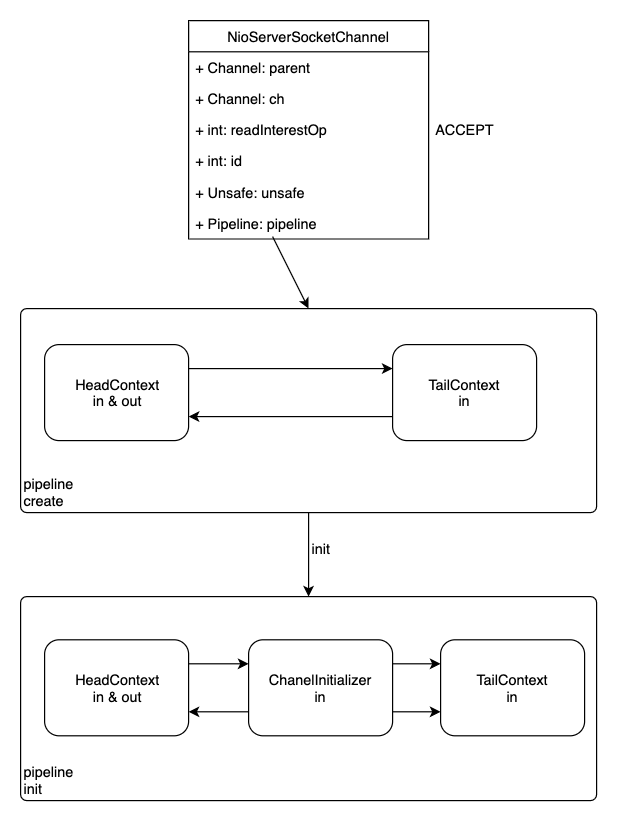
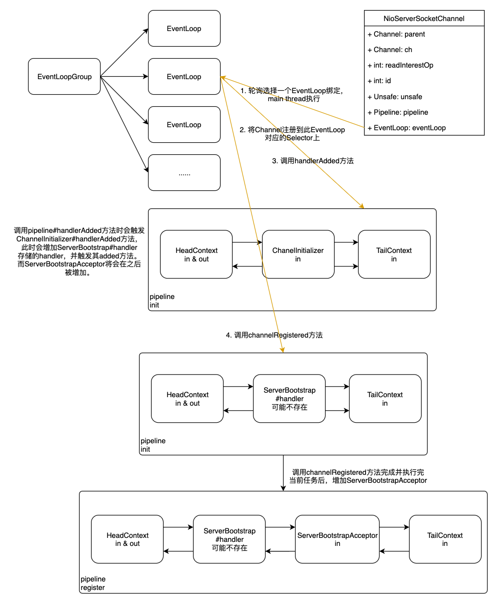
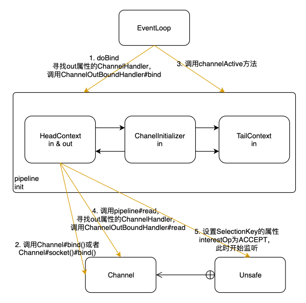

# ServerBootstrap

Netty服务端启动代码如下所示：
```java
NioEventLoopGroup group = new NioEventLoopGroup();
ServerBootstrap bootstrap = new ServerBootstrap();
bootstrap.group(group)
    .channel(NioServerSocketChannel.class)
    .childHandler(new SimpleChannelInboundHandler<ByteBuf>() {
        @Override
        protected void channelRead0(ChannelHandlerContext ctx,
                ByteBuf byteBuf) throws Exception {
            System.out.println("Received data");
        }
    });
ChannelFuture future = bootstrap.bind(new InetSocketAddress(8080));
future.addListener(new ChannelFutureListener() {
    @Override
    public void operationComplete(ChannelFuture channelFuture)
            throws Exception {
        if (channelFuture.isSuccess()) {
            System.out.println("Server bound");
        } else {
            System.err.println("Bound attempt failed");
            channelFuture.cause().printStackTrace();
        }
    }
});
```

首先是`ServerBootstrap`的各种属性的设置，比如线程池，channel类型等等。设置完其属性后，就可以绑定本地端口，对外开放服务。

## ServerBootstrap属性

`ServerBootstrap`运用了nio的refactor模型，一个boss线程池用来进行`select`操作，与远程主机建立通信，另一个worker线程池用以执行预设的处理逻辑。如果调用`group(EventLoopGroup group)`方法，那么这两个线程池将使用同一个线程池。

```java
@Override
public ServerBootstrap group(EventLoopGroup group) {
    return group(group, group);
}

public ServerBootstrap group(EventLoopGroup parentGroup, EventLoopGroup childGroup) {
    super.group(parentGroup);
    ObjectUtil.checkNotNull(childGroup, "childGroup");
    if (this.childGroup != null) {
        throw new IllegalStateException("childGroup set already");
    }
    this.childGroup = childGroup;
    return this;
}
```

而`channel(Class<? extends C> channelClass)`则指定了`Channel`的类型，一般此类的类型需要与线程池的类型对应，否则Netty将会抛出不匹配的异常。

下面是可以相互兼容的 `EventLoopGroup` 和 `Channel`。
```
channel
├───nio
│       NioEventLoopGroup
├───oio 
│       OioEventLoopGroup
└───socket
        ├───nio
        │         NioDatagramChannel
        │         NioServerSocketChannel
        │         NioSocketChannel
        └───oio
                  OioDatagramChannel 
                  OioServerSocketChannel 
                  OioSocketChannel
```

`channel()`方法指定了`Channel`的实现类。如果该实现类没提供默认的构造函数，可以通过调用`channelFactory()`方法来指定一个工厂类，它将会被`bind()`方法调用。此方法本身也是借用一个反射工厂，通过反射调用其默认构造方法来构建一个实例。

```java
public B channel(Class<? extends C> channelClass) {
    return channelFactory(new ReflectiveChannelFactory<C>(
            ObjectUtil.checkNotNull(channelClass, "channelClass")
    ));
}

public B channelFactory(io.netty.channel.ChannelFactory<? extends C> channelFactory) {
    return channelFactory((ChannelFactory<C>) channelFactory);
}

@Deprecated
public B channelFactory(ChannelFactory<? extends C> channelFactory) {
    ObjectUtil.checkNotNull(channelFactory, "channelFactory");
    if (this.channelFactory != null) {
        throw new IllegalStateException("channelFactory set already");
    }

    this.channelFactory = channelFactory;
    return self();
}

```

## bind

初始化`ServerBootstrap`之后，进行绑定本地端口的流程。

```java
public ChannelFuture bind(SocketAddress localAddress) {
    // 验证必需属性是否已设置
    validate();
    return doBind(ObjectUtil.checkNotNull(localAddress, "localAddress"));
}

private ChannelFuture doBind(final SocketAddress localAddress) {
    // 初始化并且注册ServerChannel
    // 这是一个异步过程
    final ChannelFuture regFuture = initAndRegister();
    final Channel channel = regFuture.channel();
    if (regFuture.cause() != null) {
        return regFuture;
    }

    // 如果注册完成，那么执行真正的绑定过程。
    // 否则，对异步返回的Future增加一个监听器，当绑定完成后通知此监听器执行绑定
    if (regFuture.isDone()) {
        // At this point we know that the registration was complete and successful.
        ChannelPromise promise = channel.newPromise();
        doBind0(regFuture, channel, localAddress, promise);
        return promise;
    } else {
        // Registration future is almost always fulfilled already, but just in case it's not.
        final PendingRegistrationPromise promise = new PendingRegistrationPromise(channel);
        regFuture.addListener(new ChannelFutureListener() {
            @Override
            public void operationComplete(ChannelFuture future) throws Exception {
                // 如果注册失败，抛出异常
                Throwable cause = future.cause();
                if (cause != null) {
                    // Registration on the EventLoop failed so fail the ChannelPromise directly to not cause an
                    // IllegalStateException once we try to access the EventLoop of the Channel.
                    promise.setFailure(cause);
                } else {
                    // Registration was successful, so set the correct executor to use.
                    // See https://github.com/netty/netty/issues/2586
                    promise.registered();

                    doBind0(regFuture, channel, localAddress, promise);
                }
            }
        });
        return promise;
    }
}

```

从上面的代码中可以看出，绑定过程分为两步：
1. 初始化并注册ServarChannel
2. 执行真正的绑定过程

### 初始化并注册ServerChannel

`ServerBootstrap`所使用的Channel由`channel(Class<?>)`方法指定，最常用的就是`NioServerSocketChannel`类。

```java
final ChannelFuture initAndRegister() {
    Channel channel = null;
    try {
        // 使用工厂方法构造一个新的Channel
        // 默认使用ReflectiveChannelFactory
        // Channel类型由 channel(NioServerSocketChannel.class) 设置
        channel = channelFactory.newChannel();
        // 执行初始化操作
        init(channel);
    } catch (Throwable t) {
        if (channel != null) {
            // channel can be null if newChannel crashed (eg SocketException("too many open files"))
            channel.unsafe().closeForcibly();
            // as the Channel is not registered yet we need to force the usage of the GlobalEventExecutor
            return new DefaultChannelPromise(channel, GlobalEventExecutor.INSTANCE).setFailure(t);
        }
        // as the Channel is not registered yet we need to force the usage of the GlobalEventExecutor
        return new DefaultChannelPromise(new FailedChannel(), GlobalEventExecutor.INSTANCE).setFailure(t);
    }

    // 将channel注册到group中
    ChannelFuture regFuture = config().group().register(channel);
    if (regFuture.cause() != null) {
        if (channel.isRegistered()) {
            channel.close();
        } else {
            channel.unsafe().closeForcibly();
        }
    }

    // If we are here and the promise is not failed, it's one of the following cases:
    // 1) If we attempted registration from the event loop, the registration has been completed at this point.
    //    i.e. It's safe to attempt bind() or connect() now because the channel has been registered.
    // 2) If we attempted registration from the other thread, the registration request has been successfully
    //    added to the event loop's task queue for later execution.
    //    i.e. It's safe to attempt bind() or connect() now:
    //         because bind() or connect() will be executed *after* the scheduled registration task is executed
    //         because register(), bind(), and connect() are all bound to the same thread.

    return regFuture;
}


----------------------- NioServerSocketChannel构造过程 -----------------------

private static final SelectorProvider DEFAULT_SELECTOR_PROVIDER = SelectorProvider.provider();

public NioServerSocketChannel() {
    this(newSocket(DEFAULT_SELECTOR_PROVIDER));
}

private static ServerSocketChannel newSocket(SelectorProvider provider) {
    try {
        /**
         *  Use the {@link SelectorProvider} to open {@link SocketChannel} and so remove condition in
         *  {@link SelectorProvider#provider()} which is called by each ServerSocketChannel.open() otherwise.
         *
         *  See <a href="https://github.com/netty/netty/issues/2308">#2308</a>.
         */
        return provider.openServerSocketChannel();
    } catch (IOException e) {
        throw new ChannelException(
                "Failed to open a server socket.", e);
    }
}

public NioServerSocketChannel(ServerSocketChannel channel) {
    // 设置interestOp为ACCPET
    super(null, channel, SelectionKey.OP_ACCEPT);
    config = new NioServerSocketChannelConfig(this, javaChannel().socket());
}

protected AbstractNioMessageChannel(Channel parent, SelectableChannel ch, int readInterestOp) {
    super(parent, ch, readInterestOp);
}

protected AbstractNioChannel(Channel parent, SelectableChannel ch, int readInterestOp) {
    super(parent);
    this.ch = ch;
    this.readInterestOp = readInterestOp;
    // 设置为非阻塞
    try {
        ch.configureBlocking(false);
    } catch (IOException e) {
        try {
            ch.close();
        } catch (IOException e2) {
            if (logger.isWarnEnabled()) {
                logger.warn(
                        "Failed to close a partially initialized socket.", e2);
            }
        }

        throw new ChannelException("Failed to enter non-blocking mode.", e);
    }
}

protected AbstractChannel(Channel parent) {
    this.parent = parent;
    // 构造一个属于此channel的唯一id
    id = newId();
    // 构造与之关联的unsafe类
    unsafe = newUnsafe();
    // 构造与之关联的pipeline
    pipeline = newChannelPipeline();
}

```

`NioServerSocketChannel`的构造与我们常用的nio相似，设置interestOp，然后设置为非阻塞模式。当然，在此处还没有与具体的`seletor`进行绑定。

除了nio模式的构造外，此处还加入了netty自己的`unsafe`以及`pileline`。

```java
# AbstractNioMessageChannel.java

@Override
protected AbstractNioUnsafe newUnsafe() {
    return new NioMessageUnsafe();
}

-----------------------------------------------------------

protected DefaultChannelPipeline newChannelPipeline() {
    return new DefaultChannelPipeline(this);
}

protected DefaultChannelPipeline(Channel channel) {
    this.channel = ObjectUtil.checkNotNull(channel, "channel");
    succeededFuture = new SucceededChannelFuture(channel, null);
    voidPromise =  new VoidChannelPromise(channel, true);

    tail = new TailContext(this);
    head = new HeadContext(this);

    head.next = tail;
    tail.prev = head;
}

final class TailContext extends AbstractChannelHandlerContext implements ChannelInboundHandler {}

final class HeadContext extends AbstractChannelHandlerContext
        implements ChannelOutboundHandler, ChannelInboundHandler {}

```

其中`unsafe`类的构造由具体的`channel`实现，此处`NioServerSocketChannel`使用的是其父类实现的`NioMessageUnsafe`。而`pipeline`则维护了一个`ChannelHandler`链表，并预设了两个`ChannelHandler`，一个是双向Handler，另一个是入站Handler。
<br/>
<br/>

构造完`NioServerSocketChannel`之后，需要对其进行初始化操作，设置`ServerBootstrap`提供的一些属性，以及初始化`Pipeline`，将`ServerBootstrap`提供的`ChannelHandler`以及`ServerBootstrapAcceptor`加入到`Pileline`中。

```java
void init(Channel channel) throws Exception {
    final Map<ChannelOption<?>, Object> options = options0();
    synchronized (options) {
        setChannelOptions(channel, options, logger);
    }

    final Map<AttributeKey<?>, Object> attrs = attrs0();
    synchronized (attrs) {
        for (Entry<AttributeKey<?>, Object> e: attrs.entrySet()) {
            @SuppressWarnings("unchecked")
            AttributeKey<Object> key = (AttributeKey<Object>) e.getKey();
            channel.attr(key).set(e.getValue());
        }
    }

    ChannelPipeline p = channel.pipeline();

    final EventLoopGroup currentChildGroup = childGroup;
    final ChannelHandler currentChildHandler = childHandler;
    final Entry<ChannelOption<?>, Object>[] currentChildOptions;
    final Entry<AttributeKey<?>, Object>[] currentChildAttrs;
    synchronized (childOptions) {
        currentChildOptions = childOptions.entrySet().toArray(newOptionArray(0));
    }
    synchronized (childAttrs) {
        currentChildAttrs = childAttrs.entrySet().toArray(newAttrArray(0));
    }

    p.addLast(new ChannelInitializer<Channel>() {
        @Override
        public void initChannel(final Channel ch) throws Exception {
            final ChannelPipeline pipeline = ch.pipeline();
            ChannelHandler handler = config.handler();
            if (handler != null) {
                pipeline.addLast(handler);
            }

            ch.eventLoop().execute(new Runnable() {
                @Override
                public void run() {
                    pipeline.addLast(new ServerBootstrapAcceptor(
                            ch, currentChildGroup, currentChildHandler, currentChildOptions, currentChildAttrs));
                }
            });
        }
    });
}

```

`ServerChannel`初始化之后，需要将其注册到`NioEventLoop`中。

```java
# MultithreadEventLoopGroup.java 

@Override
public ChannelFuture register(Channel channel) {
    return next().register(channel);
}

# SingleThreadEventLoop.java 

@Override
public ChannelFuture register(Channel channel) {
    return register(new DefaultChannelPromise(channel, this));
}

@Override
public ChannelFuture register(final ChannelPromise promise) {
    ObjectUtil.checkNotNull(promise, "promise");
    promise.channel().unsafe().register(this, promise);
    return promise;
}

# AbstractChannel.java ------------------------------------

@Override
public final void register(EventLoop eventLoop, final ChannelPromise promise) {
    if (eventLoop == null) {
        throw new NullPointerException("eventLoop");
    }
    if (isRegistered()) {
        promise.setFailure(new IllegalStateException("registered to an event loop already"));
        return;
    }
    // 检查channel与eventloop的兼容性
    if (!isCompatible(eventLoop)) {
        promise.setFailure(
                new IllegalStateException("incompatible event loop type: " + eventLoop.getClass().getName()));
        return;
    }

    // 将自己绑定到eventLoop上
    AbstractChannel.this.eventLoop = eventLoop;

    // 异步注册，serverbootstrap的绑定过程由main thread（此例中）执行
    if (eventLoop.inEventLoop()) {
        register0(promise);
    } else {
        try {
            eventLoop.execute(new Runnable() {
                @Override
                public void run() {
                    register0(promise);
                }
            });
        } catch (Throwable t) {
            logger.warn(
                    "Force-closing a channel whose registration task was not accepted by an event loop: {}",
                    AbstractChannel.this, t);
            closeForcibly();
            closeFuture.setClosed();
            safeSetFailure(promise, t);
        }
    }
}

private void register0(ChannelPromise promise) {
    try {
        // check if the channel is still open as it could be closed in the mean time when the register
        // call was outside of the eventLoop
        if (!promise.setUncancellable() || !ensureOpen(promise)) {
            return;
        }
        boolean firstRegistration = neverRegistered;
        // 子类实现对应的注册过程
        doRegister();
        neverRegistered = false;
        registered = true;

        // Ensure we call handlerAdded(...) before we actually notify the promise. This is needed as the
        // user may already fire events through the pipeline in the ChannelFutureListener.
        // 调用pipeline链上所有ChannelHandler的handlerAdded(...)方法
        pipeline.invokeHandlerAddedIfNeeded();

        // 将promise置为成功
        safeSetSuccess(promise);
        // 调用pipeline链ChannelInboundHandler#channelRegistered()方法
        pipeline.fireChannelRegistered();
        // Only fire a channelActive if the channel has never been registered. This prevents firing
        // multiple channel actives if the channel is deregistered and re-registered.
        if (isActive()) {
            if (firstRegistration) {
                // 只有在首次注册时，才调用ChannelInboundHandler#channelActive()方法
                pipeline.fireChannelActive();
            } else if (config().isAutoRead()) {
                // This channel was registered before and autoRead() is set. This means we need to begin read
                // again so that we process inbound data.
                //
                // See https://github.com/netty/netty/issues/4805
                beginRead();
            }
        }
    } catch (Throwable t) {
        // Close the channel directly to avoid FD leak.
        closeForcibly();
        closeFuture.setClosed();
        safeSetFailure(promise, t);
    }
}


@Override
protected void doRegister() throws Exception {
    boolean selected = false;
    for (;;) {
        try {
            // 将channel注册到selector上，此处interestOp为0，并且将自己作为attachment
            selectionKey = javaChannel().register(eventLoop().unwrappedSelector(), 0, this);
            return;
        } catch (CancelledKeyException e) {
            if (!selected) {
                // Force the Selector to select now as the "canceled" SelectionKey may still be
                // cached and not removed because no Select.select(..) operation was called yet.
                eventLoop().selectNow();
                selected = true;
            } else {
                // We forced a select operation on the selector before but the SelectionKey is still cached
                // for whatever reason. JDK bug ?
                throw e;
            }
        }
    }
}

```

注册过程主要是`Channel`与`EventLoop`之间的绑定，Netty的NIO线程模型为一个`EventLoop`对应多个`Channel`。同时，这里运用了模板方法模式，封装了注册Channel的通用逻辑，并将具体的注册过程留给子类实现。除此以外，还需要触发`Channel`的增加以及注册事件等。

调用`ChannelHandler#handlerAdded`方法：
```java
final void invokeHandlerAddedIfNeeded() {
    assert channel.eventLoop().inEventLoop();
    if (firstRegistration) {
        firstRegistration = false;
        // We are now registered to the EventLoop. It's time to call the callbacks for the ChannelHandlers,
        // that were added before the registration was done.
        callHandlerAddedForAllHandlers();
    }
}

private void callHandlerAddedForAllHandlers() {
    // 执行addFirst，addLast等方法时，增加回调任务
    final PendingHandlerCallback pendingHandlerCallbackHead;
    synchronized (this) {
        assert !registered;

        // This Channel itself was registered.
        registered = true;

        pendingHandlerCallbackHead = this.pendingHandlerCallbackHead;
        // Null out so it can be GC'ed.
        this.pendingHandlerCallbackHead = null;
    }

    // This must happen outside of the synchronized(...) block as otherwise handlerAdded(...) may be called while
    // holding the lock and so produce a deadlock if handlerAdded(...) will try to add another handler from outside
    // the EventLoop.
    PendingHandlerCallback task = pendingHandlerCallbackHead;
    while (task != null) {
        // 执行回调任务
        task.execute();
        task = task.next;
    }
}

@Override
void execute() {
    EventExecutor executor = ctx.executor();
    if (executor.inEventLoop()) {
        callHandlerAdded0(ctx);
    } else {
        try {
            executor.execute(this);
        } catch (RejectedExecutionException e) {
            if (logger.isWarnEnabled()) {
                logger.warn(
                        "Can't invoke handlerAdded() as the EventExecutor {} rejected it, removing handler {}.",
                        executor, ctx.name(), e);
            }
            atomicRemoveFromHandlerList(ctx);
            ctx.setRemoved();
        }
    }
}

private void callHandlerAdded0(final AbstractChannelHandlerContext ctx) {
    try {
        // 调用对应ChannelHandler#handlerAdded方法
        ctx.callHandlerAdded();
    } catch (Throwable t) {
        boolean removed = false;
        try {
            atomicRemoveFromHandlerList(ctx);
            ctx.callHandlerRemoved();
            removed = true;
        } catch (Throwable t2) {
            if (logger.isWarnEnabled()) {
                logger.warn("Failed to remove a handler: " + ctx.name(), t2);
            }
        }

        if (removed) {
            fireExceptionCaught(new ChannelPipelineException(
                    ctx.handler().getClass().getName() +
                    ".handlerAdded() has thrown an exception; removed.", t));
        } else {
            fireExceptionCaught(new ChannelPipelineException(
                    ctx.handler().getClass().getName() +
                    ".handlerAdded() has thrown an exception; also failed to remove.", t));
        }
    }
}

final void callHandlerAdded() throws Exception {
    // We must call setAddComplete before calling handlerAdded. Otherwise if the handlerAdded method generates
    // any pipeline events ctx.handler() will miss them because the state will not allow it.
    if (setAddComplete()) {
        handler().handlerAdded(this);
    }
}

```

调用`ChannelInboundHandler#channelRegister`方法：
```java
@Override
public final ChannelPipeline fireChannelRegistered() {
    AbstractChannelHandlerContext.invokeChannelRegistered(head);
    return this;
}

static void invokeChannelRegistered(final AbstractChannelHandlerContext next) {
    EventExecutor executor = next.executor();
    if (executor.inEventLoop()) {
        next.invokeChannelRegistered();
    } else {
        executor.execute(new Runnable() {
            @Override
            public void run() {
                next.invokeChannelRegistered();
            }
        });
    }
}

private void invokeChannelRegistered() {
    if (invokeHandler()) {
        try {
            ((ChannelInboundHandler) handler()).channelRegistered(this);
        } catch (Throwable t) {
            notifyHandlerException(t);
        }
    } else {
        fireChannelRegistered();
    }
}

private boolean invokeHandler() {
    // Store in local variable to reduce volatile reads.
    int handlerState = this.handlerState;
    return handlerState == ADD_COMPLETE || (!ordered && handlerState == ADD_PENDING);
}

```

由于此处还未执行绑定操作，因此不满足`isActive()`，`ChannelInboundHandler#channelActive()`方法不会被调用，在之后绑定操作完成后才会执行。

至此，初始化并注册`ServerChannel`的过程完成，可以总结为如下几步：
1. 构造对应的`Channel`，以及与其对应的pipeline等
2. 初始化此`Channel`，设置用户指定的属性以及增加Netty定义的`ChannelHandler`等
3. 将此`Channel`注册到`EventLoop`以及`Selector`上，并通知其pipeline上的`ChannelHandler`执行`handlerAdded`, `handlerRegistered`方法。


### 执行真正的绑定过程

在`Channel`注册后，需要将其与本地地址相绑定，如此方可收发消息。

```java
private static void doBind0(
        final ChannelFuture regFuture, final Channel channel,
        final SocketAddress localAddress, final ChannelPromise promise) {

    // This method is invoked before channelRegistered() is triggered.  Give user handlers a chance to set up
    // the pipeline in its channelRegistered() implementation.
    channel.eventLoop().execute(new Runnable() {
        @Override
        public void run() {
            if (regFuture.isSuccess()) {
                channel.bind(localAddress, promise).addListener(ChannelFutureListener.CLOSE_ON_FAILURE);
            } else {
                promise.setFailure(regFuture.cause());
            }
        }
    });
}

@Override
public ChannelFuture bind(SocketAddress localAddress, ChannelPromise promise) {
    return pipeline.bind(localAddress, promise);
}

@Override
public final ChannelFuture bind(SocketAddress localAddress, ChannelPromise promise) {
    return tail.bind(localAddress, promise);
}

@Override
public ChannelFuture bind(final SocketAddress localAddress, final ChannelPromise promise) {
    if (localAddress == null) {
        throw new NullPointerException("localAddress");
    }
    if (isNotValidPromise(promise, false)) {
        // cancelled
        return promise;
    }

    // 从尾部开始寻找ChannelOutboundHandler
    final AbstractChannelHandlerContext next = findContextOutbound(MASK_BIND);
    EventExecutor executor = next.executor();
    if (executor.inEventLoop()) {
        next.invokeBind(localAddress, promise);
    } else {
        safeExecute(executor, new Runnable() {
            @Override
            public void run() {
                next.invokeBind(localAddress, promise);
            }
        }, promise, null);
    }
    return promise;
}

private void invokeBind(SocketAddress localAddress, ChannelPromise promise) {
    if (invokeHandler()) {
        try {
            ((ChannelOutboundHandler) handler()).bind(this, localAddress, promise);
        } catch (Throwable t) {
            notifyOutboundHandlerException(t, promise);
        }
    } else {
        bind(localAddress, promise);
    }
}

```

此时pipeline中共有三个`ChannelHandler`：
```
HeadContext(duplex) -> ServerBootstrapAcceptor(in) -> TailContext(in)
```

因此绑定操作将会在`HeadContext`上执行。

```java
@Override
public void bind(
        ChannelHandlerContext ctx, SocketAddress localAddress, ChannelPromise promise) {
    unsafe.bind(localAddress, promise);
}

@Override
public final void bind(final SocketAddress localAddress, final ChannelPromise promise) {
    assertEventLoop();

    if (!promise.setUncancellable() || !ensureOpen(promise)) {
        return;
    }

    // See: https://github.com/netty/netty/issues/576
    if (Boolean.TRUE.equals(config().getOption(ChannelOption.SO_BROADCAST)) &&
        localAddress instanceof InetSocketAddress &&
        !((InetSocketAddress) localAddress).getAddress().isAnyLocalAddress() &&
        !PlatformDependent.isWindows() && !PlatformDependent.maybeSuperUser()) {
        // Warn a user about the fact that a non-root user can't receive a
        // broadcast packet on *nix if the socket is bound on non-wildcard address.
        logger.warn(
                "A non-root user can't receive a broadcast packet if the socket " +
                "is not bound to a wildcard address; binding to a non-wildcard " +
                "address (" + localAddress + ") anyway as requested.");
    }

    boolean wasActive = isActive();
    try {
        // 子类执行对应的绑定操作
        doBind(localAddress);
    } catch (Throwable t) {
        safeSetFailure(promise, t);
        closeIfClosed();
        return;
    }

    if (!wasActive && isActive()) {
        invokeLater(new Runnable() {
            @Override
            public void run() {
                pipeline.fireChannelActive();
            }
        });
    }

    safeSetSuccess(promise);
}

@Override
protected void doBind(SocketAddress localAddress) throws Exception {
    // 调用java nio channel的bind方法
    if (PlatformDependent.javaVersion() >= 7) {
        javaChannel().bind(localAddress, config.getBacklog());
    } else {
        javaChannel().socket().bind(localAddress, config.getBacklog());
    }
}

```

执行完绑定操作后，还会调用pipeline链上的`channelActive()`方法。

```java
@Override
public void channelActive(ChannelHandlerContext ctx) {
    // class HeadContext
    ctx.fireChannelActive();

    readIfIsAutoRead();
}

private void readIfIsAutoRead() {
    if (channel.config().isAutoRead()) {
        channel.read();
    }
}

@Override
public Channel read() {
    pipeline.read();
    return this;
}

@Override
public final ChannelPipeline read() {
    tail.read();
    return this;
}

@Override
public ChannelHandlerContext read() {
    // class TailContext
    final AbstractChannelHandlerContext next = findContextOutbound(MASK_READ);
    EventExecutor executor = next.executor();
    if (executor.inEventLoop()) {
        next.invokeRead();
    } else {
        Tasks tasks = next.invokeTasks;
        if (tasks == null) {
            next.invokeTasks = tasks = new Tasks(next);
        }
        executor.execute(tasks.invokeReadTask);
    }

    return this;
}

private void invokeRead() {
    if (invokeHandler()) {
        try {
            ((ChannelOutboundHandler) handler()).read(this);
        } catch (Throwable t) {
            notifyHandlerException(t);
        }
    } else {
        read();
    }
}

@Override
public void read(ChannelHandlerContext ctx) {
    // class HeadContext
    unsafe.beginRead();
}

@Override
public final void beginRead() {
    assertEventLoop();

    if (!isActive()) {
        return;
    }

    try {
        doBeginRead();
    } catch (final Exception e) {
        invokeLater(new Runnable() {
            @Override
            public void run() {
                pipeline.fireExceptionCaught(e);
            }
        });
        close(voidPromise());
    }
}

@Override
protected void doBeginRead() throws Exception {
    // Channel.read() or ChannelHandlerContext.read() was called
    final SelectionKey selectionKey = this.selectionKey;
    if (!selectionKey.isValid()) {
        return;
    }

    readPending = true;

    // 设置interestOps，加上此Channel初始化时设置的accpet interestOps
    final int interestOps = selectionKey.interestOps();
    if ((interestOps & readInterestOp) == 0) {
        selectionKey.interestOps(interestOps | readInterestOp);
    }
}

```

此时，绑定操作完成，`ServerChannel`不仅注册到了`Selector`上，并且还设置了其感兴趣的事件`accept`。同时，`ServerChannel`也开始等待来自客户端的连接。

`ServerBootstrap`的初始化大致过程如下所示：







# Bootstrap

```java
NioEventLoopGroup group = new NioEventLoopGroup();
try {
    final Bootstrap bootstrapA = new Bootstrap();
    bootstrapA.group(group);
    bootstrapA.channel(NioSocketChannel.class);
    bootstrapA.handler(dummyHandler);
    bootstrapA.connect(LocalAddress.ANY).syncUninterruptibly();
} finally {
    group.shutdownGracefully();
}

```

客户端的示例代码如上所示，核心代码为`bootstrapA.connect(LocalAddress.ANY)`。

```java
public ChannelFuture connect(SocketAddress remoteAddress) {
    ObjectUtil.checkNotNull(remoteAddress, "remoteAddress");
    validate();
    return doResolveAndConnect(remoteAddress, config.localAddress());
}

private ChannelFuture doResolveAndConnect(final SocketAddress remoteAddress, final SocketAddress localAddress) {
    final ChannelFuture regFuture = initAndRegister();
    final Channel channel = regFuture.channel();

    if (regFuture.isDone()) {
        if (!regFuture.isSuccess()) {
            return regFuture;
        }
        return doResolveAndConnect0(channel, remoteAddress, localAddress, channel.newPromise());
    } else {
        // Registration future is almost always fulfilled already, but just in case it's not.
        final PendingRegistrationPromise promise = new PendingRegistrationPromise(channel);
        regFuture.addListener(new ChannelFutureListener() {
            @Override
            public void operationComplete(ChannelFuture future) throws Exception {
                // Directly obtain the cause and do a null check so we only need one volatile read in case of a
                // failure.
                Throwable cause = future.cause();
                if (cause != null) {
                    // Registration on the EventLoop failed so fail the ChannelPromise directly to not cause an
                    // IllegalStateException once we try to access the EventLoop of the Channel.
                    promise.setFailure(cause);
                } else {
                    // Registration was successful, so set the correct executor to use.
                    // See https://github.com/netty/netty/issues/2586
                    promise.registered();
                    doResolveAndConnect0(channel, remoteAddress, localAddress, promise);
                }
            }
        });
        return promise;
    }
}

private ChannelFuture doResolveAndConnect0(final Channel channel, SocketAddress remoteAddress,
                                           final SocketAddress localAddress, final ChannelPromise promise) {
    try {
        final EventLoop eventLoop = channel.eventLoop();
        // 初次调用时针对此eventLoop构造一个新的Resolver
        final AddressResolver<SocketAddress> resolver = this.resolver.getResolver(eventLoop);

        if (!resolver.isSupported(remoteAddress) || resolver.isResolved(remoteAddress)) {
            // Resolver has no idea about what to do with the specified remote address or it's resolved already.
            doConnect(remoteAddress, localAddress, promise);
            return promise;
        }

        // 针对指定的地址进行异步解析，默认支持InetSocketAddress。
        // 如果想要支持其他类型的SocketAddress，可以使用resolver(AddressResolverGroup<?> resolver)提供
        // 自定义的解析器
        final Future<SocketAddress> resolveFuture = resolver.resolve(remoteAddress);

        // 如果异步操作执行完成，并且没发生异常则进行连接操作
        if (resolveFuture.isDone()) {
            final Throwable resolveFailureCause = resolveFuture.cause();

            if (resolveFailureCause != null) {
                // Failed to resolve immediately
                channel.close();
                promise.setFailure(resolveFailureCause);
            } else {
                // Succeeded to resolve immediately; cached? (or did a blocking lookup)
                doConnect(resolveFuture.getNow(), localAddress, promise);
            }
            return promise;
        }

        // Wait until the name resolution is finished.
        resolveFuture.addListener(new FutureListener<SocketAddress>() {
            @Override
            public void operationComplete(Future<SocketAddress> future) throws Exception {
                if (future.cause() != null) {
                    channel.close();
                    promise.setFailure(future.cause());
                } else {
                    doConnect(future.getNow(), localAddress, promise);
                }
            }
        });
    } catch (Throwable cause) {
        promise.tryFailure(cause);
    }
    return promise;
}

```

`initAndRegister()`在之前已经解析过，不过此处`Channel`的类型为`NioSocketChannel`，整体逻辑类似，不再赘述。初始化之后，进行解析以及连接操作。

由于`connect(SocketAddress remoteAddress)`方法接受的参数类型为`SocketAddress`，所以除了可以使用jdk提供的`InetSocketAddress`外，还可以自定义`SocketAddress`的子类，以进行特殊化处理。因此，Netty需要一个解析器针对各种`SocketAddress`进行解析，默认支持`InetSocketAddress`。如果你想要解析自定义的`SocketAddress`，那么你需要继承`AddressResolverGroup`类，实现自己的解析逻辑，并在构造bootstrap时调用`resolver(AddressResolverGroup<?> resolver)`方法以使用你自定义的解析器。

## 解析

`Bootstrap`类中提供了一个默认的解析器`DEFAULT_RESOLVER`，下面让我们分析一下它的行为。

```java
final AddressResolver<SocketAddress> resolver = this.resolver.getResolver(eventLoop);

private volatile AddressResolverGroup<SocketAddress> resolver =
        (AddressResolverGroup<SocketAddress>) DEFAULT_RESOLVER;

private static final AddressResolverGroup<?> DEFAULT_RESOLVER = DefaultAddressResolverGroup.INSTANCE;
```

`getResolver(final EventExecutor executor)`方法结合了延迟初始化以及`ThreadLocal`的特性，为每一个`EventExecutor`都提供一个与之对应的`AddressResolver<T>`。

```java
public AddressResolver<T> getResolver(final EventExecutor executor) {
    if (executor == null) {
        throw new NullPointerException("executor");
    }

    if (executor.isShuttingDown()) {
        throw new IllegalStateException("executor not accepting a task");
    }

    AddressResolver<T> r;
    synchronized (resolvers) {
        r = resolvers.get(executor);
        if (r == null) {
            final AddressResolver<T> newResolver;
            try {
                newResolver = newResolver(executor);
            } catch (Exception e) {
                throw new IllegalStateException("failed to create a new resolver", e);
            }

            resolvers.put(executor, newResolver);
            executor.terminationFuture().addListener(new FutureListener<Object>() {
                @Override
                public void operationComplete(Future<Object> future) throws Exception {
                    synchronized (resolvers) {
                        resolvers.remove(executor);
                    }
                    newResolver.close();
                }
            });

            r = newResolver;
        }
    }

    return r;
}

@Override
protected AddressResolver<InetSocketAddress> newResolver(EventExecutor executor) throws Exception {
    return new DefaultNameResolver(executor).asAddressResolver();
}

public AddressResolver<InetSocketAddress> asAddressResolver() {
    AddressResolver<InetSocketAddress> result = addressResolver;
    if (result == null) {
        synchronized (this) {
            result = addressResolver;
            if (result == null) {
                addressResolver = result = new InetSocketAddressResolver(executor(), this);
            }
        }
    }
    return result;
}

```

`newResolver(EventExecutor executor) throws Exception`是一个抽象方法，如果自己实现解析器，那么需要实现此方法以提供一个真正的解析器。

获取到解析器，需要判断指定的远程地址是否可以被此解析器解析或者是否已被解析过，如果不是那么直接执行连接操作，否则需要对此地址进行解析。注意：如果`InetSocketAddress`没有被解析，那么在将来可能会出现异常。

```java
@Override
public final Future<T> resolve(SocketAddress address) {
    if (!isSupported(checkNotNull(address, "address"))) {
        // Address type not supported by the resolver
        return executor().newFailedFuture(new UnsupportedAddressTypeException());
    }

    if (isResolved(address)) {
        // Resolved already; no need to perform a lookup
        @SuppressWarnings("unchecked")
        final T cast = (T) address;
        return executor.newSucceededFuture(cast);
    }

    try {
        @SuppressWarnings("unchecked")
        final T cast = (T) address;
        final Promise<T> promise = executor().newPromise();
        doResolve(cast, promise);
        return promise;
    } catch (Exception e) {
        return executor().newFailedFuture(e);
    }
}

@Override
protected void doResolve(final InetSocketAddress unresolvedAddress, final Promise<InetSocketAddress> promise)
        throws Exception {
    // Note that InetSocketAddress.getHostName() will never incur a reverse lookup here,
    // because an unresolved address always has a host name.
    // 将hostName解析为InetAddress，然后通过InetAddress构造InetSocketAddress
    nameResolver.resolve(unresolvedAddress.getHostName())
            .addListener(new FutureListener<InetAddress>() {
                @Override
                public void operationComplete(Future<InetAddress> future) throws Exception {
                    if (future.isSuccess()) {
                        promise.setSuccess(new InetSocketAddress(future.getNow(), unresolvedAddress.getPort()));
                    } else {
                        promise.setFailure(future.cause());
                    }
                }
            });
}

@Override
public final Future<T> resolve(String inetHost) {
    final Promise<T> promise = executor().newPromise();
    return resolve(inetHost, promise);
}

@Override
public Future<T> resolve(String inetHost, Promise<T> promise) {
    checkNotNull(promise, "promise");

    try {
        doResolve(inetHost, promise);
        return promise;
    } catch (Exception e) {
        return promise.setFailure(e);
    }
}

@Override
protected void doResolve(String inetHost, Promise<InetAddress> promise) throws Exception {
    try {
        promise.setSuccess(SocketUtils.addressByName(inetHost));
    } catch (UnknownHostException e) {
        promise.setFailure(e);
    }
}

public static InetAddress addressByName(final String hostname) throws UnknownHostException {
    try {
        return AccessController.doPrivileged(new PrivilegedExceptionAction<InetAddress>() {
            @Override
            public InetAddress run() throws UnknownHostException {
                return InetAddress.getByName(hostname);
            }
        });
    } catch (PrivilegedActionException e) {
        throw (UnknownHostException) e.getCause();
    }
}

```

最终的解析只是调用`InetAddress.getByName(hostname)`将hostName解析为`InetAddress`，然后通过这个`InetAddress`构造`InetSocketAddress`。虽然目的很简单，但是此处将解析这一过程设计成了一个良好的结构，可拓展性可维护性都得到了极大的提升，当用户想要自定义解析器时，只需要实现几个必需的类以及方法即可，充分体现了面向对象的思想。

注意，此处只是针对了未被解析的`InetSocketAddress`（例如通过`createUnresolved(String host, int port)`方法构造的），如果你在构造`InetSocketAddress`时已经解析，那么将直接进入连接流程。

## 连接

准备好远程地址后，就可以进行连接操作了。连接与绑定操作类似，都是通过调用pipeline链上的`ChannelOutBoundHandler`的`connect`方法完成，当然，pipeline上最后一个`ChannelOutBoundHandler`是Netty提供的`HeadContext`。

```java
private static void doConnect(
        final SocketAddress remoteAddress, final SocketAddress localAddress, final ChannelPromise connectPromise) {

    // This method is invoked before channelRegistered() is triggered.  Give user handlers a chance to set up
    // the pipeline in its channelRegistered() implementation.
    final Channel channel = connectPromise.channel();
    channel.eventLoop().execute(new Runnable() {
        @Override
        public void run() {
            if (localAddress == null) {
                channel.connect(remoteAddress, connectPromise);
            } else {
                channel.connect(remoteAddress, localAddress, connectPromise);
            }
            connectPromise.addListener(ChannelFutureListener.CLOSE_ON_FAILURE);
        }
    });
}

@Override
public ChannelFuture connect(SocketAddress remoteAddress, ChannelPromise promise) {
    return pipeline.connect(remoteAddress, promise);
}

@Override
public final ChannelFuture connect(SocketAddress remoteAddress, ChannelPromise promise) {
    return tail.connect(remoteAddress, promise);
}

@Override
public ChannelFuture connect(SocketAddress remoteAddress, ChannelPromise promise) {
    return connect(remoteAddress, null, promise);
}

@Override
public ChannelFuture connect(
        final SocketAddress remoteAddress, final SocketAddress localAddress, final ChannelPromise promise) {

    if (remoteAddress == null) {
        throw new NullPointerException("remoteAddress");
    }
    if (isNotValidPromise(promise, false)) {
        // cancelled
        return promise;
    }

    final AbstractChannelHandlerContext next = findContextOutbound(MASK_CONNECT);
    EventExecutor executor = next.executor();
    if (executor.inEventLoop()) {
        next.invokeConnect(remoteAddress, localAddress, promise);
    } else {
        safeExecute(executor, new Runnable() {
            @Override
            public void run() {
                next.invokeConnect(remoteAddress, localAddress, promise);
            }
        }, promise, null);
    }
    return promise;
}

private void invokeConnect(SocketAddress remoteAddress, SocketAddress localAddress, ChannelPromise promise) {
    if (invokeHandler()) {
        try {
            ((ChannelOutboundHandler) handler()).connect(this, remoteAddress, localAddress, promise);
        } catch (Throwable t) {
            notifyOutboundHandlerException(t, promise);
        }
    } else {
        connect(remoteAddress, localAddress, promise);
    }
}

```

上面的代码我们已经比较熟悉了，在pipeline上寻找合适的`ChannelHandler`以调用相应的方法，此处pipeline上唯一一个`ChannelOutBoundHandler`是`HeadContext`。

```java
@Override
public void connect(
        ChannelHandlerContext ctx,
        SocketAddress remoteAddress, SocketAddress localAddress,
        ChannelPromise promise) {
    unsafe.connect(remoteAddress, localAddress, promise);
}

@Override
public final void connect(
        final SocketAddress remoteAddress, final SocketAddress localAddress, final ChannelPromise promise) {
    if (!promise.setUncancellable() || !ensureOpen(promise)) {
        return;
    }

    try {
        if (connectPromise != null) {
            // Already a connect in process.
            throw new ConnectionPendingException();
        }

        boolean wasActive = isActive();
        // 进行连接操作
        if (doConnect(remoteAddress, localAddress)) {
            fulfillConnectPromise(promise, wasActive);
        } else {
            // 如果连接失败，则开始一个定时任务，30000ms后设置连接超时异常，并尝试关闭此Channel，默认30000ms
            connectPromise = promise;
            requestedRemoteAddress = remoteAddress;

            // Schedule connect timeout.
            int connectTimeoutMillis = config().getConnectTimeoutMillis();
            if (connectTimeoutMillis > 0) {
                connectTimeoutFuture = eventLoop().schedule(new Runnable() {
                    @Override
                    public void run() {
                        ChannelPromise connectPromise = AbstractNioChannel.this.connectPromise;
                        ConnectTimeoutException cause =
                                new ConnectTimeoutException("connection timed out: " + remoteAddress);
                        if (connectPromise != null && connectPromise.tryFailure(cause)) {
                            close(voidPromise());
                        }
                    }
                }, connectTimeoutMillis, TimeUnit.MILLISECONDS);
            }

            promise.addListener(new ChannelFutureListener() {
                @Override
                public void operationComplete(ChannelFuture future) throws Exception {
                    if (future.isCancelled()) {
                        if (connectTimeoutFuture != null) {
                            connectTimeoutFuture.cancel(false);
                        }
                        connectPromise = null;
                        close(voidPromise());
                    }
                }
            });
        }
    } catch (Throwable t) {
        promise.tryFailure(annotateConnectException(t, remoteAddress));
        closeIfClosed();
    }
}

@Override
protected boolean doConnect(SocketAddress remoteAddress, SocketAddress localAddress) throws Exception {
    if (localAddress != null) {
        doBind0(localAddress);
    }

    boolean success = false;
    try {
        boolean connected = SocketUtils.connect(javaChannel(), remoteAddress);
        if (!connected) {
            selectionKey().interestOps(SelectionKey.OP_CONNECT);
        }
        success = true;
        return connected;
    } finally {
        if (!success) {
            doClose();
        }
    }
}

```

连接操作实质上就是调用此`SocketChannel`的`conntect(SocketAddress)`方法。由于NIO模式下的连接是非阻塞的，所以如果连接没有马上建立成功，将会返回false，需要设置此`Channel`的`interestOps`为`CONNECT`，以便之后等待连接完成才执行读写操作。

如果连接成功或者正在进行，那么调用`fulfillConnectPromise`方法，通知pipeline上的`ChannelHandler`调用`channelActive`方法，此时会将此`Channel`的`interestOps`设置为`READ`。如果连接失败，那么加入一个定时任务，30000ms后关闭此`Channel`，并返回超时异常。

```java
private void fulfillConnectPromise(ChannelPromise promise, boolean wasActive) {
    if (promise == null) {
        // Closed via cancellation and the promise has been notified already.
        return;
    }

    // Get the state as trySuccess() may trigger an ChannelFutureListener that will close the Channel.
    // We still need to ensure we call fireChannelActive() in this case.
    boolean active = isActive();

    // trySuccess() will return false if a user cancelled the connection attempt.
    boolean promiseSet = promise.trySuccess();

    // Regardless if the connection attempt was cancelled, channelActive() event should be triggered,
    // because what happened is what happened.
    if (!wasActive && active) {
        pipeline().fireChannelActive();
    }

    // If a user cancelled the connection attempt, close the channel, which is followed by channelInactive().
    if (!promiseSet) {
        close(voidPromise());
    }
}

```