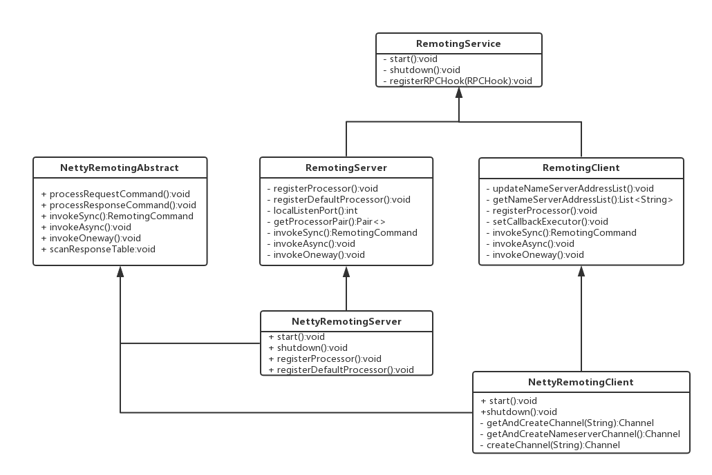
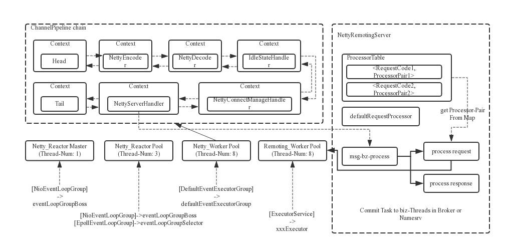

RocketMQ使用Netty进行底层通信，包括`NameServer`、`Broker(Master/Slave)`、`Producer`、`Consumer`4个角色，接下来让我们分析一下它是如何实现的。

Version: 4.5.2

## 基本概念

`rocketmq-remoting`模块承担了远程通信的任务，相关代码都存在于`org.apache.rocketmq.remoting`包下面。

虽然`Netty`本身已经对许多网络问题进行了处理，并且大幅简化了网络编程（相对于使用原生Java NIO API），但是我们在开发时大多情况下仍然是在应用层进行的。因此，我们在采用TCP作为传输层协议时，需要考虑TCP流协议的特性，自定义一个应用层协议以便解决所谓的“粘包”，“半包”问题（当然这两个术语都是不严谨的，此处因其知名度借用）。虽然可以直接使用最常接触的HTTP协议等应用层协议，但是其头部信息对于常规应用来说都是无用的，考虑到通信性能等因素，自定义应用层协议是最好的选择。而`Netty`本身提供了通用的编码器以及解码器，用于解决TCP传输问题，例如`LengthFieldBasedFrameDecoder`，但是我们在其上抽象出一层专用的通信API是更好的选择。同时，当我们不使用`Netty`作为底层通信框架时，其他模块也是无感的。

分析完不直接使用`Netty`进行编码的原因后，让我们看一下RocketMQ提供的通信API。

remoting通信类结构如下：



`RemotingServer`和`RemotingClient`接口都提供了同步调用，异步调用以及单向调用三种通信方式，因此可以满足几乎所有的通信需求。在此基础上，使用`Netty`作为具体实现，完成高性能的通信过程。


### 协议设计与编解码

在`Client`和`Server`之间完成一次消息发送时，需要对发送的消息进行一个协议约定，因此就有必要自定义`RocketMQ`的消息协议。同时，为了高效地在网络中传输消息和对收到的消息读取，就需要对消息进行编解码。在`RocketMQ`中，`RemotingCommand`这个类在消息传输过程中对所有数据内容的封装，不但包含了所有的数据结构，还包含了编码解码操作。

下面是`RocketMQ`所使用协议的头部字段：

Header字段 | 类型 | Request说明 | Response说明
--- | --- | --- | --- |
code |int | 请求操作码，应答方根据不同的请求码进行不同的业务处理 | 应答响应码。0表示成功，非0则表示各种错误
language | LanguageCode | 请求方实现的语言 | 应答方实现的语言
version | int | 请求方程序的版本 | 应答方程序的版本
opaque | int |相当于reqeustId，在同一个连接上的不同请求标识码，与响应消息中的相对应 | 应答不做修改直接返回
flag | int | 区分是普通RPC还是onewayRPC得标志 | 区分是普通RPC还是onewayRPC得标志
remark | String | 传输自定义文本信息 | 传输自定义文本信息
extFields | HashMap<String, String> | 请求自定义扩展信息 | 响应自定义扩展信息

对其进行编码以后，一个完整的消息结构如下所示：

)

可见传输内容主要可以分为以下4部分：

1. 消息长度：总长度，四个字节存储，占用一个int类型；

2. 序列化类型&消息头长度：同样占用一个int类型，第一个字节表示序列化类型，后面三个字节表示消息头长度；

3. 消息头数据：经过序列化后的消息头数据；

4. 消息主体数据：消息主体的二进制字节数据内容；


### Refactor多线程设计

`RocketMQ`的RPC通信采用`Netty`组件作为底层通信库，同样也遵循了`Reactor`多线程模型，同时又在这之上做了一些扩展和优化。



在`Netty`的`ChannelPipeline`链中包含编码器，解码器，空闲状态处理器，连接管理器以及核心的业务处理器。其中编码器和解码器用于`RemotingCommand`的编解码；空闲状态处理器用于检测空闲连接，如果某个客户端在给定时间内未与服务端通信（无论读写），那么将会关闭这个空闲连接；连接管理器用于记录客户端连接日志，同时也作为事件源，发出连接事件，空闲时间，连接关闭事件，异常事件等，用户可以自定义监听器处理这些事件。

上面的框图中可以大致了解`RocketMQ`中`NettyRemotingServer`的`Reactor`多线程模型。一个`Reactor`主线程（`eventLoopGroupBoss`，即为上面的`Netty_Reactor_Master`）负责监听TCP网络连接请求，建立好连接，创建`SocketChannel`，并注册到`Selector`上。`RocketMQ`的源码中会自动根据OS的类型选择`NIO`和`Epoll`，也可以通过参数配，然后监听真正的网络数据。拿到网络数据后，再丢给Worker线程池（`eventLoopGroupSelector`，即为上面的`Netty_Reactor_Pool`，源码中默认设置线程数为3），在真正执行业务逻辑之前需要进行SSL验证、编解码、空闲检查、网络连接管理，这些工作交给`defaultEventExecutorGroup`（即为上面的`Netty_Worker_Pool`，源码中默认设置线程数为8）去做。而处理业务操作放在业务线程池中执行，根据`RomotingCommand`的业务请求码code去`processorTable`这个本地缓存变量中找到对应的`processor`，然后封装成task任务后，提交给对应的业务`processor`处理线程池来执行（以处理请求消息为例，即为上面的`Remoting_Worker_Pool`）。从入口到业务逻辑的几个步骤中线程池一直再增加，这跟每一步逻辑复杂性相关，越复杂，需要的并发通道越宽。

线程数 | 线程名 | 线程具体说明
 --- | --- | --- 
1 | NettyBoss_%d | Reactor 主线程
N | NettyServerEPOLLSelector_%d_%d | Reactor 线程池
M1 | NettyServerCodecThread_%d | Worker线程池
M2 | RemotingExecutorThread_%d | 业务processor处理线程池

从我个人的观点来看，boss以及selector线程池是必需的，这也是`Netty`经典的线程处理模型（由于`Netty`使用了`Reactor`模型），但是`M1`线程池却不是必需的，甚至会在一定程度上降低并发性能。参照`Netty`的线程模型，它希望一个`Channel`的所有数据发送接收都有同一条线程处理，以此最大程度上减少上下文切换带来的性能开销，而在`RocketMQ`的线程模型中，这一点反而被违背了，`Reactor线程池`在此处几乎没有任何作用，`ChannelPipeline`中的自定义处理器全部交由`Worker线程池`处理，`Reactor线程池`只负责消息的接受发送以及最后的异常兜底（此步也由`NettyConnectManageHandle`代为处理了），之后消息的后续处理全部需要进行一次线程切换，由`Worker线程池`中的线程进行处理，而这也是完全不必要的。因为NIO的高性能，I/O在此处并不是扯性能后腿的地方。

了解了基本信息后，让我们正式开始源码解析。

### RemotingCommand

`RemotingCommand`类定义了`RocketMQ`所用协议的内容，我们首先需要理解这个类的内容，以便之后源码的分析。

```java
    private int code;
    private LanguageCode language = LanguageCode.JAVA;
    private int version = 0;
    private int opaque = requestId.getAndIncrement();
    private int flag = 0;
    private String remark;
    private HashMap<String, String> extFields;
    private transient CommandCustomHeader customHeader;

    private SerializeType serializeTypeCurrentRPC = serializeTypeConfigInThisServer;

    private transient byte[] body;
```

`RemotingCommand`类的私有字段如上所示，大部分字段都在之前的`协议Header表`中进行了介绍，此处多出的第一个字段`customHeader`用来简化`RemotingCommand`的构造，它的类型为`CommandCustomHeader`接口，你可以实现这个接口用来自定义额外的协议头信息，这些信息最终将会编码到`extFields`字段中；第二个字段`serializeTypeCurrentRPC`表示`RemotingCommand`类的序列化方式，当前实现存在json序列化以及紧凑型序列化两种方式，第二种方法将协议头字段紧密排列在一起，以减少数据流的大小，默认使用json序列化方式。

`RemotingCommand`类的构造方法的访问控制符为`protected`，因此我们无法通过构造方法构造它的对象，只能使用其提供的几个静态工厂方法，当然这几个方法也提供了极大的便利。

1. createRequestCommand(int code, CommandCustomHeader customHeader)
2. createResponseCommand(Class<? extends CommandCustomHeader> classHeader)
3. createResponseCommand(int code, String remark,
        Class<? extends CommandCustomHeader> classHeader)
4. createResponseCommand(int code, String remark)

其中第一个用来构造请求数据，剩余三个用于构造回复数据。当你的回复数据需要自定义请求头信息时，你需要先调用第二个方法或者第三个方法，然后调用`RemotingCommand#readCustomHeader`方法获取自定义请求头的实例，最后将你自定义的字段信息写入这个实例中。当然，这个过程很有画蛇添足的感觉，直接传入一个已经设置好数据的`CommandCustomHeader`接口实例可以省略上面的这些步骤，而非其类型。在此处引入这些麻烦过程的意义在我看来是强制用户自定义的`CommandCustomHeader`接口实例需要一个公有的无参构造方法，以便之后解码时无法构造实例，不过这个要求可以通过约定以及相应的检查，而非加大构造实例的负担。

#### 编码

为了可以在网络中传输数据，需要将`RemotingCommand`类实例编码为字节流，`RemotingCommand`类提供了相应的编码方法`encodeHeader()`，将协议头编码为字节流。

```java
    public ByteBuffer encodeHeader() {
        return encodeHeader(this.body != null ? this.body.length : 0);
    }

    public ByteBuffer encodeHeader(final int bodyLength) {
        // 1> header length size
        int length = 4;

        // 2> header data length
        byte[] headerData;
        headerData = this.headerEncode();

        length += headerData.length;

        // 3> body data length
        length += bodyLength;

        ByteBuffer result = ByteBuffer.allocate(4 + length - bodyLength);

        // length
        result.putInt(length);

        // header length
        result.put(markProtocolType(headerData.length, serializeTypeCurrentRPC));

        // header data
        result.put(headerData);

        result.flip();

        return result;
    }

    public static byte[] markProtocolType(int source, SerializeType type) {
        byte[] result = new byte[4];

        result[0] = type.getCode();
        result[1] = (byte) ((source >> 16) & 0xFF);
        result[2] = (byte) ((source >> 8) & 0xFF);
        result[3] = (byte) (source & 0xFF);
        return result;
    }
```

之前在协议设计一节中已经介绍了编码后的数据结构。首先为4字节的数据流大小，包括协议头以及协议体的总体长度，在上面的方法中为临时变量`length`。接下来的四字节为协议头长度以及序列化所用的方法的合并，第一个字节表示序列化方法，后三个字节表示协议头长度，因为协议头包括`String`以及`HashMap<String, String>`两种不定长的字段。最后是协议头数据，协议体本身已经是`byte[]`，无需编码。

让我们看一下核心方法`headerEncode()`的实现。

```java
    private byte[] headerEncode() {
        this.makeCustomHeaderToNet();
        if (SerializeType.ROCKETMQ == serializeTypeCurrentRPC) {
            return RocketMQSerializable.rocketMQProtocolEncode(this);
        } else {
            return RemotingSerializable.encode(this);
        }
    }

    public void makeCustomHeaderToNet() {
        if (this.customHeader != null) {
            Field[] fields = getClazzFields(customHeader.getClass());
            if (null == this.extFields) {
                this.extFields = new HashMap<String, String>();
            }

            for (Field field : fields) {
                if (!Modifier.isStatic(field.getModifiers())) {
                    String name = field.getName();
                    if (!name.startsWith("this")) {
                        Object value = null;
                        try {
                            field.setAccessible(true);
                            value = field.get(this.customHeader);
                        } catch (Exception e) {
                            log.error("Failed to access field [{}]", name, e);
                        }

                        if (value != null) {
                            this.extFields.put(name, value.toString());
                        }
                    }
                }
            }
        }
    }

```

`makeCustomHeaderToNet()`方法用于将自定义的`CommandCustomHeader`实例数据放入`extFields`字段中。然后根据不同的序列化方法对协议头字段进行序列化，包括`json`序列化以及`RocketMQ`自定义的序列化两种方式。

关于`json`序列化方式没有什么好介绍的，`RocketMQ`使用`fastjson`作为底层json框架，这个框架目前拥有许多问题，作者也没有足够精力进行解决，如果需要借用`rocketmq-remoting`模块，最好换用其他稳定性较高的json框架。`RocketMQ`自定义的序列化方式相比json更加高效，如下所示：

| 字段 | 长度（字节） |
| :-: | :-:|
| code | 2 |
| language | 1|
| version | 2 |
| opaque | 4 | 
| flag | 4 |
| remark | 不定长 |
| extFields | 不定长 |

关于最后两个不定长字段，如果存在数据，那么先写入长度，再写入数据。即`remark len | remark data | extFields len | extFields data`。

这种序列化方式相对于json来说省去了字段名以及json的格式，只传输真正的数据，因此每一次的数据传输都更加精简，无论性能还是稳定性都获得了提升。

完整的编码过程在`NettyEncoder`类中，如下所示：

```java
    public void encode(ChannelHandlerContext ctx, RemotingCommand remotingCommand, ByteBuf out)
        throws Exception {
        try {
            ByteBuffer header = remotingCommand.encodeHeader();
            out.writeBytes(header);
            byte[] body = remotingCommand.getBody();
            if (body != null) {
                out.writeBytes(body);
            }
        } catch (Exception e) {
            log.error("encode exception, " + RemotingHelper.parseChannelRemoteAddr(ctx.channel()), e);
            if (remotingCommand != null) {
                log.error(remotingCommand.toString());
            }
            RemotingUtil.closeChannel(ctx.channel());
        }
    }
```

首先对协议头编码写入，然后直接写入协议体内容。

#### 解码

了解了编码的过程后，解码的过程则很容易理解。解码方法如下所示：

```java
    public static RemotingCommand decode(final ByteBuffer byteBuffer) {
        int length = byteBuffer.limit();
        int oriHeaderLen = byteBuffer.getInt();
        int headerLength = getHeaderLength(oriHeaderLen);

        byte[] headerData = new byte[headerLength];
        byteBuffer.get(headerData);

        RemotingCommand cmd = headerDecode(headerData, getProtocolType(oriHeaderLen));

        int bodyLength = length - 4 - headerLength;
        byte[] bodyData = null;
        if (bodyLength > 0) {
            bodyData = new byte[bodyLength];
            byteBuffer.get(bodyData);
        }
        cmd.body = bodyData;

        return cmd;
    }

    public static int getHeaderLength(int length) {
        return length & 0xFFFFFF;
    }
```

在解码过程中，我们发现数据的前4个字节为协议头长度，而编码时前4个字节为消息的总长度。这并不是代码写错了，而是`RocketMQ`使用`Netty`提供了解码工具类`LengthFieldBasedFrameDecoder`。如下所示：

```java
public NettyDecoder() {
    super(FRAME_MAX_LENGTH, 0, 4, 0, 4);
}
```

在这个解码器的构造过程中，指明了消息长度为前4字节，并且最后会丢弃前4字节。具体细节请自行查阅`LengthFieldBasedFrameDecoder`类的文档。

```java
    private static RemotingCommand headerDecode(byte[] headerData, SerializeType type) {
        switch (type) {
            case JSON:
                RemotingCommand resultJson = RemotingSerializable.decode(headerData, RemotingCommand.class);
                resultJson.setSerializeTypeCurrentRPC(type);
                return resultJson;
            case ROCKETMQ:
                RemotingCommand resultRMQ = RocketMQSerializable.rocketMQProtocolDecode(headerData);
                resultRMQ.setSerializeTypeCurrentRPC(type);
                return resultRMQ;
            default:
                break;
        }

        return null;
    }

    public static SerializeType getProtocolType(int source) {
        return SerializeType.valueOf((byte) ((source >> 24) & 0xFF));
    }
```

协议头的反序列化过程如上所示，只是根据编码所用的序列化方法反序列化。如果你需要获取自定义的`CommandCustomHeader`实例，需要调用`decodeCommandCustomHeader()`方法。具体过程只是使用java反射，此处不多赘述了。

完成的解码过程在`NettyDecoder`方法中，如下所示：

```java
    @Override
    public Object decode(ChannelHandlerContext ctx, ByteBuf in) throws Exception {
        ByteBuf frame = null;
        try {
            frame = (ByteBuf) super.decode(ctx, in);
            if (null == frame) {
                return null;
            }

            ByteBuffer byteBuffer = frame.nioBuffer();

            return RemotingCommand.decode(byteBuffer);
        } catch (Exception e) {
            log.error("decode exception, " + RemotingHelper.parseChannelRemoteAddr(ctx.channel()), e);
            RemotingUtil.closeChannel(ctx.channel());
        } finally {
            if (null != frame) {
                frame.release();
            }
        }

        return null;
    }
```

## 服务端

服务端`NettyRemotingServer`的构造方法有两个，其中一个可以指定之前提到的事件监听器，默认为空，具体如下：

```java
public NettyRemotingServer(final NettyServerConfig nettyServerConfig) {
    this(nettyServerConfig, null);
}

public NettyRemotingServer(final NettyServerConfig nettyServerConfig,
    final ChannelEventListener channelEventListener) {
    // 256 64
    super(nettyServerConfig.getServerOnewaySemaphoreValue(), nettyServerConfig.getServerAsyncSemaphoreValue());
    this.serverBootstrap = new ServerBootstrap();
    this.nettyServerConfig = nettyServerConfig;
    this.channelEventListener = channelEventListener;

    // 0
    int publicThreadNums = nettyServerConfig.getServerCallbackExecutorThreads();
    if (publicThreadNums <= 0) {
        publicThreadNums = 4;
    }

    this.publicExecutor = Executors.newFixedThreadPool(publicThreadNums, new ThreadFactory() {
        private AtomicInteger threadIndex = new AtomicInteger(0);

        @Override
        public Thread newThread(Runnable r) {
            return new Thread(r, "NettyServerPublicExecutor_" + this.threadIndex.incrementAndGet());
        }
    });

    // linux环境使用epoll
    if (useEpoll()) {
        // 1  boss eventLoopGroup，负责监听accept请求
        this.eventLoopGroupBoss = new EpollEventLoopGroup(1, new ThreadFactory() {
            private AtomicInteger threadIndex = new AtomicInteger(0);

            @Override
            public Thread newThread(Runnable r) {
                return new Thread(r, String.format("NettyEPOLLBoss_%d", this.threadIndex.incrementAndGet()));
            }
        });

        // 3  selector eventLoopGroup，收发网络数据
        this.eventLoopGroupSelector = new EpollEventLoopGroup(nettyServerConfig.getServerSelectorThreads(), new ThreadFactory() {
            private AtomicInteger threadIndex = new AtomicInteger(0);
            private int threadTotal = nettyServerConfig.getServerSelectorThreads();

            @Override
            public Thread newThread(Runnable r) {
                return new Thread(r, String.format("NettyServerEPOLLSelector_%d_%d", threadTotal, this.threadIndex.incrementAndGet()));
            }
        });
    } else {
        this.eventLoopGroupBoss = new NioEventLoopGroup(1, new ThreadFactory() {
            private AtomicInteger threadIndex = new AtomicInteger(0);

            @Override
            public Thread newThread(Runnable r) {
                return new Thread(r, String.format("NettyNIOBoss_%d", this.threadIndex.incrementAndGet()));
            }
        });

        this.eventLoopGroupSelector = new NioEventLoopGroup(nettyServerConfig.getServerSelectorThreads(), new ThreadFactory() {
            private AtomicInteger threadIndex = new AtomicInteger(0);
            private int threadTotal = nettyServerConfig.getServerSelectorThreads();

            @Override
            public Thread newThread(Runnable r) {
                return new Thread(r, String.format("NettyServerNIOSelector_%d_%d", threadTotal, this.threadIndex.incrementAndGet()));
            }
        });
    }

    loadSslContext();
}

```

核心过程就是`ServerBootstrap`所需组件的构造，默认使用`NioEventLoopGroup`，使用一个boss线程处理TCP网络请求，三个worker线程处理消息收发。你也可以使用`epoll`代替默认的`nio`，如果你所使用的平台为linux并且支持`epoll`，同时你还需要主动配置以启用它。

```java
private boolean useEpoll() {
    return RemotingUtil.isLinuxPlatform()
        && nettyServerConfig.isUseEpollNativeSelector()
        && Epoll.isAvailable();
}

/**
 * make make install
 *
 *
 * ../glibc-2.10.1/configure \ --prefix=/usr \ --with-headers=/usr/include \
 * --host=x86_64-linux-gnu \ --build=x86_64-pc-linux-gnu \ --without-gd
 */
private boolean useEpollNativeSelector = false;

```

`Netty`本身是建立在传输层之上的通信框架，为了消息的安全性，还需要设置SSL，以保证通信安全。在此处，`RocketMQ`使用`Netty`内建的SSL工具类。

```java
public void loadSslContext() {
    // 默认为permissive
    TlsMode tlsMode = TlsSystemConfig.tlsMode;
    log.info("Server is running in TLS {} mode", tlsMode.getName());

    if (tlsMode != TlsMode.DISABLED) {
        try {
            sslContext = TlsHelper.buildSslContext(false);
            log.info("SSLContext created for server");
        } catch (CertificateException e) {
            log.error("Failed to create SSLContext for server", e);
        } catch (IOException e) {
            log.error("Failed to create SSLContext for server", e);
        }
    }
}

public static SslContext buildSslContext(boolean forClient) throws IOException, CertificateException {
    //     /etc/rocketmq/tls.properties
    //  默认此文件不存在
    File configFile = new File(TlsSystemConfig.tlsConfigFile);
    extractTlsConfigFromFile(configFile);
    // 日志记录最终的配置信息
    logTheFinalUsedTlsConfig();

    SslProvider provider;
    if (OpenSsl.isAvailable()) {
        provider = SslProvider.OPENSSL;
        LOGGER.info("Using OpenSSL provider");
    } else {
        provider = SslProvider.JDK;
        LOGGER.info("Using JDK SSL provider");
    }

    // false
    if (forClient) {
        if (tlsTestModeEnable) {
            return SslContextBuilder
                .forClient()
                .sslProvider(SslProvider.JDK)
                .trustManager(InsecureTrustManagerFactory.INSTANCE)
                .build();
        } else {
            SslContextBuilder sslContextBuilder = SslContextBuilder.forClient().sslProvider(SslProvider.JDK);


            if (!tlsClientAuthServer) {
                sslContextBuilder.trustManager(InsecureTrustManagerFactory.INSTANCE);
            } else {
                if (!isNullOrEmpty(tlsClientTrustCertPath)) {
                    sslContextBuilder.trustManager(new File(tlsClientTrustCertPath));
                }
            }

            return sslContextBuilder.keyManager(
                !isNullOrEmpty(tlsClientCertPath) ? new FileInputStream(tlsClientCertPath) : null,
                !isNullOrEmpty(tlsClientKeyPath) ? decryptionStrategy.decryptPrivateKey(tlsClientKeyPath, true) : null,
                !isNullOrEmpty(tlsClientKeyPassword) ? tlsClientKeyPassword : null)
                .build();
        }
    } else {
        // tls.test.mode.enable 系统变量，默认为true
        if (tlsTestModeEnable) {
            // 使用netty内建的ssl context
            SelfSignedCertificate selfSignedCertificate = new SelfSignedCertificate();
            return SslContextBuilder
                .forServer(selfSignedCertificate.certificate(), selfSignedCertificate.privateKey())
                .sslProvider(SslProvider.JDK)
                .clientAuth(ClientAuth.OPTIONAL)
                .build();
        } else {
            SslContextBuilder sslContextBuilder = SslContextBuilder.forServer(
                !isNullOrEmpty(tlsServerCertPath) ? new FileInputStream(tlsServerCertPath) : null,
                !isNullOrEmpty(tlsServerKeyPath) ? decryptionStrategy.decryptPrivateKey(tlsServerKeyPath, false) : null,
                !isNullOrEmpty(tlsServerKeyPassword) ? tlsServerKeyPassword : null)
                .sslProvider(provider);

            if (!tlsServerAuthClient) {
                sslContextBuilder.trustManager(InsecureTrustManagerFactory.INSTANCE);
            } else {
                if (!isNullOrEmpty(tlsServerTrustCertPath)) {
                    sslContextBuilder.trustManager(new File(tlsServerTrustCertPath));
                }
            }

            sslContextBuilder.clientAuth(parseClientAuthMode(tlsServerNeedClientAuth));
            return sslContextBuilder.build();
        }
    }
}

```

如果你需要自定义SSL相关信息，请构建`/etc/rocketmq/tls.properties`文件，并将`tls.test.mode.enable`属性设置为`false`。配置文件支持的全部配置项如下所示：

```java
    public static final String TLS_SERVER_MODE = "tls.server.mode";
    public static final String TLS_ENABLE = "tls.enable";
    public static final String TLS_CONFIG_FILE = "tls.config.file";
    public static final String TLS_TEST_MODE_ENABLE = "tls.test.mode.enable";

    public static final String TLS_SERVER_NEED_CLIENT_AUTH = "tls.server.need.client.auth";
    public static final String TLS_SERVER_KEYPATH = "tls.server.keyPath";
    public static final String TLS_SERVER_KEYPASSWORD = "tls.server.keyPassword";
    public static final String TLS_SERVER_CERTPATH = "tls.server.certPath";
    public static final String TLS_SERVER_AUTHCLIENT = "tls.server.authClient";
    public static final String TLS_SERVER_TRUSTCERTPATH = "tls.server.trustCertPath";

    public static final String TLS_CLIENT_KEYPATH = "tls.client.keyPath";
    public static final String TLS_CLIENT_KEYPASSWORD = "tls.client.keyPassword";
    public static final String TLS_CLIENT_CERTPATH = "tls.client.certPath";
    public static final String TLS_CLIENT_AUTHSERVER = "tls.client.authServer";
    public static final String TLS_CLIENT_TRUSTCERTPATH = "tls.client.trustCertPath";
```

每一个配置项的具体信息请查阅源码文档，在此处不具体介绍。

### 启动服务端

在所有准备工作完成后，我们正式开始`ServerBootstrap`的构造。这一步只是常规的`ServerBootstrap`构造过程，我们直接看代码即可。

```java
public void start() {
    // 8  worker线程池，负责执行ChannelHandler链
    this.defaultEventExecutorGroup = new DefaultEventExecutorGroup(
        nettyServerConfig.getServerWorkerThreads(),
        new ThreadFactory() {

            private AtomicInteger threadIndex = new AtomicInteger(0);

            @Override
            public Thread newThread(Runnable r) {
                return new Thread(r, "NettyServerCodecThread_" + this.threadIndex.incrementAndGet());
            }
        });

    // 准备共享的ChannelHandler
    prepareSharableHandlers();

    // 配置ServerBootstrap
    ServerBootstrap childHandler =
        this.serverBootstrap.group(this.eventLoopGroupBoss, this.eventLoopGroupSelector)
            .channel(useEpoll() ? EpollServerSocketChannel.class : NioServerSocketChannel.class)
            .option(ChannelOption.SO_BACKLOG, 1024)
            .option(ChannelOption.SO_REUSEADDR, true)
            .option(ChannelOption.SO_KEEPALIVE, false)
            .childOption(ChannelOption.TCP_NODELAY, true)
            .childOption(ChannelOption.SO_SNDBUF, nettyServerConfig.getServerSocketSndBufSize())
            .childOption(ChannelOption.SO_RCVBUF, nettyServerConfig.getServerSocketRcvBufSize())
            .localAddress(new InetSocketAddress(this.nettyServerConfig.getListenPort()))
            .childHandler(new ChannelInitializer<SocketChannel>() {
                @Override
                public void initChannel(SocketChannel ch) throws Exception {
                    ch.pipeline()
                        .addLast(defaultEventExecutorGroup, HANDSHAKE_HANDLER_NAME, handshakeHandler)
                        .addLast(defaultEventExecutorGroup,
                            encoder,
                            new NettyDecoder(),
                            new IdleStateHandler(0, 0, nettyServerConfig.getServerChannelMaxIdleTimeSeconds()),
                            connectionManageHandler,
                            serverHandler
                        );
                }
            });

    if (nettyServerConfig.isServerPooledByteBufAllocatorEnable()) {
        childHandler.childOption(ChannelOption.ALLOCATOR, PooledByteBufAllocator.DEFAULT);
    }

    try {
        ChannelFuture sync = this.serverBootstrap.bind().sync();
        InetSocketAddress addr = (InetSocketAddress) sync.channel().localAddress();
        // 8888
        this.port = addr.getPort();
    } catch (InterruptedException e1) {
        throw new RuntimeException("this.serverBootstrap.bind().sync() InterruptedException", e1);
    }

    if (this.channelEventListener != null) {
        this.nettyEventExecutor.start();
    }

    // 定期扫描回复表，执行回调方法
    this.timer.scheduleAtFixedRate(new TimerTask() {

        @Override
        public void run() {
            try {
                NettyRemotingServer.this.scanResponseTable();
            } catch (Throwable e) {
                log.error("scanResponseTable exception", e);
            }
        }
    }, 1000 * 3, 1000);
}

```

以上指定了`ServerBootstrap`的各种配置项，包括TCP的配置以及本地绑定的端口号，默认为`8888`。

### ChannelHandlers

作为服务端，最主要的功能就是接受客户端的请求并进行处理。由于底层通信框架是`Netty`，因此我们直接看`ChannelPipeline`中注册的`ChannelHandler`即可。

在之前的`start()`方法中，有一个方法为`prepareSharableHandlers()`，它是一个私有方法，用来准备将要使用的`ChannelHandler`。

```java
    private void prepareSharableHandlers() {
        handshakeHandler = new HandshakeHandler(TlsSystemConfig.tlsMode);
        encoder = new NettyEncoder();
        connectionManageHandler = new NettyConnectManageHandler();
        serverHandler = new NettyServerHandler();
    }
```

在之后`ServerBootstrap`的构造过程中，共注册了`handshakeHandler`, `encoder`, `decoder`, `IdleStateHandler`, `connectionManageHandler`以及`serverHandler`六种`ChannelHandler`，接下来我们逐个介绍它们的用处以及实现。

#### handshakeHandler

`HandshakeHandler`的声明如下，它是一个入站处理器，用于处理客户端发送来的消息：

```java
class HandshakeHandler extends SimpleChannelInboundHandler<ByteBuf>
```

让我们看一下它的核心方法`channelRead0`，这个方法用于处理客户端发送的消息：

```java
        private static final byte HANDSHAKE_MAGIC_CODE = 0x16;

        @Override
        protected void channelRead0(ChannelHandlerContext ctx, ByteBuf msg) throws Exception {

            // mark the current position so that we can peek the first byte to determine if the content is starting with
            // TLS handshake
            msg.markReaderIndex();

            byte b = msg.getByte(0);

            if (b == HANDSHAKE_MAGIC_CODE) {
                switch (tlsMode) {
                    case DISABLED:
                        ctx.close();
                        log.warn("Clients intend to establish a SSL connection while this server is running in SSL disabled mode");
                        break;
                    case PERMISSIVE:
                    case ENFORCING:
                        if (null != sslContext) {
                            ctx.pipeline()
                                .addAfter(defaultEventExecutorGroup, HANDSHAKE_HANDLER_NAME, TLS_HANDLER_NAME, sslContext.newHandler(ctx.channel().alloc()))
                                .addAfter(defaultEventExecutorGroup, TLS_HANDLER_NAME, FILE_REGION_ENCODER_NAME, new FileRegionEncoder());
                            log.info("Handlers prepended to channel pipeline to establish SSL connection");
                        } else {
                            ctx.close();
                            log.error("Trying to establish a SSL connection but sslContext is null");
                        }
                        break;

                    default:
                        log.warn("Unknown TLS mode");
                        break;
                }
            } else if (tlsMode == TlsMode.ENFORCING) {
                ctx.close();
                log.warn("Clients intend to establish an insecure connection while this server is running in SSL enforcing mode");
            }

            // reset the reader index so that handshake negotiation may proceed as normal.
            msg.resetReaderIndex();

            try {
                // Remove this handler
                ctx.pipeline().remove(this);
            } catch (NoSuchElementException e) {
                log.error("Error while removing HandshakeHandler", e);
            }

            // Hand over this message to the next .
            ctx.fireChannelRead(msg.retain());
        }
```

它主要用来进行TLS启动的握手步骤，服务端可以配置是否使用SSL加密，分为三个级别：

1. DISABLED。禁用SSL，任何SSL握手请求都将被拒绝并且关闭连接。
2. PERMISSIVE。可选，客户端无论是否使用SSL都会被接受。
3. ENFORCING。必需，任何不使用SSL的连接都将被拒绝。

如果允许SSL加密，并且客户端发送了SSL握手请求，那么服务端的`ChannelPipeline`中将会新增两个`ChannelHandler`，分别为`SslHandler`以及`FileRegionEncoder`，第一个用来SSL加密通信，第二个用于处理`FileRegion`信息，由于`SslHandler`要求数据形式必须为`ByteBuf`，因此当使用`FileRegion`时需要先将其转换为`ByteBuf`类型的信息。这两个`ChannelHandler`都将被增加到`handshakeHandler`后面，增加完成后`handshakeHandler`将会被移除，因为它的任务已经完成了。

#### encoder & decoder

这两个处理器已经在之前介绍过，此处不多说。

#### IdleStateHandler

`IdleStateHandler`是`Netty`内建的空闲处理器，`RocketMQ`对其的构造使用如下：

```java
new IdleStateHandler(0, 0, nettyServerConfig.getServerChannelMaxIdleTimeSeconds())
```

当在给定时间（`getServerChannelMaxIdleTimeSeconds()`）内客户端与服务端之间的连接没有发生读写事件，那么将会发出空闲事件`IdleStateEvent`，这个事件将会在`connectionManageHandler`中处理，关闭这条连接。关于`IdleStateHandler`的具体实现原理，请查阅其源码文档。

#### connectionManageHandler

连接管理处理器主要用于记录日志，如果在构造`NettyRemotingServer`时提供了事件监听器，那么当有客户端连接或者失联时，将会发出事件，由监听器进行处理。

#### serverHandler

核心的业务处理器，核心方法如下：

```java
    @Override
    protected void channelRead0(ChannelHandlerContext ctx, RemotingCommand msg) throws Exception {
        processMessageReceived(ctx, msg);
    }

    public void processMessageReceived(ChannelHandlerContext ctx, RemotingCommand msg) throws Exception {
        final RemotingCommand cmd = msg;
        if (cmd != null) {
            switch (cmd.getType()) {
                case REQUEST_COMMAND:
                    processRequestCommand(ctx, cmd);
                    break;
                case RESPONSE_COMMAND:
                    processResponseCommand(ctx, cmd);
                    break;
                default:
                    break;
            }
        }
    }
```

请求处理主要适用于服务端，服务端持有一个请求处理器表，请求码与处理器一对一映射。当请求到来时，会根据其请求码到表中寻找对应的处理器进行处理，如果没有那么将使用默认处理器。如果不存在默认处理器，那么将会直接发送一个不支持此请求的回复给客户端。

处理器可以通过`registerProcessor(final int requestCode, final NettyRequestProcessor processor, final ExecutorService executor)`和`registerDefaultProcessor(final NettyRequestProcessor processor, final ExecutorService executor)`两个方法进行注册，第一个根据请求码注册，第二个则是注册默认处理器。

除此以外，用户还可以注册hook，它们会在处理请求前以及处理回复后执行，你可以自定义`RPCHook`实现类并通过`registerRPCHook(RPCHook rpcHook)`方法注册。

下面是`processRequestCommand`方法的实现：

```java
    public void processRequestCommand(final ChannelHandlerContext ctx, final RemotingCommand cmd) {
        // 根据请求码获取对应的处理器，默认使用defaultRequestProcessor
        final Pair<NettyRequestProcessor, ExecutorService> matched = this.processorTable.get(cmd.getCode());
        final Pair<NettyRequestProcessor, ExecutorService> pair = null == matched ? this.defaultRequestProcessor : matched;
        final int opaque = cmd.getOpaque();

        // 如果存在可用的处理器
        if (pair != null) {
            Runnable run = new Runnable() {
                @Override
                public void run() {
                    try {
                        // 执行hook
                        doBeforeRpcHooks(RemotingHelper.parseChannelRemoteAddr(ctx.channel()), cmd);
                        // 处理请求，并生成回复
                        final RemotingCommand response = pair.getObject1().processRequest(ctx, cmd);
                        // 执行hook
                        doAfterRpcHooks(RemotingHelper.parseChannelRemoteAddr(ctx.channel()), cmd, response);

                        // 如果不是单向请求，发送回复
                        if (!cmd.isOnewayRPC()) {
                            if (response != null) {
                                response.setOpaque(opaque);
                                response.markResponseType();
                                try {
                                    ctx.writeAndFlush(response);
                                } catch (Throwable e) {
                                    log.error("process request over, but response failed", e);
                                    log.error(cmd.toString());
                                    log.error(response.toString());
                                }
                            } else {

                            }
                        }
                    } catch (Throwable e) {
                        log.error("process request exception", e);
                        log.error(cmd.toString());

                        if (!cmd.isOnewayRPC()) {
                            final RemotingCommand response = RemotingCommand.createResponseCommand(RemotingSysResponseCode.SYSTEM_ERROR,
                                RemotingHelper.exceptionSimpleDesc(e));
                            response.setOpaque(opaque);
                            ctx.writeAndFlush(response);
                        }
                    }
                }
            };

            // 默认为false
            if (pair.getObject1().rejectRequest()) {
                final RemotingCommand response = RemotingCommand.createResponseCommand(RemotingSysResponseCode.SYSTEM_BUSY,
                    "[REJECTREQUEST]system busy, start flow control for a while");
                response.setOpaque(opaque);
                ctx.writeAndFlush(response);
                return;
            }

            try {
                // 构造任务并提交到线程池
                final RequestTask requestTask = new RequestTask(run, ctx.channel(), cmd);
                pair.getObject2().submit(requestTask);
            } catch (RejectedExecutionException e) {
                if ((System.currentTimeMillis() % 10000) == 0) {
                    log.warn(RemotingHelper.parseChannelRemoteAddr(ctx.channel())
                        + ", too many requests and system thread pool busy, RejectedExecutionException "
                        + pair.getObject2().toString()
                        + " request code: " + cmd.getCode());
                }

                if (!cmd.isOnewayRPC()) {
                    final RemotingCommand response = RemotingCommand.createResponseCommand(RemotingSysResponseCode.SYSTEM_BUSY,
                        "[OVERLOAD]system busy, start flow control for a while");
                    response.setOpaque(opaque);
                    ctx.writeAndFlush(response);
                }
            }
        } else {
            String error = " request type " + cmd.getCode() + " not supported";
            final RemotingCommand response =
                RemotingCommand.createResponseCommand(RemotingSysResponseCode.REQUEST_CODE_NOT_SUPPORTED, error);
            response.setOpaque(opaque);
            ctx.writeAndFlush(response);
            log.error(RemotingHelper.parseChannelRemoteAddr(ctx.channel()) + error);
        }
    }
```

`NettyRequestProcessor`接口提供了`boolean rejectRequest()`方法，用户可以实现它进行限流或者熔断操作，而它的另一个方法`RemotingCommand processRequest(ChannelHandlerContext ctx, RemotingCommand request) throws Exception`则用来处理到来的请求。

如果可以根据请求码找到可用的`NettyRequestProcessor`，那么这个请求将会被封装并交由业务线程池处理。


回复处理则适用于客户端，关于这个功能我们将在后续介绍，接下来先看一下如何发出一个请求。

## 客户端

客户端的构造以及启动过程与服务端大体一样，它的构造方法也是做一些准备工作，如下所示：

```java
    public NettyRemotingClient(final NettyClientConfig nettyClientConfig) {
        this(nettyClientConfig, null);
    }

    public NettyRemotingClient(final NettyClientConfig nettyClientConfig,
        final ChannelEventListener channelEventListener) {
        super(nettyClientConfig.getClientOnewaySemaphoreValue(), nettyClientConfig.getClientAsyncSemaphoreValue());
        this.nettyClientConfig = nettyClientConfig;
        this.channelEventListener = channelEventListener;

        // Runtime.getRuntime().availableProcessors()
        int publicThreadNums = nettyClientConfig.getClientCallbackExecutorThreads();
        if (publicThreadNums <= 0) {
            publicThreadNums = 4;
        }

        // 作为默认业务线程池
        this.publicExecutor = Executors.newFixedThreadPool(publicThreadNums, new ThreadFactory() {
            private AtomicInteger threadIndex = new AtomicInteger(0);

            @Override
            public Thread newThread(Runnable r) {
                return new Thread(r, "NettyClientPublicExecutor_" + this.threadIndex.incrementAndGet());
            }
        });

        // 收发消息线程池
        this.eventLoopGroupWorker = new NioEventLoopGroup(1, new ThreadFactory() {
            private AtomicInteger threadIndex = new AtomicInteger(0);

            @Override
            public Thread newThread(Runnable r) {
                return new Thread(r, String.format("NettyClientSelector_%d", this.threadIndex.incrementAndGet()));
            }
        });

        // 是否使用SSL
        if (nettyClientConfig.isUseTLS()) {
            try {
                sslContext = TlsHelper.buildSslContext(true);
                log.info("SSL enabled for client");
            } catch (IOException e) {
                log.error("Failed to create SSLContext", e);
            } catch (CertificateException e) {
                log.error("Failed to create SSLContext", e);
                throw new RuntimeException("Failed to create SSLContext", e);
            }
        }
    }
```

准备工作完成后，让我们看一下它的启动过程。

```java
    public void start() {
        this.defaultEventExecutorGroup = new DefaultEventExecutorGroup(
            nettyClientConfig.getClientWorkerThreads(),
            new ThreadFactory() {

                private AtomicInteger threadIndex = new AtomicInteger(0);

                @Override
                public Thread newThread(Runnable r) {
                    return new Thread(r, "NettyClientWorkerThread_" + this.threadIndex.incrementAndGet());
                }
            });

        Bootstrap handler = this.bootstrap.group(this.eventLoopGroupWorker).channel(NioSocketChannel.class)
            .option(ChannelOption.TCP_NODELAY, true)
            .option(ChannelOption.SO_KEEPALIVE, false)
            .option(ChannelOption.CONNECT_TIMEOUT_MILLIS, nettyClientConfig.getConnectTimeoutMillis())
            .option(ChannelOption.SO_SNDBUF, nettyClientConfig.getClientSocketSndBufSize())
            .option(ChannelOption.SO_RCVBUF, nettyClientConfig.getClientSocketRcvBufSize())
            .handler(new ChannelInitializer<SocketChannel>() {
                @Override
                public void initChannel(SocketChannel ch) throws Exception {
                    ChannelPipeline pipeline = ch.pipeline();
                    if (nettyClientConfig.isUseTLS()) {
                        if (null != sslContext) {
                            pipeline.addFirst(defaultEventExecutorGroup, "sslHandler", sslContext.newHandler(ch.alloc()));
                            log.info("Prepend SSL handler");
                        } else {
                            log.warn("Connections are insecure as SSLContext is null!");
                        }
                    }
                    pipeline.addLast(
                        defaultEventExecutorGroup,
                        new NettyEncoder(),
                        new NettyDecoder(),
                        new IdleStateHandler(0, 0, nettyClientConfig.getClientChannelMaxIdleTimeSeconds()),
                        new NettyConnectManageHandler(),
                        new NettyClientHandler());
                }
            });

        this.timer.scheduleAtFixedRate(new TimerTask() {
            @Override
            public void run() {
                try {
                    NettyRemotingClient.this.scanResponseTable();
                } catch (Throwable e) {
                    log.error("scanResponseTable exception", e);
                }
            }
        }, 1000 * 3, 1000);

        if (this.channelEventListener != null) {
            this.nettyEventExecutor.start();
        }
    }

```

客户端的线程模型为一个线程负责建立连接以及收发消息，另一个线程池负责`ChannelPipeline`链中处理器的执行。`ChannelPipeline`链的结构如下所示：

```
Head -> SslHandler(optional) -> NettyEncoder -> NettyDecoder -> IdleStateHandler -> NettyConnectManageHandler -> NettyClientHandler -> Tail
```

其中大部分处理器的功能我们都已经介绍过，而`NettyClientHandler`与`NettyServerHandler`的功能也一样。

## 请求

在`RocketMQ`中定义了三种请求方式：同步请求，异步请求，单向请求。接下来逐个进行介绍。

### 同步调用

同步调用在发出请求后会进行等待状态，直到收到回复或者超时。因此，`RemotingClient#invokeSync`方法需要提供一个超时时间的参数，不过大多情况这个超时时间是固定的，所以如果另外提供一个使用默认超时时间的`invokeSync`方法会更加方便。

```java
    @Override
    public RemotingCommand invokeSync(String addr, final RemotingCommand request, long timeoutMillis)
        throws InterruptedException, RemotingConnectException, RemotingSendRequestException, RemotingTimeoutException {
        long beginStartTime = System.currentTimeMillis();
        // 通过netty构造channel
        // Bootstrap#conntect(addr)
        final Channel channel = this.getAndCreateChannel(addr);
        if (channel != null && channel.isActive()) {
            try {
                doBeforeRpcHooks(addr, request);
                long costTime = System.currentTimeMillis() - beginStartTime;
                if (timeoutMillis < costTime) {
                    throw new RemotingTimeoutException("invokeSync call timeout");
                }
                // 发起同步调用
                RemotingCommand response = this.invokeSyncImpl(channel, request, timeoutMillis - costTime);
                doAfterRpcHooks(RemotingHelper.parseChannelRemoteAddr(channel), request, response);
                return response;
            } catch (RemotingSendRequestException e) {
                log.warn("invokeSync: send request exception, so close the channel[{}]", addr);
                this.closeChannel(addr, channel);
                throw e;
            } catch (RemotingTimeoutException e) {
                if (nettyClientConfig.isClientCloseSocketIfTimeout()) {
                    this.closeChannel(addr, channel);
                    log.warn("invokeSync: close socket because of timeout, {}ms, {}", timeoutMillis, addr);
                }
                log.warn("invokeSync: wait response timeout exception, the channel[{}]", addr);
                throw e;
            }
        } else {
            this.closeChannel(addr, channel);
            throw new RemotingConnectException(addr);
        }
    }
```

使用`Netty`进行通信时需要先与服务端建立连接，在`invokeSync`中我们需要提供服务端的地址，然后通过`getAndCreateChannel`方法构造或者获取一个已有的`Channel`用于通信。我们也可以在`NettyRemotingClient`实例构造完成后通过`void updateNameServerAddressList(final List<String> addrs)`方法提前注册一组服务端地址，当我们传入的服务端地址为`null`时，客户端将从之前注册的服务端地址中选择一个进行通信。当然，这种方式看起来非常不优雅，可以再多加一个`invokeSync(RemotingCommand)`方法，虽然会出现一些方法数量的膨胀，但在这个场景下并不是大问题。

```java
    private Channel getAndCreateChannel(final String addr) throws InterruptedException {
        if (null == addr) {
            return getAndCreateNameserverChannel();
        }

        ChannelWrapper cw = this.channelTables.get(addr);
        if (cw != null && cw.isOK()) {
            return cw.getChannel();
        }

        return this.createChannel(addr);
    }

    private Channel getAndCreateNameserverChannel() throws InterruptedException {
        // 首次调用时返回null
        String addr = this.namesrvAddrChoosed.get();
        if (addr != null) {
            ChannelWrapper cw = this.channelTables.get(addr);
            // 当前channel可用
            if (cw != null && cw.isOK()) {
                return cw.getChannel();
            }
        }

        final List<String> addrList = this.namesrvAddrList.get();
        // 双重检查锁定
        if (this.lockNamesrvChannel.tryLock(LOCK_TIMEOUT_MILLIS, TimeUnit.MILLISECONDS)) {
            try {
                addr = this.namesrvAddrChoosed.get();
                if (addr != null) {
                    ChannelWrapper cw = this.channelTables.get(addr);
                    if (cw != null && cw.isOK()) {
                        return cw.getChannel();
                    }
                }

                // 轮询选择
                if (addrList != null && !addrList.isEmpty()) {
                    for (int i = 0; i < addrList.size(); i++) {
                        int index = this.namesrvIndex.incrementAndGet();
                        index = Math.abs(index);
                        index = index % addrList.size();
                        String newAddr = addrList.get(index);

                        this.namesrvAddrChoosed.set(newAddr);
                        log.info("new name server is chosen. OLD: {} , NEW: {}. namesrvIndex = {}", addr, newAddr, namesrvIndex);
                        Channel channelNew = this.createChannel(newAddr);
                        if (channelNew != null) {
                            return channelNew;
                        }
                    }
                }
            } catch (Exception e) {
                log.error("getAndCreateNameserverChannel: create name server channel exception", e);
            } finally {
                this.lockNamesrvChannel.unlock();
            }
        } else {
            log.warn("getAndCreateNameserverChannel: try to lock name server, but timeout, {}ms", LOCK_TIMEOUT_MILLIS);
        }

        return null;
    }

    private Channel createChannel(final String addr) throws InterruptedException {
        ChannelWrapper cw = this.channelTables.get(addr);
        if (cw != null && cw.isOK()) {
            cw.getChannel().close();
            channelTables.remove(addr);
        }

        if (this.lockChannelTables.tryLock(LOCK_TIMEOUT_MILLIS, TimeUnit.MILLISECONDS)) {
            try {
                boolean createNewConnection;
                cw = this.channelTables.get(addr);
                if (cw != null) {

                    if (cw.isOK()) {
                        cw.getChannel().close();
                        this.channelTables.remove(addr);
                        createNewConnection = true;
                    } else if (!cw.getChannelFuture().isDone()) {
                        createNewConnection = false;
                    } else {
                        this.channelTables.remove(addr);
                        createNewConnection = true;
                    }
                } else {
                    createNewConnection = true;
                }

                if (createNewConnection) {
                    ChannelFuture channelFuture = this.bootstrap.connect(RemotingHelper.string2SocketAddress(addr));
                    log.info("createChannel: begin to connect remote host[{}] asynchronously", addr);
                    cw = new ChannelWrapper(channelFuture);
                    this.channelTables.put(addr, cw);
                }
            } catch (Exception e) {
                log.error("createChannel: create channel exception", e);
            } finally {
                this.lockChannelTables.unlock();
            }
        } else {
            log.warn("createChannel: try to lock channel table, but timeout, {}ms", LOCK_TIMEOUT_MILLIS);
        }

        if (cw != null) {
            ChannelFuture channelFuture = cw.getChannelFuture();
            if (channelFuture.awaitUninterruptibly(this.nettyClientConfig.getConnectTimeoutMillis())) {
                if (cw.isOK()) {
                    log.info("createChannel: connect remote host[{}] success, {}", addr, channelFuture.toString());
                    return cw.getChannel();
                } else {
                    log.warn("createChannel: connect remote host[" + addr + "] failed, " + channelFuture.toString(), channelFuture.cause());
                }
            } else {
                log.warn("createChannel: connect remote host[{}] timeout {}ms, {}", addr, this.nettyClientConfig.getConnectTimeoutMillis(),
                    channelFuture.toString());
            }
        }

        return null;
    }
```

当传入的服务端地址为`null`或者上一个选择的服务端连接不可用时，将会在之前注册的服务端地址列表中轮询选取一个连接，连接使用`Bootstrap#connect(..)`方法。同时，已经构建的`Channel`将会被封装并缓存到`channelTables`中，下次与同一个服务端通信时可以直接复用此连接。

与服务端成功建立连接后，才是真正的同步调用过程，这个过程由`NettyRemotingAbstract#invokeSyncImpl`方法实现。


```java
    public RemotingCommand invokeSyncImpl(final Channel channel, final RemotingCommand request,
        final long timeoutMillis)
        throws InterruptedException, RemotingSendRequestException, RemotingTimeoutException {
        // 获取请求码
        final int opaque = request.getOpaque();

        try {
            // 构造回复回调
            final ResponseFuture responseFuture = new ResponseFuture(channel, opaque, timeoutMillis, null, null);
            // 记录到responseTable
            this.responseTable.put(opaque, responseFuture);
            final SocketAddress addr = channel.remoteAddress();
            // 发送请求并增加回调方法
            channel.writeAndFlush(request).addListener(new ChannelFutureListener() {
                @Override
                public void operationComplete(ChannelFuture f) throws Exception {
                    if (f.isSuccess()) {
                        responseFuture.setSendRequestOK(true);
                        return;
                    } else {
                        responseFuture.setSendRequestOK(false);
                    }

                    // 发送失败，记录失败原因
                    responseTable.remove(opaque);
                    responseFuture.setCause(f.cause());
                    responseFuture.putResponse(null);
                    log.warn("send a request command to channel <" + addr + "> failed.");
                }
            });

            // 等待回复
            RemotingCommand responseCommand = responseFuture.waitResponse(timeoutMillis);
            if (null == responseCommand) {
                if (responseFuture.isSendRequestOK()) {
                    throw new RemotingTimeoutException(RemotingHelper.parseSocketAddressAddr(addr), timeoutMillis,
                        responseFuture.getCause());
                } else {
                    throw new RemotingSendRequestException(RemotingHelper.parseSocketAddressAddr(addr), responseFuture.getCause());
                }
            }

            return responseCommand;
        } finally {
            this.responseTable.remove(opaque);
        }
    }
```

如果发送请求成功，那么将会等待给定的超时时间，在这段时间内如果收到回复，那么发送请求的线程将会被唤醒，否则抛出超时异常。

注意`NettyClientHandler`处理器，当收到服务端的回复时，将调用`processMessageReceived`方法处理回复。在发送请求时，请求序列号已经被记录到表中，它映射的值是一个`ResponseFuture`实例。因此，当收到请求对应的回复时，可以通过请求序列号找到对应的`ResponseFuture`实例，并设置回复值，然后唤醒发送请求的线程。

```java
    public void processResponseCommand(ChannelHandlerContext ctx, RemotingCommand cmd) {
        final int opaque = cmd.getOpaque();
        final ResponseFuture responseFuture = responseTable.get(opaque);
        if (responseFuture != null) {
            responseFuture.setResponseCommand(cmd);

            responseTable.remove(opaque);

            // 处理异步请求
            if (responseFuture.getInvokeCallback() != null) {
                executeInvokeCallback(responseFuture);
            } else {
                // 设置response
                responseFuture.putResponse(cmd);
                // 唤醒responseFuture
                responseFuture.release();
            }
        } else {
            log.warn("receive response, but not matched any request, " + RemotingHelper.parseChannelRemoteAddr(ctx.channel()));
            log.warn(cmd.toString());
        }
    }
```

至此，一个完整的同步请求的发起，服务端的处理、回复以及客户端最后对回复的处理过程已经分析完成。如果你对多线程以及异步有足够的了解，这个过程是比较容易理解的。

### 异步调用

同步调用是较为常用的请求手段，但是对于某些场景来说，异步请求可以极大提升程序的性能。事实上，同步调用与异步调用的代码实现也极为相似，只在关键部分略有不同。

```java
    @Override
    public void invokeAsync(String addr, RemotingCommand request, long timeoutMillis, InvokeCallback invokeCallback)
        throws InterruptedException, RemotingConnectException, RemotingTooMuchRequestException, RemotingTimeoutException,
        RemotingSendRequestException {
        long beginStartTime = System.currentTimeMillis();
        final Channel channel = this.getAndCreateChannel(addr);
        if (channel != null && channel.isActive()) {
            try {
                doBeforeRpcHooks(addr, request);
                long costTime = System.currentTimeMillis() - beginStartTime;
                if (timeoutMillis < costTime) {
                    throw new RemotingTooMuchRequestException("invokeAsync call timeout");
                }
                this.invokeAsyncImpl(channel, request, timeoutMillis - costTime, invokeCallback);
            } catch (RemotingSendRequestException e) {
                log.warn("invokeAsync: send request exception, so close the channel[{}]", addr);
                this.closeChannel(addr, channel);
                throw e;
            }
        } else {
            this.closeChannel(addr, channel);
            throw new RemotingConnectException(addr);
        }
    }
```

上面是`NettyRemotingClient#invokeAsync`方法的实现，它与`invokeSync`方法唯一的区别只是调用了父类的`invokeAsyncImpl`方法。同时，如果你选择异步请求，你需要自己提供一个相应的回调`InvokeCallback`用于处理回复内容。`RocketMQ`对于异步请求的数量也由限制，默认可以同时发起65535个异步请求，这个数量通过`Semaphore`类进行限制，你可以配置`com.rocketmq.remoting.clientAsyncSemaphoreValue`系统属性来自定义这个最大限制值。

```java
    public void invokeAsyncImpl(final Channel channel, final RemotingCommand request, final long timeoutMillis,
        final InvokeCallback invokeCallback)
        throws InterruptedException, RemotingTooMuchRequestException, RemotingTimeoutException, RemotingSendRequestException {
        long beginStartTime = System.currentTimeMillis();
        final int opaque = request.getOpaque();
        // 尝试获取请求资格
        boolean acquired = this.semaphoreAsync.tryAcquire(timeoutMillis, TimeUnit.MILLISECONDS);
        if (acquired) {
            final SemaphoreReleaseOnlyOnce once = new SemaphoreReleaseOnlyOnce(this.semaphoreAsync);
            long costTime = System.currentTimeMillis() - beginStartTime;
            // 如果执行到此步时已经超时，那么直接抛出超时异常，fail fast
            if (timeoutMillis < costTime) {
                once.release();
                throw new RemotingTimeoutException("invokeAsyncImpl call timeout");
            }

            final ResponseFuture responseFuture = new ResponseFuture(channel, opaque, timeoutMillis - costTime, invokeCallback, once);
            this.responseTable.put(opaque, responseFuture);
            try {
                channel.writeAndFlush(request).addListener(new ChannelFutureListener() {
                    @Override
                    public void operationComplete(ChannelFuture f) throws Exception {
                        if (f.isSuccess()) {
                            responseFuture.setSendRequestOK(true);
                            return;
                        }
                        requestFail(opaque);
                        log.warn("send a request command to channel <{}> failed.", RemotingHelper.parseChannelRemoteAddr(channel));
                    }
                });
            } catch (Exception e) {
                responseFuture.release();
                log.warn("send a request command to channel <" + RemotingHelper.parseChannelRemoteAddr(channel) + "> Exception", e);
                throw new RemotingSendRequestException(RemotingHelper.parseChannelRemoteAddr(channel), e);
            }
        } else {
            // 在给定时间内没有获取请求资格，抛出相应异常
            if (timeoutMillis <= 0) {
                throw new RemotingTooMuchRequestException("invokeAsyncImpl invoke too fast");
            } else {
                String info =
                    String.format("invokeAsyncImpl tryAcquire semaphore timeout, %dms, waiting thread nums: %d semaphoreAsyncValue: %d",
                        timeoutMillis,
                        this.semaphoreAsync.getQueueLength(),
                        this.semaphoreAsync.availablePermits()
                    );
                log.warn(info);
                throw new RemotingTimeoutException(info);
            }
        }
    }

```

异步请求的实现与同步请求也是大体相似，只是增加了获取请求资格的步骤，以及去除了等待回复的过程。

收到回复的处理方法依然是`processResponseCommand`，因为在请求时注册了对应的回调`InvokeCallback`，所以直接调用`executeInvokeCallback`方法。

```java
    public void processResponseCommand(ChannelHandlerContext ctx, RemotingCommand cmd) {
        final int opaque = cmd.getOpaque();
        final ResponseFuture responseFuture = responseTable.get(opaque);
        if (responseFuture != null) {
            responseFuture.setResponseCommand(cmd);

            responseTable.remove(opaque);

            // 处理异步请求
            if (responseFuture.getInvokeCallback() != null) {
                executeInvokeCallback(responseFuture);
            } else {
                // 设置response
                responseFuture.putResponse(cmd);
                // 唤醒responseFuture
                responseFuture.release();
            }
        } else {
            log.warn("receive response, but not matched any request, " + RemotingHelper.parseChannelRemoteAddr(ctx.channel()));
            log.warn(cmd.toString());
        }
    }

    private void executeInvokeCallback(final ResponseFuture responseFuture) {
        boolean runInThisThread = false;
        // 获取执行回调方法的线程池
        ExecutorService executor = this.getCallbackExecutor();
        // 如果存在，那么交由线程池处理，否则直接在当前线程处理
        if (executor != null) {
            try {
                executor.submit(new Runnable() {
                    @Override
                    public void run() {
                        try {
                            // 调用注册的回调方法
                            responseFuture.executeInvokeCallback();
                        } catch (Throwable e) {
                            log.warn("execute callback in executor exception, and callback throw", e);
                        } finally {
                            responseFuture.release();
                        }
                    }
                });
            } catch (Exception e) {
                runInThisThread = true;
                log.warn("execute callback in executor exception, maybe executor busy", e);
            }
        } else {
            runInThisThread = true;
        }

        if (runInThisThread) {
            try {
                responseFuture.executeInvokeCallback();
            } catch (Throwable e) {
                log.warn("executeInvokeCallback Exception", e);
            } finally {
                responseFuture.release();
            }
        }
    }
```

当处理完异步请求的回复后，将会调用`Semaphore#release()`方法释放一个异步请求资格。

异步调用时存在一个新的问题，即异步调用也需要提供一个超时时间，由于无法和同步调用一样等待给定的超时时间，因此需要其他线程在请求表中检查已超时的异步请求。在`NettyRemotingClient#start()`方法中，存在如下一段代码：

```java
    this.timer.scheduleAtFixedRate(new TimerTask() {
        @Override
        public void run() {
            try {
                NettyRemotingClient.this.scanResponseTable();
            } catch (Throwable e) {
                log.error("scanResponseTable exception", e);
            }
            }
    }, 1000 * 3, 1000);

    public void scanResponseTable() {
        final List<ResponseFuture> rfList = new LinkedList<ResponseFuture>();
        Iterator<Entry<Integer, ResponseFuture>> it = this.responseTable.entrySet().iterator();
        while (it.hasNext()) {
            Entry<Integer, ResponseFuture> next = it.next();
            ResponseFuture rep = next.getValue();

            if ((rep.getBeginTimestamp() + rep.getTimeoutMillis() + 1000) <= System.currentTimeMillis()) {
                rep.release();
                it.remove();
                rfList.add(rep);
                log.warn("remove timeout request, " + rep);
            }
        }

        for (ResponseFuture rf : rfList) {
            try {
                executeInvokeCallback(rf);
            } catch (Throwable e) {
                log.warn("scanResponseTable, operationComplete Exception", e);
            }
        }
    }

    private void executeInvokeCallback(final ResponseFuture responseFuture) {
        boolean runInThisThread = false;
        ExecutorService executor = this.getCallbackExecutor();
        if (executor != null) {
            try {
                executor.submit(new Runnable() {
                    @Override
                    public void run() {
                        try {
                            responseFuture.executeInvokeCallback();
                        } catch (Throwable e) {
                            log.warn("execute callback in executor exception, and callback throw", e);
                        } finally {
                            responseFuture.release();
                        }
                    }
                });
            } catch (Exception e) {
                runInThisThread = true;
                log.warn("execute callback in executor exception, maybe executor busy", e);
            }
        } else {
            runInThisThread = true;
        }

        if (runInThisThread) {
            try {
                responseFuture.executeInvokeCallback();
            } catch (Throwable e) {
                log.warn("executeInvokeCallback Exception", e);
            } finally {
                responseFuture.release();
            }
        }
    }

```

`RocketMQ`启用一个定时器执行扫描请求表任务，如果检查到有请求已经超时，那么将其从请求表中删除，并调用其回调方法。在`InvokeCallback#operationComplete`方法中，你可以根据其参数`ResponseFuture`提供的方法检查请求是否成功。当然，由于`RocketMQ`并未提供相关文档，因此编码时可能默认会将这个当作请求成功，导致一系列bug存在。因此，如果在其他项目中借用此模块，要么提供良好的文档说明，要么将这个方法拆分为`operateSuccess`以及`operateFail`两个方法。

### 单向调用

单向调用与异步调用类似，也需要获取请求资格，默认最大限制也是65535，可以设置系统属性`com.rocketmq.remoting.clientOnewaySemaphoreValue`来改变默认值。另外，单向调用无需服务端发送回复。

具体实现如下，不多讲述。

```java
    @Override
    public void invokeOneway(String addr, RemotingCommand request, long timeoutMillis) throws InterruptedException,
        RemotingConnectException, RemotingTooMuchRequestException, RemotingTimeoutException, RemotingSendRequestException {
        final Channel channel = this.getAndCreateChannel(addr);
        if (channel != null && channel.isActive()) {
            try {
                doBeforeRpcHooks(addr, request);
                this.invokeOnewayImpl(channel, request, timeoutMillis);
            } catch (RemotingSendRequestException e) {
                log.warn("invokeOneway: send request exception, so close the channel[{}]", addr);
                this.closeChannel(addr, channel);
                throw e;
            }
        } else {
            this.closeChannel(addr, channel);
            throw new RemotingConnectException(addr);
        }
    }
    public void invokeOnewayImpl(final Channel channel, final RemotingCommand request, final long timeoutMillis)
        throws InterruptedException, RemotingTooMuchRequestException, RemotingTimeoutException, RemotingSendRequestException {
        request.markOnewayRPC();
        boolean acquired = this.semaphoreOneway.tryAcquire(timeoutMillis, TimeUnit.MILLISECONDS);
        if (acquired) {
            final SemaphoreReleaseOnlyOnce once = new SemaphoreReleaseOnlyOnce(this.semaphoreOneway);
            try {
                channel.writeAndFlush(request).addListener(new ChannelFutureListener() {
                    @Override
                    public void operationComplete(ChannelFuture f) throws Exception {
                        once.release();
                        if (!f.isSuccess()) {
                            log.warn("send a request command to channel <" + channel.remoteAddress() + "> failed.");
                        }
                    }
                });
            } catch (Exception e) {
                once.release();
                log.warn("write send a request command to channel <" + channel.remoteAddress() + "> failed.");
                throw new RemotingSendRequestException(RemotingHelper.parseChannelRemoteAddr(channel), e);
            }
        } else {
            if (timeoutMillis <= 0) {
                throw new RemotingTooMuchRequestException("invokeOnewayImpl invoke too fast");
            } else {
                String info = String.format(
                    "invokeOnewayImpl tryAcquire semaphore timeout, %dms, waiting thread nums: %d semaphoreAsyncValue: %d",
                    timeoutMillis,
                    this.semaphoreOneway.getQueueLength(),
                    this.semaphoreOneway.availablePermits()
                );
                log.warn(info);
                throw new RemotingTimeoutException(info);
            }
        }
    }
```

## 结语

我们已经介绍完`RocketMQ`通信模块的核心功能，如果你能理解它的大体实现，那么阅读其他模块的源码也会轻松许多。当然，这个模块的具体实现也有着许多问题，无论代码质量还是接口设计上都存在许多优化的空间，不过，它的整体通信架构依然是值得我们学习以及借鉴的。