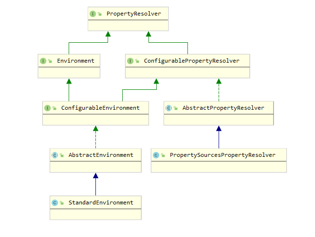
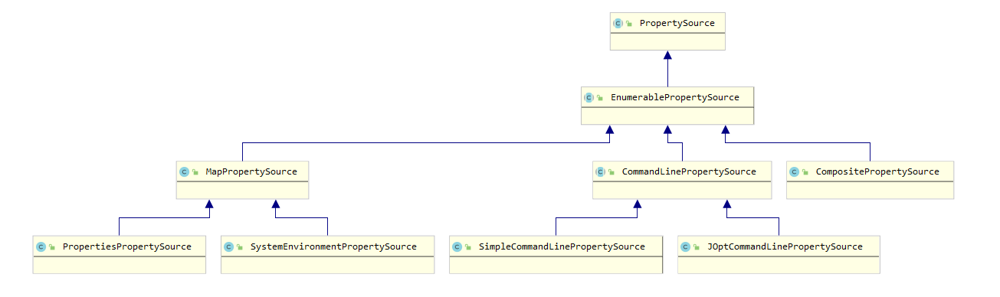

`org.springframework.core.env`包的核心功能是为应用提供一套运行环境。主要包含两个功能：`profiles`以及`properties`。

当给定的`profile`被激活时，只有特定的一组bean会被注册到容器中。这是`Spring`应用环境中特有的功能。

而`properties`在大多数应用中都扮演了一个重要的角色，它可以从各种资源组合而成：properties文件，JVM系统属性，系统环境变量，JNDI，servlet上下文参数，Properties对象，Map对象等。因此，应当向用户提供一个方便的接口来配置属性源以及从它们中解析属性。

核心接口的UML类图如下所示：



其中`PropertyResolver`接口定义了一组方便的获取属性的APIs，包括给定默认值，给定想要的类型等特性。同时，它还提供了解析给定字符串的API，将给定字符串中的占位符替换为属性源中的对应值。

```java
public interface PropertyResolver {

	/**
	 * Return whether the given property key is available for resolution,
	 * i.e. if the value for the given key is not {@code null}.
	 */
	boolean containsProperty(String key);

	/**
	 * Return the property value associated with the given key,
	 * or {@code null} if the key cannot be resolved.
	 * @param key the property name to resolve
	 * @see #getProperty(String, String)
	 * @see #getProperty(String, Class)
	 * @see #getRequiredProperty(String)
	 */
	@Nullable
	String getProperty(String key);

	/**
	 * Return the property value associated with the given key, or
	 * {@code defaultValue} if the key cannot be resolved.
	 * @param key the property name to resolve
	 * @param defaultValue the default value to return if no value is found
	 * @see #getRequiredProperty(String)
	 * @see #getProperty(String, Class)
	 */
	String getProperty(String key, String defaultValue);

	/**
	 * Return the property value associated with the given key,
	 * or {@code null} if the key cannot be resolved.
	 * @param key the property name to resolve
	 * @param targetType the expected type of the property value
	 * @see #getRequiredProperty(String, Class)
	 */
	@Nullable
	<T> T getProperty(String key, Class<T> targetType);

	/**
	 * Return the property value associated with the given key,
	 * or {@code defaultValue} if the key cannot be resolved.
	 * @param key the property name to resolve
	 * @param targetType the expected type of the property value
	 * @param defaultValue the default value to return if no value is found
	 * @see #getRequiredProperty(String, Class)
	 */
	<T> T getProperty(String key, Class<T> targetType, T defaultValue);

	/**
	 * Return the property value associated with the given key (never {@code null}).
	 * @throws IllegalStateException if the key cannot be resolved
	 * @see #getRequiredProperty(String, Class)
	 */
	String getRequiredProperty(String key) throws IllegalStateException;

	/**
	 * Return the property value associated with the given key, converted to the given
	 * targetType (never {@code null}).
	 * @throws IllegalStateException if the given key cannot be resolved
	 */
	<T> T getRequiredProperty(String key, Class<T> targetType) throws IllegalStateException;

	/**
	 * Resolve ${...} placeholders in the given text, replacing them with corresponding
	 * property values as resolved by {@link #getProperty}. Unresolvable placeholders with
	 * no default value are ignored and passed through unchanged.
	 * @param text the String to resolve
	 * @return the resolved String (never {@code null})
	 * @throws IllegalArgumentException if given text is {@code null}
	 * @see #resolveRequiredPlaceholders
	 */
	String resolvePlaceholders(String text);

	/**
	 * Resolve ${...} placeholders in the given text, replacing them with corresponding
	 * property values as resolved by {@link #getProperty}. Unresolvable placeholders with
	 * no default value will cause an IllegalArgumentException to be thrown.
	 * @return the resolved String (never {@code null})
	 * @throws IllegalArgumentException if given text is {@code null}
	 * or if any placeholders are unresolvable
	 */
	String resolveRequiredPlaceholders(String text) throws IllegalArgumentException;

}

```

UML图右侧的接口以及类对属性解析获取的功能进行了进一步拓展以及实现。而左侧`Environment`接口则拓展了`profile`的功能特性。


## 属性解析

`PropertyResolver`接口主要提供了获取以及解析属性的功能，但是占位符的规则多种多样。为了提供更加灵活的功能，因此需要对解析规则可配置。`ConfigurablePropertyResolver`接口提供了相应的APIs，包括设置占位符前缀，占位符后缀，值分隔符，是否忽略无法解析的占位符等。

```java
public interface ConfigurablePropertyResolver extends PropertyResolver {

	/**
	 * Return the {@link ConfigurableConversionService} used when performing type
	 * conversions on properties.
	 * <p>The configurable nature of the returned conversion service allows for
	 * the convenient addition and removal of individual {@code Converter} instances:
	 * <pre class="code">
	 * ConfigurableConversionService cs = env.getConversionService();
	 * cs.addConverter(new FooConverter());
	 * </pre>
	 * @see PropertyResolver#getProperty(String, Class)
	 * @see org.springframework.core.convert.converter.ConverterRegistry#addConverter
	 */
	ConfigurableConversionService getConversionService();

	/**
	 * Set the {@link ConfigurableConversionService} to be used when performing type
	 * conversions on properties.
	 * <p><strong>Note:</strong> as an alternative to fully replacing the
	 * {@code ConversionService}, consider adding or removing individual
	 * {@code Converter} instances by drilling into {@link #getConversionService()}
	 * and calling methods such as {@code #addConverter}.
	 * @see PropertyResolver#getProperty(String, Class)
	 * @see #getConversionService()
	 * @see org.springframework.core.convert.converter.ConverterRegistry#addConverter
	 */
	void setConversionService(ConfigurableConversionService conversionService);

	/**
	 * Set the prefix that placeholders replaced by this resolver must begin with.
	 */
	void setPlaceholderPrefix(String placeholderPrefix);

	/**
	 * Set the suffix that placeholders replaced by this resolver must end with.
	 */
	void setPlaceholderSuffix(String placeholderSuffix);

	/**
	 * Specify the separating character between the placeholders replaced by this
	 * resolver and their associated default value, or {@code null} if no such
	 * special character should be processed as a value separator.
	 */
	void setValueSeparator(@Nullable String valueSeparator);

	/**
	 * Set whether to throw an exception when encountering an unresolvable placeholder
	 * nested within the value of a given property. A {@code false} value indicates strict
	 * resolution, i.e. that an exception will be thrown. A {@code true} value indicates
	 * that unresolvable nested placeholders should be passed through in their unresolved
	 * ${...} form.
	 * <p>Implementations of {@link #getProperty(String)} and its variants must inspect
	 * the value set here to determine correct behavior when property values contain
	 * unresolvable placeholders.
	 * @since 3.2
	 */
	void setIgnoreUnresolvableNestedPlaceholders(boolean ignoreUnresolvableNestedPlaceholders);

	/**
	 * Specify which properties must be present, to be verified by
	 * {@link #validateRequiredProperties()}.
	 */
	void setRequiredProperties(String... requiredProperties);

	/**
	 * Validate that each of the properties specified by
	 * {@link #setRequiredProperties} is present and resolves to a
	 * non-{@code null} value.
	 * @throws MissingRequiredPropertiesException if any of the required
	 * properties are not resolvable.
	 */
	void validateRequiredProperties() throws MissingRequiredPropertiesException;

}
```

至此，属性获取以及解析的功能接口已经相当全面灵活了。因此，可以提供一个抽象骨架类，简化子类实现。`PropertyResolver`接口中大量的获取属性方法都可以通过委托给一个功能最为完整的方法进行实现，因此这些功能可以在抽象类中完成。而解析功能主要有两部分组成：属性源以及解析算法。其中解析算法本质上是独立的，它只需要可以从属性源中获取属性值即可。因此，只要向解析器暴露一个获取属性值的API，即可将解析器独立出来。

同时，占位符的配置功能与如何获取属性之间不存在任何依赖关系，因此它也可以在抽象类中实现。并且，可以依据这些配置信息构造出一个解析器。这个解析器可以作为静态内部类存在，也可以作为一个公共的工具类存在。

`AbstractPropertyResolver`抽象类的实现如下所示：

```java
public abstract class AbstractPropertyResolver implements ConfigurablePropertyResolver {

	protected final Log logger = LogFactory.getLog(getClass());

	@Nullable
	private volatile ConfigurableConversionService conversionService;

	@Nullable
	private PropertyPlaceholderHelper nonStrictHelper;

	@Nullable
	private PropertyPlaceholderHelper strictHelper;

	private boolean ignoreUnresolvableNestedPlaceholders = false;

    // ${
	private String placeholderPrefix = SystemPropertyUtils.PLACEHOLDER_PREFIX;

    // }
	private String placeholderSuffix = SystemPropertyUtils.PLACEHOLDER_SUFFIX;

    // :
	@Nullable
	private String valueSeparator = SystemPropertyUtils.VALUE_SEPARATOR;

	private final Set<String> requiredProperties = new LinkedHashSet<>();


	@Override
	public ConfigurableConversionService getConversionService() {
		// Need to provide an independent DefaultConversionService, not the
		// shared DefaultConversionService used by PropertySourcesPropertyResolver.
		ConfigurableConversionService cs = this.conversionService;
		if (cs == null) {
			synchronized (this) {
				cs = this.conversionService;
				if (cs == null) {
					cs = new DefaultConversionService();
					this.conversionService = cs;
				}
			}
		}
		return cs;
	}

	@Override
	public void setConversionService(ConfigurableConversionService conversionService) {
		Assert.notNull(conversionService, "ConversionService must not be null");
		this.conversionService = conversionService;
	}

	/**
	 * Set the prefix that placeholders replaced by this resolver must begin with.
	 * <p>The default is "${".
	 * @see org.springframework.util.SystemPropertyUtils#PLACEHOLDER_PREFIX
	 */
	@Override
	public void setPlaceholderPrefix(String placeholderPrefix) {
		Assert.notNull(placeholderPrefix, "'placeholderPrefix' must not be null");
		this.placeholderPrefix = placeholderPrefix;
	}

	/**
	 * Set the suffix that placeholders replaced by this resolver must end with.
	 * <p>The default is "}".
	 * @see org.springframework.util.SystemPropertyUtils#PLACEHOLDER_SUFFIX
	 */
	@Override
	public void setPlaceholderSuffix(String placeholderSuffix) {
		Assert.notNull(placeholderSuffix, "'placeholderSuffix' must not be null");
		this.placeholderSuffix = placeholderSuffix;
	}

	/**
	 * Specify the separating character between the placeholders replaced by this
	 * resolver and their associated default value, or {@code null} if no such
	 * special character should be processed as a value separator.
	 * <p>The default is ":".
	 * @see org.springframework.util.SystemPropertyUtils#VALUE_SEPARATOR
	 */
	@Override
	public void setValueSeparator(@Nullable String valueSeparator) {
		this.valueSeparator = valueSeparator;
	}

	/**
	 * Set whether to throw an exception when encountering an unresolvable placeholder
	 * nested within the value of a given property. A {@code false} value indicates strict
	 * resolution, i.e. that an exception will be thrown. A {@code true} value indicates
	 * that unresolvable nested placeholders should be passed through in their unresolved
	 * ${...} form.
	 * <p>The default is {@code false}.
	 * @since 3.2
	 */
	@Override
	public void setIgnoreUnresolvableNestedPlaceholders(boolean ignoreUnresolvableNestedPlaceholders) {
		this.ignoreUnresolvableNestedPlaceholders = ignoreUnresolvableNestedPlaceholders;
	}

	@Override
	public void setRequiredProperties(String... requiredProperties) {
		Collections.addAll(this.requiredProperties, requiredProperties);
	}

	@Override
	public void validateRequiredProperties() {
		MissingRequiredPropertiesException ex = new MissingRequiredPropertiesException();
		for (String key : this.requiredProperties) {
			if (this.getProperty(key) == null) {
				ex.addMissingRequiredProperty(key);
			}
		}
		if (!ex.getMissingRequiredProperties().isEmpty()) {
			throw ex;
		}
	}

	@Override
	public boolean containsProperty(String key) {
		return (getProperty(key) != null);
	}

	@Override
	@Nullable
	public String getProperty(String key) {
		return getProperty(key, String.class);
	}

	@Override
	public String getProperty(String key, String defaultValue) {
		String value = getProperty(key);
		return (value != null ? value : defaultValue);
	}

	@Override
	public <T> T getProperty(String key, Class<T> targetType, T defaultValue) {
		T value = getProperty(key, targetType);
		return (value != null ? value : defaultValue);
	}

	@Override
	public String getRequiredProperty(String key) throws IllegalStateException {
		String value = getProperty(key);
		if (value == null) {
			throw new IllegalStateException("Required key '" + key + "' not found");
		}
		return value;
	}

	@Override
	public <T> T getRequiredProperty(String key, Class<T> valueType) throws IllegalStateException {
		T value = getProperty(key, valueType);
		if (value == null) {
			throw new IllegalStateException("Required key '" + key + "' not found");
		}
		return value;
	}

	@Override
	public String resolvePlaceholders(String text) {
		if (this.nonStrictHelper == null) {
			this.nonStrictHelper = createPlaceholderHelper(true);
		}
		return doResolvePlaceholders(text, this.nonStrictHelper);
	}

	@Override
	public String resolveRequiredPlaceholders(String text) throws IllegalArgumentException {
		if (this.strictHelper == null) {
			this.strictHelper = createPlaceholderHelper(false);
		}
		return doResolvePlaceholders(text, this.strictHelper);
	}

	/**
	 * Resolve placeholders within the given string, deferring to the value of
	 * {@link #setIgnoreUnresolvableNestedPlaceholders} to determine whether any
	 * unresolvable placeholders should raise an exception or be ignored.
	 * <p>Invoked from {@link #getProperty} and its variants, implicitly resolving
	 * nested placeholders. In contrast, {@link #resolvePlaceholders} and
	 * {@link #resolveRequiredPlaceholders} do <i>not</i> delegate
	 * to this method but rather perform their own handling of unresolvable
	 * placeholders, as specified by each of those methods.
	 * @since 3.2
	 * @see #setIgnoreUnresolvableNestedPlaceholders
	 */
	protected String resolveNestedPlaceholders(String value) {
		if (value.isEmpty()) {
			return value;
		}
		return (this.ignoreUnresolvableNestedPlaceholders ?
				resolvePlaceholders(value) : resolveRequiredPlaceholders(value));
	}

	private PropertyPlaceholderHelper createPlaceholderHelper(boolean ignoreUnresolvablePlaceholders) {
		return new PropertyPlaceholderHelper(this.placeholderPrefix, this.placeholderSuffix,
				this.valueSeparator, ignoreUnresolvablePlaceholders);
	}

	private String doResolvePlaceholders(String text, PropertyPlaceholderHelper helper) {
		return helper.replacePlaceholders(text, this::getPropertyAsRawString);
	}

	/**
	 * Convert the given value to the specified target type, if necessary.
	 * @param value the original property value
	 * @param targetType the specified target type for property retrieval
	 * @return the converted value, or the original value if no conversion
	 * is necessary
	 * @since 4.3.5
	 */
	@SuppressWarnings("unchecked")
	@Nullable
	protected <T> T convertValueIfNecessary(Object value, @Nullable Class<T> targetType) {
		if (targetType == null) {
			return (T) value;
		}
		ConversionService conversionServiceToUse = this.conversionService;
		if (conversionServiceToUse == null) {
			// Avoid initialization of shared DefaultConversionService if
			// no standard type conversion is needed in the first place...
			if (ClassUtils.isAssignableValue(targetType, value)) {
				return (T) value;
			}
			conversionServiceToUse = DefaultConversionService.getSharedInstance();
		}
		return conversionServiceToUse.convert(value, targetType);
	}


	/**
	 * Retrieve the specified property as a raw String,
	 * i.e. without resolution of nested placeholders.
	 * @param key the property name to resolve
	 * @return the property value or {@code null} if none found
	 */
	@Nullable
	protected abstract String getPropertyAsRawString(String key);

}
```

可以看出，`ConfigurablePropertyResolver`接口的大部分方法都已经在此抽象类中实现，只有具体的如何获取属性值的功能交由子类具体实现。

解析算法则被实现为一个更加通用的工具类`PropertyPlaceholderHelper`，它不仅可以处理来自`PropertyResolver`接口的解析功能，还可以直接将一个给定的`Properties`作为属性源进行解析。如果只需要使用`Properties`进行简单的解析功能，这无疑相较于构造一个完整的`ConfigurablePropertyResolver`实现类来说更加轻量化。这个实现的核心便是提供了一个`PlaceholderResolver`接口进行解耦，无论属性源到底是什么，只需要实现`PlaceholderResolver`接口就足够解析器进行工作了。

```java
	/**
	 * Strategy interface used to resolve replacement values for placeholders contained in Strings.
	 */
	@FunctionalInterface
	public interface PlaceholderResolver {

		/**
		 * Resolve the supplied placeholder name to the replacement value.
		 * @param placeholderName the name of the placeholder to resolve
		 * @return the replacement value, or {@code null} if no replacement is to be made
		 */
		@Nullable
		String resolvePlaceholder(String placeholderName);
	}
```

解析器的算法较为简单，不多赘述。

## 属性源

`Spring`提供了一个抽象泛型类`PropertySource<T>`用于表示属性源，它可以接受任何封装了属性name/value对的对象，例如`Properties`， `Map`等。`PropertySource<T>`一般并不会单独使用，因为通常在应用环境中会有多个属性源，因此每个属性源都需要一个唯一的名字进行标识。`Spring`提供了一个`PropertySources`接口作为多个`PropertySource<T>`的集合。

```java
public abstract class PropertySource<T> {

	protected final Log logger = LogFactory.getLog(getClass());

	protected final String name;

	protected final T source;


	/**
	 * Create a new {@code PropertySource} with the given name and source object.
	 * @param name the associated name
	 * @param source the source object
	 */
	public PropertySource(String name, T source) {
		Assert.hasText(name, "Property source name must contain at least one character");
		Assert.notNull(source, "Property source must not be null");
		this.name = name;
		this.source = source;
	}

	/**
	 * Create a new {@code PropertySource} with the given name and with a new
	 * {@code Object} instance as the underlying source.
	 * <p>Often useful in testing scenarios when creating anonymous implementations
	 * that never query an actual source but rather return hard-coded values.
	 */
	@SuppressWarnings("unchecked")
	public PropertySource(String name) {
		this(name, (T) new Object());
	}


	/**
	 * Return the name of this {@code PropertySource}.
	 */
	public String getName() {
		return this.name;
	}

	/**
	 * Return the underlying source object for this {@code PropertySource}.
	 */
	public T getSource() {
		return this.source;
	}

	/**
	 * Return whether this {@code PropertySource} contains the given name.
	 * <p>This implementation simply checks for a {@code null} return value
	 * from {@link #getProperty(String)}. Subclasses may wish to implement
	 * a more efficient algorithm if possible.
	 * @param name the property name to find
	 */
	public boolean containsProperty(String name) {
		return (getProperty(name) != null);
	}

	/**
	 * Return the value associated with the given name,
	 * or {@code null} if not found.
	 * @param name the property to find
	 * @see PropertyResolver#getRequiredProperty(String)
	 */
	@Nullable
	public abstract Object getProperty(String name);


	/**
	 * This {@code PropertySource} object is equal to the given object if:
	 * <ul>
	 * <li>they are the same instance
	 * <li>the {@code name} properties for both objects are equal
	 * </ul>
	 * <p>No properties other than {@code name} are evaluated.
	 */
	@Override
	public boolean equals(@Nullable Object other) {
		return (this == other || (other instanceof PropertySource &&
				ObjectUtils.nullSafeEquals(this.name, ((PropertySource<?>) other).name)));
	}

	/**
	 * Return a hash code derived from the {@code name} property
	 * of this {@code PropertySource} object.
	 */
	@Override
	public int hashCode() {
		return ObjectUtils.nullSafeHashCode(this.name);
	}

	/**
	 * Produce concise output (type and name) if the current log level does not include
	 * debug. If debug is enabled, produce verbose output including the hash code of the
	 * PropertySource instance and every name/value property pair.
	 * <p>This variable verbosity is useful as a property source such as system properties
	 * or environment variables may contain an arbitrary number of property pairs,
	 * potentially leading to difficult to read exception and log messages.
	 * @see Log#isDebugEnabled()
	 */
	@Override
	public String toString() {
		if (logger.isDebugEnabled()) {
			return getClass().getSimpleName() + "@" + System.identityHashCode(this) +
					" {name='" + this.name + "', properties=" + this.source + "}";
		}
		else {
			return getClass().getSimpleName() + " {name='" + this.name + "'}";
		}
	}


	/**
	 * Return a {@code PropertySource} implementation intended for collection comparison purposes only.
	 * <p>Primarily for internal use, but given a collection of {@code PropertySource} objects, may be
	 * used as follows:
	 * <pre class="code">
	 * {@code List<PropertySource<?>> sources = new ArrayList<PropertySource<?>>();
	 * sources.add(new MapPropertySource("sourceA", mapA));
	 * sources.add(new MapPropertySource("sourceB", mapB));
	 * assert sources.contains(PropertySource.named("sourceA"));
	 * assert sources.contains(PropertySource.named("sourceB"));
	 * assert !sources.contains(PropertySource.named("sourceC"));
	 * }</pre>
	 * The returned {@code PropertySource} will throw {@code UnsupportedOperationException}
	 * if any methods other than {@code equals(Object)}, {@code hashCode()}, and {@code toString()}
	 * are called.
	 * @param name the name of the comparison {@code PropertySource} to be created and returned.
	 */
	public static PropertySource<?> named(String name) {
		return new ComparisonPropertySource(name);
	}


	/**
	 * {@code PropertySource} to be used as a placeholder in cases where an actual
	 * property source cannot be eagerly initialized at application context
	 * creation time.  For example, a {@code ServletContext}-based property source
	 * must wait until the {@code ServletContext} object is available to its enclosing
	 * {@code ApplicationContext}.  In such cases, a stub should be used to hold the
	 * intended default position/order of the property source, then be replaced
	 * during context refresh.
	 * @see org.springframework.context.support.AbstractApplicationContext#initPropertySources()
	 * @see org.springframework.web.context.support.StandardServletEnvironment
	 * @see org.springframework.web.context.support.ServletContextPropertySource
	 */
	public static class StubPropertySource extends PropertySource<Object> {

		public StubPropertySource(String name) {
			super(name, new Object());
		}

		/**
		 * Always returns {@code null}.
		 */
		@Override
		@Nullable
		public String getProperty(String name) {
			return null;
		}
	}


	/**
	 * A {@code PropertySource} implementation intended for collection comparison
	 * purposes.
	 *
	 * @see PropertySource#named(String)
	 */
	static class ComparisonPropertySource extends StubPropertySource {

		private static final String USAGE_ERROR =
				"ComparisonPropertySource instances are for use with collection comparison only";

		public ComparisonPropertySource(String name) {
			super(name);
		}

		@Override
		public Object getSource() {
			throw new UnsupportedOperationException(USAGE_ERROR);
		}

		@Override
		public boolean containsProperty(String name) {
			throw new UnsupportedOperationException(USAGE_ERROR);
		}

		@Override
		@Nullable
		public String getProperty(String name) {
			throw new UnsupportedOperationException(USAGE_ERROR);
		}
	}

}
```

它的唯一的抽象方法便是`public abstract Object getProperty(String name);`，`PropertyResolver`接口获取属性值的功能将会委托至此方法。

同时，观察`PropertySource<T>`类的`equals`方法，可以发现用于区分`PropertySource<T>`的方式便是通过它的名称。因此，采用`List`进行聚合即可实现`PropertySource<T>`的优先查找，相比`LinkedHashMap`而言减少了许多对空间的占用。当需要进行查找时，只需要构造一个名称相同的`stub`对象即可。虽然查询相对而言满了些许，但是这并不是`PropertySources`常用的核心功能。这种时间空间上的权衡见仁见智，不过`Spring`在此处的实现方式可以帮助开拓视野。

`PropertySource<T>`的继承体系如下所示：



在`PropertySource<T>`的默认实现中，`containsProperty`方法是调用`getProperty`实现的，如下所示：

```java
	public boolean containsProperty(String name) {
		return (getProperty(name) != null);
	}
```

当`getProperty`方法的开销比较大时，`containsProperty`方法的性能也会因此大幅下滑，这明显不符合我们的期望。因此，为了预防这一情况出现，`Spring`设计了`EnumerablePropertySource`类，并且所有的子类实现都继承自此类。

`EnumerablePropertySource`类要求所有子类都实现`public abstract String[] getPropertyNames()`方法，这个方法用于列举出属性源中包含的所有`name`，使用名称列表进行查询可以使`containsProperty`的开销控制在一个良好的范围内。

```java
public abstract class EnumerablePropertySource<T> extends PropertySource<T> {

	/**
	 * Create a new {@code EnumerablePropertySource} with the given name and source object.
	 * @param name the associated name
	 * @param source the source object
	 */
	public EnumerablePropertySource(String name, T source) {
		super(name, source);
	}

	/**
	 * Create a new {@code EnumerablePropertySource} with the given name and with a new
	 * {@code Object} instance as the underlying source.
	 * @param name the associated name
	 */
	protected EnumerablePropertySource(String name) {
		super(name);
	}


	/**
	 * Return whether this {@code PropertySource} contains a property with the given name.
	 * <p>This implementation checks for the presence of the given name within the
	 * {@link #getPropertyNames()} array.
	 * @param name the name of the property to find
	 */
	@Override
	public boolean containsProperty(String name) {
		return ObjectUtils.containsElement(getPropertyNames(), name);
	}

	/**
	 * Return the names of all properties contained by the
	 * {@linkplain #getSource() source} object (never {@code null}).
	 */
	public abstract String[] getPropertyNames();

}
```

在其下派生了三种数据源：第一个为最常见的`MapPropertySource`，使用`Map<String, Object>`作为数据源；第二为`CommandLinePropertySource`，使用命令行参数作为数据源，并提供命令行相关的一些特性；最后则为`CompositePropertySource`，它是多个数据源的聚合，不过它只接受`EnumerablePropertySource`，相比`PropertySources`而言没有什么用处。

### MapPropertySource

除了最常用的`Map`作为数据源以外，`Properties`以及系统环境也经常会作为数据源使用。

`PropertiesPropertySource`可以接受一个`Properties`对象作为数据源，`Properties`类本身也实现了`Map`接口，因此可以无缝对接，唯一的限制便是`Properties`的key必须为`String`类型。

`System.getenv()`方法也返回一个`Map<String, String>`对象，因此`SystemEnvironmentPropertySource`的构建也很简单。但是，bash或者其他shell不支持`.`或者`_`符号，因此`SystemEnvironmentPropertySource`主要便是填补这一块的空缺，以便用户可以获取更加好的体验。除此以外，`SystemEnvironmentPropertySource`还允许使用大写的属性名。

例如对于属性名`"foo.bar"`，`SystemEnvironmentPropertySource`会尝试使用下面的形式进行查找：

- `foo.bar`
- `foo_bar`
- `FOO.BAR`
- `FOO_BAR`

只有有任何一种形式可以查询到对应的属性值，都会作为查询结果返回。而它的实现也相当简单，只需要在`getProperty(String)`方法中按预订规则作简单的替换即可。

### CommandLinePropertySource

`CommandLinePropertySource`主要是将命令行参数作为数据源，它可以接受一个`String[]`数组，将其分为`option arguments`以及`non-option arguments`。

具体可查看`CommandLinePropertySource`的子类，获取相关的预设参数规则。

## PropertySources

`PropertySources`接口类似一个集合，它继承了`Iterable`接口，可以对`PropertySource`进行遍历。

```java
public interface PropertySources extends Iterable<PropertySource<?>> {

	/**
	 * Return a sequential {@link Stream} containing the property sources.
	 * @since 5.1
	 */
	default Stream<PropertySource<?>> stream() {
		return StreamSupport.stream(spliterator(), false);
	}

	/**
	 * Return whether a property source with the given name is contained.
	 * @param name the {@linkplain PropertySource#getName() name of the property source} to find
	 */
	boolean contains(String name);

	/**
	 * Return the property source with the given name, {@code null} if not found.
	 * @param name the {@linkplain PropertySource#getName() name of the property source} to find
	 */
	@Nullable
	PropertySource<?> get(String name);

}
```

`PropertySources`接口的默认实现`MutablePropertySources`使用了一个`CopyOnWriteArrayList`来存储`PropertySource`，并且它是可变的，可以随时增加或者删除某一个`PropertySource`。

## StandardEnvironment

与`PropertyResolver`相同，`Environment`接口只提供了访问操作，因此它也需要一定的可配置功能。这个功能由`ConfigurableEnvironment`实现，它不仅继承了`Environment`接口接口，还继承了`ConfigurablePropertyResolver`接口。

```java
public interface ConfigurableEnvironment extends Environment, ConfigurablePropertyResolver {

	/**
	 * Specify the set of profiles active for this {@code Environment}. Profiles are
	 * evaluated during container bootstrap to determine whether bean definitions
	 * should be registered with the container.
	 * <p>Any existing active profiles will be replaced with the given arguments; call
	 * with zero arguments to clear the current set of active profiles. Use
	 * {@link #addActiveProfile} to add a profile while preserving the existing set.
	 * @throws IllegalArgumentException if any profile is null, empty or whitespace-only
	 * @see #addActiveProfile
	 * @see #setDefaultProfiles
	 * @see org.springframework.context.annotation.Profile
	 * @see AbstractEnvironment#ACTIVE_PROFILES_PROPERTY_NAME
	 */
	void setActiveProfiles(String... profiles);

	/**
	 * Add a profile to the current set of active profiles.
	 * @throws IllegalArgumentException if the profile is null, empty or whitespace-only
	 * @see #setActiveProfiles
	 */
	void addActiveProfile(String profile);

	/**
	 * Specify the set of profiles to be made active by default if no other profiles
	 * are explicitly made active through {@link #setActiveProfiles}.
	 * @throws IllegalArgumentException if any profile is null, empty or whitespace-only
	 * @see AbstractEnvironment#DEFAULT_PROFILES_PROPERTY_NAME
	 */
	void setDefaultProfiles(String... profiles);

	/**
	 * Return the {@link PropertySources} for this {@code Environment} in mutable form,
	 * allowing for manipulation of the set of {@link PropertySource} objects that should
	 * be searched when resolving properties against this {@code Environment} object.
	 * The various {@link MutablePropertySources} methods such as
	 * {@link MutablePropertySources#addFirst addFirst},
	 * {@link MutablePropertySources#addLast addLast},
	 * {@link MutablePropertySources#addBefore addBefore} and
	 * {@link MutablePropertySources#addAfter addAfter} allow for fine-grained control
	 * over property source ordering. This is useful, for example, in ensuring that
	 * certain user-defined property sources have search precedence over default property
	 * sources such as the set of system properties or the set of system environment
	 * variables.
	 * @see AbstractEnvironment#customizePropertySources
	 */
	MutablePropertySources getPropertySources();

	/**
	 * Return the value of {@link System#getProperties()} if allowed by the current
	 * {@link SecurityManager}, otherwise return a map implementation that will attempt
	 * to access individual keys using calls to {@link System#getProperty(String)}.
	 * <p>Note that most {@code Environment} implementations will include this system
	 * properties map as a default {@link PropertySource} to be searched. Therefore, it is
	 * recommended that this method not be used directly unless bypassing other property
	 * sources is expressly intended.
	 * <p>Calls to {@link Map#get(Object)} on the Map returned will never throw
	 * {@link IllegalAccessException}; in cases where the SecurityManager forbids access
	 * to a property, {@code null} will be returned and an INFO-level log message will be
	 * issued noting the exception.
	 */
	Map<String, Object> getSystemProperties();

	/**
	 * Return the value of {@link System#getenv()} if allowed by the current
	 * {@link SecurityManager}, otherwise return a map implementation that will attempt
	 * to access individual keys using calls to {@link System#getenv(String)}.
	 * <p>Note that most {@link Environment} implementations will include this system
	 * environment map as a default {@link PropertySource} to be searched. Therefore, it
	 * is recommended that this method not be used directly unless bypassing other
	 * property sources is expressly intended.
	 * <p>Calls to {@link Map#get(Object)} on the Map returned will never throw
	 * {@link IllegalAccessException}; in cases where the SecurityManager forbids access
	 * to a property, {@code null} will be returned and an INFO-level log message will be
	 * issued noting the exception.
	 */
	Map<String, Object> getSystemEnvironment();

	/**
	 * Append the given parent environment's active profiles, default profiles and
	 * property sources to this (child) environment's respective collections of each.
	 * <p>For any identically-named {@code PropertySource} instance existing in both
	 * parent and child, the child instance is to be preserved and the parent instance
	 * discarded. This has the effect of allowing overriding of property sources by the
	 * child as well as avoiding redundant searches through common property source types,
	 * e.g. system environment and system properties.
	 * <p>Active and default profile names are also filtered for duplicates, to avoid
	 * confusion and redundant storage.
	 * <p>The parent environment remains unmodified in any case. Note that any changes to
	 * the parent environment occurring after the call to {@code merge} will not be
	 * reflected in the child. Therefore, care should be taken to configure parent
	 * property sources and profile information prior to calling {@code merge}.
	 * @param parent the environment to merge with
	 * @since 3.1.2
	 * @see org.springframework.context.support.AbstractApplicationContext#setParent
	 */
	void merge(ConfigurableEnvironment parent);

}
```

虽然它继承了`ConfigurablePropertyResolver`接口，但是只需要组合一个`PropertySourcesPropertyResolver`对象即可将所有接口方法委托实现。同时，它还可以使用一个`MutablePropertySources`对象作为属性源以供`PropertySourcesPropertyResolver`对象使用。而专属于`ConfigurableEnvironment`接口的方法主要都是与`profiles`相关的内容，因此，几乎所有的接口方法都可以由抽象类提供一个默认实现，只需要向子类暴露一个可以定制化`MutablePropertySources`对象的方法即可，子类可以据此增加自己想要提供的属性源。

最终构建出的`StandardEnvironment`注册了`System.getProperties()`以及`System.getenv()`两个属性源。

```java
public class StandardEnvironment extends AbstractEnvironment {

	/** System environment property source name: {@value}. */
	public static final String SYSTEM_ENVIRONMENT_PROPERTY_SOURCE_NAME = "systemEnvironment";

	/** JVM system properties property source name: {@value}. */
	public static final String SYSTEM_PROPERTIES_PROPERTY_SOURCE_NAME = "systemProperties";


	/**
	 * Customize the set of property sources with those appropriate for any standard
	 * Java environment:
	 * <ul>
	 * <li>{@value #SYSTEM_PROPERTIES_PROPERTY_SOURCE_NAME}
	 * <li>{@value #SYSTEM_ENVIRONMENT_PROPERTY_SOURCE_NAME}
	 * </ul>
	 * <p>Properties present in {@value #SYSTEM_PROPERTIES_PROPERTY_SOURCE_NAME} will
	 * take precedence over those in {@value #SYSTEM_ENVIRONMENT_PROPERTY_SOURCE_NAME}.
	 * @see AbstractEnvironment#customizePropertySources(MutablePropertySources)
	 * @see #getSystemProperties()
	 * @see #getSystemEnvironment()
	 */
	@Override
	protected void customizePropertySources(MutablePropertySources propertySources) {
		propertySources.addLast(
				new PropertiesPropertySource(SYSTEM_PROPERTIES_PROPERTY_SOURCE_NAME, getSystemProperties()));
		propertySources.addLast(
				new SystemEnvironmentPropertySource(SYSTEM_ENVIRONMENT_PROPERTY_SOURCE_NAME, getSystemEnvironment()));
	}

}
```